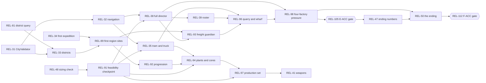

# Relight — implementation readiness review

**Date:** 2026-09-21, corrected the same day after the backlog reconciliation · **Game reviewed:** `Unity/Relight/` only (the TypeScript/Phaser reference stays paused and separate).

**What this file is.** A derived readiness assessment. It is not a tracker. `Unity/Docs/TASKS.md` alone owns task status and `Unity/Docs/DECISIONS.md` owns decisions. Nothing here changes a status or approves a proposal.

**What changed since the first version.** The owner authorised documentation and Linear backlog corrections (not code, not commits). Those corrections are now applied. This version records what was applied, withdraws the first version's mistakes (section J), and states the baseline precisely.

**Nothing in this file claims that any work is implemented or accepted.** Every issue below is in Backlog. No gate has a recorded verdict.

**How to read it.** Section A is the answer. Section D is the full issue list. Section K is the first batch. Everything between is the evidence.

Issue links use the short form, for example [REL-44](https://linear.app/relightgame/issue/REL-44).

---

## A. Verdict

### **Ready with bounded blockers.**

The backlog is reconciled. The first implementation batch can be understood and built from the issues alone.

**One thing must happen before the first code change:**

| Blocker | What it blocks | What resolves it |
|---|---|---|
| **The owner's hold on gameplay and code is still on.** | Everything. | The owner's word. |

**One thing is recommended, and is not a technical prerequisite:**

| Recommendation | Why | If skipped |
|---|---|---|
| **Commit the baseline first.** Decisions U-D-64 to U-D-67, task rows E-18 to E-23, FEAS-01, the district tools and the three reports exist only in the working tree. HEAD `9d1a0f90` is five commits ahead of origin and not pushed. | A clean starting point, and diffs that show only the new work. | Nothing breaks. The first batch builds on the working tree exactly as it is. The first commit will just be larger and mix docs with code. |

**What the first version called blocker 2 is fixed.** Linear's blocker graph now holds technical dependencies only (section F-1). [REL-71](https://linear.app/relightgame/issue/REL-71) blocks nothing.

**What the tests say, precisely** (detail in section G):

- **Passed today:** Unity EditMode 766 of 766. Offline sim suite 740 passed, 0 failed, 1 skipped, of 741.
- **Known failing, not re-run:** Unity PlayMode, last recorded 78 pass, 5 fail, 5 skip, of 88 ([REL-54](https://linear.app/relightgame/issue/REL-54)). Not run because it writes into the owner's real saves ([REL-61](https://linear.app/relightgame/issue/REL-61)).
- **Unrun:** the offline engine-side compile check, the reference `npm` checks, any Mono performance measurement, a scripted full-opening run (no runner exists), a standalone Windows build.
- **Human:** no formal acceptance verdict is recorded for any gate. That is not the same as "never played": the owner has played the Unity opening informally (section G-3).

**Open owner decisions do not stop the first batch.** Each one blocks only the issues named in section H.

---

## B. Scope, sources and exact baseline

### What I read

| Source | State |
|---|---|
| `CLAUDE.md`, `Unity/README.md` | Read. Unity port is the active game; always dark (U-D-58). |
| `Unity/Docs/TASKS.md`, `DECISIONS.md`, `ALWAYS_DARK_SPEC.md`, `TECHNICAL_ARCHITECTURE.md` §9.4.2 | Read, including today's uncommitted rows. |
| `TASK-REMAINING.md` (integration audit), `ENEMY-THREAT-AUDIT.md` (enemy audit) | Read in full. Untracked files. |
| **Linear, live, 2026-09-21** | **109 Relight issues, REL-5 to REL-113**, re-read after the last edit, with descriptions, labels, milestones and relations. REL-1 to REL-4 are Linear's stock onboarding cards, not Relight work. |
| Unity code | Spot-read where an issue made a checkable claim. Claims I did not re-check are named in section G-4. |

**Tool limits, stated plainly**

- **CodeGraph is not active** here (no `.codegraph/` directory). I used grep and direct reads.
- Three MCP servers failed to connect (coplay, chrome-devtools, serena). None was needed. Linear connected.

### Exact baseline

- **Commit:** `9d1a0f9081fa5c91cc69ccd715b428877791dcde` on `main`, five commits ahead of origin, **not pushed**.
- **Uncommitted, modified:** `Unity/Docs/ALWAYS_DARK_SPEC.md`, `DECISIONS.md`, `TASKS.md`, `UI/Admin/AdminPanel.uxml`, `UI/Admin/AdminPanelController.cs`. (`.serena/project.yml` is also modified, not by me.)
- **Untracked:** `TASK-REMAINING.md`, `ENEMY-THREAT-AUDIT.md`, `IMPLEMENTATION-READINESS.md`, `Assets/Editor/DistrictGizmo.cs`, `Presentation/City/DistrictMap.cs`, `Presentation/City/DistrictOverlay.cs` (plus `.meta` files).
- **Nothing uncommitted touches `Assets/Relight/Sim`.**
- **Save schema:** version 9.
- **Editor:** Unity 6000.6.0f1.

### The agreed scope, sorted

**Approved requirements**

- Always dark, no day or night (U-D-58). Light matters in a fight (U-D-59). The ending is "switch the city on" (U-D-60). Dry-turret and wreck alerts (U-D-61, built). Strongholds as sieges, weapons last (U-D-62). Fuel, power and failure readability (U-D-63, built).
- Four threat layers: roamers, camps, strongholds, raids (U-D-64). The raid failure path is fixed first.
- The tram connects every base; a resource may exist in one place only (U-D-65).
- Eight threat improvements, in a fixed order (U-D-66): failure path → tools → feedback → curve and fair timing → roamer behaviour → alien roles and raid types.
- Turret-count raid scaling exists as a switch, shipped **off** (U-D-67).
- GP-15 to GP-25 are in scope with no per-feature go-ahead (U-D-31). The owner's hold sits on top of that.

**Approved provisional values (build now, tune later, U-D-28)**

- U-P-15 roamers about 1 per 2,500 street tiles (about 65). U-P-16 camps 10–12, later 20–22. U-P-17 quiet spell 8 minutes. U-P-18 six turrets free, +4% each, cap +50%.
- Roamer refill one per 120 s, up to the district's number (`ALWAYS_DARK_SPEC.md` §6).
- Raid tiers by plants: 60–90 / 90–140 / 160–220. Strongholds 40–60 plus the guardian. At most 48 major-raid bodies alive; world cap 240.
- U-P-13 Master Switch stage 60 s at throttle 0.5.

**Proposed numbers, not recorded as U-P rows.** "Near the core" 12 tiles; a deferral limit of 180 s or less; the Home core floor's share. They sit in the issues, marked as proposals. They become U-P rows only when built or agreed (next free: U-P-19).

**Optional proposals (not approved)**

- [REL-70](https://linear.app/relightgame/issue/REL-70) OPT-01 to OPT-06. C-R01 to C-R07 from another session (F1-15). [REL-87](https://linear.app/relightgame/issue/REL-87) click-to-find. [REL-107](https://linear.app/relightgame/issue/REL-107)'s proposed F-10 build row (F1-34).
- The enemy audit's §9 recommendations, until the owner says yes to each.

**Superseded**

- Spec §6 "3 to 6 roamers per district" → U-D-64 (a).
- The reference's day and night cycle → U-D-58.
- U-D-37's raid tiers versus U-D-47's +15% per assault → settled by U-D-64 (f); F1-07 is decided.
- U-P-07 and U-P-08 are stale (DOC-07, in [REL-69](https://linear.app/relightgame/issue/REL-69)).
- OPT-02 → now [REL-73](https://linear.app/relightgame/issue/REL-73) and [REL-74](https://linear.app/relightgame/issue/REL-74).

**One provenance caveat, carried honestly.** The owner said "record them" about the U-D-66 page. U-D-64 was recorded in the same pass, and the owner has since said "I like all your suggestions for enemies and counts." If U-D-64 was not meant, strike it.

---

## C. Requirement-to-Linear coverage matrix

Read across: what was agreed → what exists → what is missing → where it lives → how we will know.

Kind: **R** approved requirement · **P** provisional value · **?** open decision.

"Now" describes the code as read on 2026-09-21. None of the listed issues is started.

### New Game and the opening

| Requirement | Now | Gap | Linear | Evidence needed |
|---|---|---|---|---|
| R · Home opening: prepared turret → first attack → resupply → three turrets (Phase C, GP-OPEN-1) | Built. Played informally by the owner; **no C-ACC verdict recorded** | Last objective promises a game that is not there; copper and the dark-sight rule are never taught; small wrong sentences | [REL-19](https://linear.app/relightgame/issue/REL-19), [REL-21](https://linear.app/relightgame/issue/REL-21), [REL-22](https://linear.app/relightgame/issue/REL-22), [REL-23](https://linear.app/relightgame/issue/REL-23) | Sim tests plus the C-ACC verdict ([REL-102](https://linear.app/relightgame/issue/REL-102)) |
| R · Opening reworked around the unattended workshop, fewer objectives, objectives that see queued jobs (GP-W7 row) | Not built | Waits on the owner's word to start GP-W7 (F1-12) | [REL-90](https://linear.app/relightgame/issue/REL-90); expedition half in [REL-34](https://linear.app/relightgame/issue/REL-34) | Sim tests; owner play |
| R · Machines with no recipe ship idle (U-D-53); unlock notes must be true | Notes gate nothing | Hide or mark (F1-11) | [REL-24](https://linear.app/relightgame/issue/REL-24), [REL-28](https://linear.app/relightgame/issue/REL-28), [REL-29](https://linear.app/relightgame/issue/REL-29) | Catalogue test over every build row |
| R · A core-down card that tells the truth | False today | Interim wording now, final after the failure path (F1-28 touches the final words) | [REL-72](https://linear.app/relightgame/issue/REL-72) | Text test; owner read |

### Death, recovery and being told

| Requirement | Now | Gap | Linear | Evidence |
|---|---|---|---|---|
| R · Death must not delete the Backpack | `DeathCache.Spill` drops a pile; nothing draws or collects it | Draw it, collect it | [REL-5](https://linear.app/relightgame/issue/REL-5) | Sim test: items conserved across death |
| R · Dying mid-repair must not root the engineer | Bug | Fix; heal locked saves on load; Cancel's refund rule is already U-D-05 | [REL-16](https://linear.app/relightgame/issue/REL-16) | Sim test plus a locked-save fixture |
| R · "Escape cancels" | Promised, does nothing | Wire it | [REL-17](https://linear.app/relightgame/issue/REL-17) | UI test |
| R · The worst events get an on-screen alert | None for core or engineer | Rows; needs the row budget first | [REL-60](https://linear.app/relightgame/issue/REL-60), [REL-86](https://linear.app/relightgame/issue/REL-86) | UI tests; screenshots |
| R · One source per figure; the raid account only claims what it saw (U-D-63) | Partly true | ×2 defence row, over-claiming account, five-minute "under attack" | [REL-6](https://linear.app/relightgame/issue/REL-6), [REL-8](https://linear.app/relightgame/issue/REL-8) (children [REL-78](https://linear.app/relightgame/issue/REL-78), [79](https://linear.app/relightgame/issue/REL-79), [80](https://linear.app/relightgame/issue/REL-80)), [REL-10](https://linear.app/relightgame/issue/REL-10), [REL-12](https://linear.app/relightgame/issue/REL-12), [REL-14](https://linear.app/relightgame/issue/REL-14) | Sim tests |

### Raids and the threat

| Requirement | Now | Gap | Linear | Evidence |
|---|---|---|---|---|
| R · **A lost major ends**; survivors leave; repair is allowed; the next raid waits a full interval (U-D-64 d, E-18) | Three bugs confirmed in code (`DirectorPhase.cs:22-58`, `EnemyCoreHook.HomeCore.cs:26`, `HomeCore.Turrets.cs:33-37`) | The fix. What "cannot finish" means, and the recorded outcome, are open (F1-30); the interim is a neutral third outcome | [REL-44](https://linear.app/relightgame/issue/REL-44) | E-18's sim tests, on the first real-city fixture |
| R · Threat tools: force a major, director page, reloadable numbers, raid log (E-19) | The Admin "raid" button **stages one ordinary group, never a major** (`AdminCommands.cs:55-59`) | All | [REL-73](https://linear.app/relightgame/issue/REL-73) (children [REL-83](https://linear.app/relightgame/issue/REL-83), [84](https://linear.app/relightgame/issue/REL-84), [85](https://linear.app/relightgame/issue/REL-85)), [REL-43](https://linear.app/relightgame/issue/REL-43) | E-19's acceptance |
| R · The 240-alien measurement | Never measured | Method and result | [REL-64](https://linear.app/relightgame/issue/REL-64) | Numbers, written down |
| R · Raid feedback: edge arrow, wave banners, report card, sound before sight (E-20) | None | All | [REL-74](https://linear.app/relightgame/issue/REL-74), [REL-67](https://linear.app/relightgame/issue/REL-67) | **Owner play**; this is feel |
| R+P · Quiet spell, one minor per cycle that really happens, fair deferrals (E-21, U-P-17) | None | Behaviour at the core floor (F1-28) and the stronghold-fight definition (F1-29) are open | [REL-75](https://linear.app/relightgame/issue/REL-75) | Sim tests; owner session A (slow start) |
| R+P · Full director: tiers by plants, newest plant nominated, one global director (U-D-64 e, f; E-05) | Home-only director | All | [REL-38](https://linear.app/relightgame/issue/REL-38) | Multi-cycle sim run on the real city |
| R · Four-factory pressure (E-16) | None | All | [REL-98](https://linear.app/relightgame/issue/REL-98) | E-16's acceptance; caps measured |
| R · One alien, one question; told apart in the dark (E-13, E-14) | Skitter, Spitter, Breaker exist | Roles; the turret-attack rule needs the owner's yes | [REL-39](https://linear.app/relightgame/issue/REL-39) | Sim tests; owner play in the dark |
| R · Raid types as data in the saved plan (E-22) | None | Ways into Home (F1-23) | [REL-76](https://linear.app/relightgame/issue/REL-76) | Plan round-trip test; owner play |
| R+P · Turret scaling switch, off (E-23) | None | — | [REL-77](https://linear.app/relightgame/issue/REL-77) | E-23's byte-identical test |
| R+P · Roamers by street area, packs, lurk, investigate gunfire, hunt, give up, refill (L-03) | None | Order against E-13 (F1-33); sleepers and the cap (F1-27) | [REL-42](https://linear.app/relightgame/issue/REL-42) | Sim tests; owner session B (leave home) |
| R · Camps, strongholds as sieges, no ordinary raid during a stronghold fight (E-06, E-07, E-15) | 72 site records as data only | Everything; Freight design (F1-03) | [REL-40](https://linear.app/relightgame/issue/REL-40) (children [REL-93](https://linear.app/relightgame/issue/REL-93), [95](https://linear.app/relightgame/issue/REL-95), [96](https://linear.app/relightgame/issue/REL-96)) | Sim tests; owner play |
| ? · Walls, light and sight follow one rule | Light and turret sight blocked by walls; alien sight is not (F1-16) | Decide, then unify | [REL-82](https://linear.app/relightgame/issue/REL-82), [REL-45](https://linear.app/relightgame/issue/REL-45), [REL-15](https://linear.app/relightgame/issue/REL-15) | Sim tests; replay hash noted |

### Exploration, logistics and the economy

| Requirement | Now | Gap | Linear | Evidence |
|---|---|---|---|---|
| R · City import validates at import time (D-02b) | Importer built, `CityValidator` missing | The validator | [REL-31](https://linear.app/relightgame/issue/REL-31) | Editor test on the real city |
| R · Full-map navigation with a path budget (D-03) | Pathfinder runs on 864×576; `RaidField` arrays are box-sized (target ± 88 tiles) | City graph, light-aware routing, budget figure | [REL-32](https://linear.app/relightgame/issue/REL-32) | Tracker line: "Ported navigation tests; path from Home to each district within budget" |
| R · Districts, discovery, the exploration objective (D-04, D-10) | District lookup written **four** times (the uncommitted `DistrictMap.cs` is the fourth) | One query; discovery state | [REL-81](https://linear.app/relightgame/issue/REL-81), [REL-33](https://linear.app/relightgame/issue/REL-33) | Sim tests |
| R · First expedition (GP-W7, first slice of D-08) | None | Reward unset; F1-03, F1-12 | [REL-34](https://linear.app/relightgame/issue/REL-34) | **Owner play** |
| R · Tram connects every base; truck recovery and delivery (D-05, D-06, U-D-65) | Rail and stops are pictures and markers | All; Quarry is about 355 tiles from any stop (F1-21) | [REL-35](https://linear.app/relightgame/issue/REL-35) | Sim tests; owner play |
| R · City map and light board (D-07, U-D-60) | None | Pins question (F1-05) | [REL-36](https://linear.app/relightgame/issue/REL-36) | Screenshots at three sizes |
| R · Sites, plants, cores, keys; lose forward (D-08, E-01, E-02, U-D-66 part 6) | Data only | All | [REL-37](https://linear.app/relightgame/issue/REL-37) (children [REL-89](https://linear.app/relightgame/issue/REL-89), [92](https://linear.app/relightgame/issue/REL-92), [94](https://linear.app/relightgame/issue/REL-94)), [REL-25](https://linear.app/relightgame/issue/REL-25) | Sim tests |
| R · Home coal must be replaceable (GP-W8) | Coal runs out before a replacement exists | **Measure** ([REL-88](https://linear.app/relightgame/issue/REL-88)), then **solve** ([REL-27](https://linear.app/relightgame/issue/REL-27), F1-32). Measuring does not replace solving | REL-88, REL-27, [REL-30](https://linear.app/relightgame/issue/REL-30) | A scripted run, recorded; then the fix's own test |
| R · Full production set and factory harness (E-03) | Most machines exist as data; harness does not | All | [REL-97](https://linear.app/relightgame/issue/REL-97) | Ported factory tests |
| R · Construction: blueprints, ghost orders, Foreman (E-04) | No `Foreman` in the Unity sim | All | [REL-99](https://linear.app/relightgame/issue/REL-99) | Ported construction tests; F-08 session 3 |
| R · Survivors and facilities (E-08) | No `Gunsmith` in the Unity sim | All | [REL-100](https://linear.app/relightgame/issue/REL-100) | Ported recruit tests |
| R · Weapons and cells, last (E-09 to E-12) | None | No acquisition route in design | [REL-41](https://linear.app/relightgame/issue/REL-41) | Sim tests |

### The ending

| Requirement | Now | Gap | Linear | Evidence |
|---|---|---|---|---|
| R · The game can be won | Unknown | A sizing check on paper, **now, not late** | [REL-48](https://linear.app/relightgame/issue/REL-48) → [REL-91](https://linear.app/relightgame/issue/REL-91) | The sums, written down |
| R · Live districts are real state | `LightState.LiveDistricts` is an **unsaved** set | Save it | [REL-46](https://linear.app/relightgame/issue/REL-46) | Save round-trip |
| ? · Master Switch site, bill, surge; what the four factories make (F1-01, F1-02) | U-P-13 only | Decisions | [REL-47](https://linear.app/relightgame/issue/REL-47) | — |
| ? · Final raid's target (F1-04) | — | Collides with U-D-64 (e) "newest plant" | [REL-49](https://linear.app/relightgame/issue/REL-49) | — |
| R · Throw, stages, final defence, completion (F-05b, F-05c) | None | Two wording points (F1-35); the interim builds to the tracker's words | [REL-50](https://linear.app/relightgame/issue/REL-50) | Full campaign run; F-ACC |

### Saves, performance, presentation and release

| Requirement | Now | Gap | Linear | Evidence |
|---|---|---|---|---|
| R · Tests must not write into the owner's saves | **PlayMode does, today** | Isolate the save root (two sites, plus one test that writes into evidence) | [REL-61](https://linear.app/relightgame/issue/REL-61) | A PlayMode run leaves the folder untouched |
| R · PlayMode suite passes | Last recorded 78 pass / 5 fail / 5 skip | Five stale tests | [REL-54](https://linear.app/relightgame/issue/REL-54) | PlayMode result |
| ? · What a save is bound to; must today's saves keep loading (F1-18, F1-31) | Any scene edit orphans every save; no Unity-to-Unity policy is recorded (U-D-27 covers reference saves only) | Decisions, then code | [REL-63](https://linear.app/relightgame/issue/REL-63) | Load test across a scene edit |
| R · Event autosaves | `AutosaveScheduler.Trigger` has no caller | Call it, with the default recorded in §9.4.2 | [REL-65](https://linear.app/relightgame/issue/REL-65) | Sim tests |
| R · Drawing must not change the sim | Presenter rebuilds sim state between ticks | Move it | [REL-9](https://linear.app/relightgame/issue/REL-9) | Replay-hash test, written first |
| R · Whole city renders, frame time recorded once (D-09) | Partial | Placeholder art, rail art, machine views, one measurement | [REL-113](https://linear.app/relightgame/issue/REL-113) | One frame-time figure in the TASKS log |
| R · 60 fps certified on the reference machine (F-07) | Never measured on Mono | Method, load, budget | [REL-106](https://linear.app/relightgame/issue/REL-106), [REL-64](https://linear.app/relightgame/issue/REL-64) | Numbers, written down |
| R · Sound (D-11, F-04) | No sound at all | Cue list, source, licence | [REL-67](https://linear.app/relightgame/issue/REL-67) | The owner's ear |
| ? · Final art (F-03, U-Q-04) | Procedural | The owner's package and licence (F1-13) | [REL-68](https://linear.app/relightgame/issue/REL-68) | "No asset without a recorded licence in the build" |
| R · Release checks (F-01, F-02, F-07, F-08, F-09) | None started | All | [REL-108](https://linear.app/relightgame/issue/REL-108), [109](https://linear.app/relightgame/issue/REL-109), [106](https://linear.app/relightgame/issue/REL-106), [110](https://linear.app/relightgame/issue/REL-110), [111](https://linear.app/relightgame/issue/REL-111) | Mixed; see each |
| ? · A standalone Windows build | Never built; **no tracker row** | F1-34 | [REL-107](https://linear.app/relightgame/issue/REL-107) (a proposal) | A build that starts and loads a save |
| R · Human gates B-ACC, C-ACC, L-ACC, D-ACC, E-ACC, F-ACC | No formal verdict recorded for any | One issue per gate; only the owner can close each | [REL-101](https://linear.app/relightgame/issue/REL-101) to [REL-105](https://linear.app/relightgame/issue/REL-105), [REL-112](https://linear.app/relightgame/issue/REL-112) | The owner's verdict, written into TASKS.md |

### Tracker row → owning issue

Every open `TASKS.md` row has exactly one owner issue, or a stated reason for having none.

| Tracker row | Owner issue |
|---|---|
| B-ACC · C-ACC · L-ACC · D-ACC · E-ACC · F-ACC | REL-101 · REL-102 · REL-103 · REL-104 · REL-105 · REL-112 |
| D-01a, D-02a (status reads `todo` though delivered) | REL-69 (DOC-01) flags it; the status change is the owner's. REL-31 runs D-02a's check |
| D-02b | REL-31 |
| D-03 | REL-32 |
| D-04, D-10 | REL-33 (the query itself: REL-81) |
| D-05, D-06 | REL-35 |
| D-07 | REL-36 |
| D-08 | REL-34 (first slice) and REL-89 (the rest), under parent REL-37 |
| D-09 | REL-113, under parent REL-68 |
| D-11, F-04 | REL-67 |
| E-01 · E-02 · E-03 · E-04 | REL-92 · REL-94 · REL-97 · REL-99 |
| E-05 | REL-38 |
| E-06 · E-07 · E-15 | REL-93 · REL-95 · REL-96, under parent REL-40 |
| E-08 | REL-100 |
| E-09 to E-12 | REL-41 |
| E-13, E-14 | REL-39 |
| E-16 | REL-98 |
| E-18 | REL-44 |
| E-19 | REL-73 (children REL-83, 84, 85) |
| E-20 · E-21 · E-22 · E-23 | REL-74 · REL-75 · REL-76 · REL-77 |
| F-01 · F-02 · F-07 · F-08 · F-09 | REL-108 · REL-109 · REL-106 · REL-110 · REL-111 |
| F-03 | REL-68 |
| F-05 (plateau) | REL-19 |
| F-05a | REL-47 |
| F-05b, F-05c | REL-50 (groundwork: REL-46) |
| GP-W7 | REL-90 (opening half) and REL-34 (expedition half) |
| GP-W8 | REL-30 (with REL-27 and REL-26) |
| GP-UX-7, 8, 9 (never seen running) | REL-58 (the assistant's look) plus REL-102 (the owner's verdict) |
| L-03 | REL-42 |
| FEAS-01 | REL-91 |
| DEF-01 to DEF-04 | None, by design: deferred by decision, each with a trigger |
| C-R01 to C-R07 | None: proposals from another session, governed by REL-71 F1-15 |
| *(no row)* standalone Windows build | REL-107, a proposal (F1-34 suggests row F-10) |

---

## D. Issue readiness table

**One rule, used everywhere in this file:**

- **Stage = Linear milestone.** Stage 0 is M0, Stage 1 is M1, up to Stage 5 is M5. **Side** means no milestone: it can run beside any stage.
- **One class per issue:**
  - ✅ can start as soon as the hold lifts
  - ⏭ can start after the issues named in "Starts after" (these are Linear's blockers, all technical)
  - 🧑 cannot start, or cannot close, until the owner acts (a decision, a gate, or the art package)
  - 🧩 parent; closes when its children close
  - ♻️ duplicate
- The hold applies to everything, so it is not repeated per row.
- An ⏭ issue that also touches an owner question names the F1 id in its note. The question blocks only the part that needs it.

**Counts:** ✅ **38** · ⏭ **38** · 🧑 **26** · 🧩 **6** · ♻️ **1** · total **109**.

| Issue | What | Stage | Class | Starts after | Note |
|---|---|---|---|---|---|
| [REL-5](https://linear.app/relightgame/issue/REL-5) | INT-01: Death makes the backpack vanish | 1 | ✅ | – | Pile dropped on death and collected. Place name comes later from the district query |
| [REL-6](https://linear.app/relightgame/issue/REL-6) | INT-02: Defence row shows "× 2" when a raid starts or ends | 1 | ✅ | – | Nothing missing |
| [REL-7](https://linear.app/relightgame/issue/REL-7) | INT-03: Power warnings read the whole map, not the circuit in trouble | 1 | ✅ | – | Steps 1 to 4 stand alone. Step 5 reuses the district query when it exists (related, not blocked). 120 s is provisional (F1-10) |
| [REL-8](https://linear.app/relightgame/issue/REL-8) | INT-04: The raid account claims more than it saw | 1 | 🧩 | – | Closes when REL-78, 79 and 80 close |
| [REL-9](https://linear.app/relightgame/issue/REL-9) | INT-05: Drawing the screen can change what the sim decides | 1 | ✅ | – | Write the replay-hash test first; the hash may change once, in its own commit |
| [REL-10](https://linear.app/relightgame/issue/REL-10) | INT-06: "One source per figure" is not true yet | 1 | ✅ | – | Nothing missing |
| [REL-11](https://linear.app/relightgame/issue/REL-11) | INT-07: "Substation 0 connected", said again on every refuel | Side | ⏭ | REL-81 | Uses the one district query |
| [REL-12](https://linear.app/relightgame/issue/REL-12) | INT-08: "Base under attack" for five minutes after the attack | Side | ✅ | – | Nothing missing |
| [REL-13](https://linear.app/relightgame/issue/REL-13) | INT-09: One district query, one sight-line rule | 2 | 🧩 | – | Closes when REL-81 and REL-82 close |
| [REL-14](https://linear.app/relightgame/issue/REL-14) | INT-10: Small gaps in the blind and defence signals | Side | ✅ | – | Nothing missing |
| [REL-15](https://linear.app/relightgame/issue/REL-15) | INT-11: A turret inside the workshop walls never fires | Side | ✅ | – | Reproduce first. Refuse or explain is the builder's choice; seeing through walls would touch F1-16 and is not in scope |
| [REL-16](https://linear.app/relightgame/issue/REL-16) | INT-12: Dying during a machine repair roots the engineer for good | 1 | ✅ | – | Cancel already refunds what was charged (U-D-05); follow that rule. Heals a locked save on load |
| [REL-17](https://linear.app/relightgame/issue/REL-17) | INT-13: "Escape cancels" is promised and does nothing | 1 | ✅ | – | Nothing missing |
| [REL-18](https://linear.app/relightgame/issue/REL-18) | INT-14: Picking up a wreck and placing it again repairs it for free | Side | 🧑 | – | F1-17 |
| [REL-19](https://linear.app/relightgame/issue/REL-19) | OPN-01: The last objective promises a game that is not there | 1 | ✅ | – | The rewording is ready. The proper fix is the opening rework, which waits on F1-12 |
| [REL-20](https://linear.app/relightgame/issue/REL-20) | OPN-02: "Prepare to scout" sends the player to an empty camp | Side | ♻️ | – | Duplicate of REL-34 |
| [REL-21](https://linear.app/relightgame/issue/REL-21) | OPN-03: Copper is never taught | Side | 🧑 | REL-102 | Waits on the C-ACC verdict (REL-102) |
| [REL-22](https://linear.app/relightgame/issue/REL-22) | OPN-04: The dark-sight rule is never taught before it bites | Side | 🧑 | REL-103 | Waits on the L-ACC verdict (REL-103) |
| [REL-23](https://linear.app/relightgame/issue/REL-23) | OPN-05: Small wrong sentences in the opening | Side | ✅ | – | Nothing missing |
| [REL-24](https://linear.app/relightgame/issue/REL-24) | OPN-06: Unlock notes that gate nothing | 1 | 🧑 | – | F1-11 (hide or mark) |
| [REL-25](https://linear.app/relightgame/issue/REL-25) | ECO-01: The Alien branch is dead weight | 3 | ⏭ | REL-92 | A cross-check that closes when the artifact route exists |
| [REL-26](https://linear.app/relightgame/issue/REL-26) | ECO-02: Orphan recipe bullet-batch-mk2 | Side | ✅ | – | Remove the orphan from the Unity data only |
| [REL-27](https://linear.app/relightgame/issue/REL-27) | ECO-03: Home coal runs out before anything can replace it | 2 | 🧑 | REL-88 | Owns solving the coal shortage. Waits on the measurement (REL-88), then F1-32 |
| [REL-28](https://linear.app/relightgame/issue/REL-28) | ECO-04: Three machines still ship with a default recipe | Side | 🧑 | – | F1-08 |
| [REL-29](https://linear.app/relightgame/issue/REL-29) | ECO-05: Old saves load their Foundry idle | Side | ✅ | – | Interim is the on-screen notice; a real migration waits on F1-31 |
| [REL-30](https://linear.app/relightgame/issue/REL-30) | ECO-06: Production balance pass | 2 | ⏭ | REL-27, REL-34, REL-90, REL-91 | Touches F1-02, F1-12, F1-21 |
| [REL-31](https://linear.app/relightgame/issue/REL-31) | EXP-01: CityValidator (finish D-02b) | 2 | ✅ | – | Editor only; never touches saves. Pulled into the first batch |
| [REL-32](https://linear.app/relightgame/issue/REL-32) | EXP-02: Full-map navigation (D-03) | 3 | ⏭ | REL-31 | Budget figure comes from REL-64's measurement |
| [REL-33](https://linear.app/relightgame/issue/REL-33) | EXP-03: Districts, discovery and the exploration objective (D-04, D-10) | 3 | ⏭ | REL-31, REL-81 | Owns D-04 and D-10 |
| [REL-34](https://linear.app/relightgame/issue/REL-34) | EXP-04: The first expedition (GP-W7, first slice of D-08) | 2 | ⏭ | REL-5, REL-79 | Touches F1-03, F1-12, F1-18. The reward is unset until F1-03 |
| [REL-35](https://linear.app/relightgame/issue/REL-35) | EXP-05: Tram and truck (D-05, D-06) | 3 | ⏭ | REL-32, REL-91 | After the FEAS-01 checkpoint. Truck half touches F1-21, F1-25; saves touch F1-31 |
| [REL-36](https://linear.app/relightgame/issue/REL-36) | EXP-06: City map and light board (D-07) | 3 | ⏭ | REL-33, REL-81 | Light board first. Pins wait on F1-05 |
| [REL-37](https://linear.app/relightgame/issue/REL-37) | EXP-07: Sites, plants, cores, keys (rest of D-08, E-01, E-02) | 3 | 🧩 | – | Closes when REL-89, 92 and 94 close (and REL-34's first slice) |
| [REL-38](https://linear.app/relightgame/issue/REL-38) | CMB-01: Full raid director, and one escalation rule (E-05) | 3 | ⏭ | REL-32, REL-91 | After the FEAS-01 checkpoint. Touches F1-06, F1-22, F1-24, F1-26, F1-31 |
| [REL-39](https://linear.app/relightgame/issue/REL-39) | CMB-02: Roster: Stalker, Howler, and the Breaker's real job (E-13, E-14) | 4 | ⏭ | REL-38 | Owns E-13 and E-14. The turret-attack rule needs the owner's yes |
| [REL-40](https://linear.app/relightgame/issue/REL-40) | CMB-03: Strongholds (E-06, E-07, E-15) | 4 | 🧩 | – | Closes when REL-93, 95 and 96 close |
| [REL-41](https://linear.app/relightgame/issue/REL-41) | CMB-04: Weapons and energy cells, last (E-09 to E-12) | 4 | ⏭ | REL-97, REL-100 | Owns E-09 to E-12. Built last (U-D-62: an order, not a cut) |
| [REL-42](https://linear.app/relightgame/issue/REL-42) | CMB-05: Roaming population in dark districts (L-03) | 3 | 🧑 | – | F1-33 (roamer order). Also touches F1-27 and F1-31. If F1-33 is "no", it moves behind REL-39 |
| [REL-43](https://linear.app/relightgame/issue/REL-43) | CMB-06: The siege tuning asset does not exist | 1 | ✅ | – | Generate the asset; the data hash changes once (a warning only today) |
| [REL-44](https://linear.app/relightgame/issue/REL-44) | CMB-07: Raid failure path: a lost raid must end (E-18) | 1 | ✅ | – | Mandated first (U-D-66, U-D-64 d). F1-30 interim: a neutral third outcome. No save rule invented (F1-31) |
| [REL-45](https://linear.app/relightgame/issue/REL-45) | CMB-08: Walls block light and turret sight, but not alien sight | Side | 🧑 | – | F1-16. The work lives in REL-82 |
| [REL-46](https://linear.app/relightgame/issue/REL-46) | END-01: Sim groundwork the ending needs | 5 | ⏭ | REL-81 | May be pulled forward; it is sim groundwork |
| [REL-47](https://linear.app/relightgame/issue/REL-47) | END-02: Set the three missing numbers (F-05a) | 5 | ⏭ | REL-48, REL-91, REL-105 | Also waits on F1-01 and F1-02. Drafts the proposal for the owner |
| [REL-48](https://linear.app/relightgame/issue/REL-48) | END-03: Can the game be won? A sizing check | 0 | ✅ | – | On paper. Output: `Unity/Docs/evidence/feasibility/ending-sizing.md` |
| [REL-49](https://linear.app/relightgame/issue/REL-49) | END-04: Who picks the final raid's target? | 5 | 🧑 | – | F1-04, shown beside U-D-64 (e) |
| [REL-50](https://linear.app/relightgame/issue/REL-50) | END-05: Throw, stages, final defence, completion (F-05b, F-05c) | 5 | ⏭ | REL-46, REL-47, REL-48, REL-49, REL-98 | F1-35 interim: build to the tracker's words, each behind one function |
| [REL-51](https://linear.app/relightgame/issue/REL-51) | UI-01: The right column can outgrow the screen | Side | ✅ | – | The check now; the fix after screenshots |
| [REL-52](https://linear.app/relightgame/issue/REL-52) | UI-02: Three rows is not enough, and nothing says so | Side | 🧩 | – | Closes when REL-86 and REL-87 close |
| [REL-53](https://linear.app/relightgame/issue/REL-53) | UI-03: A wreck is reported twice, in two vocabularies | Side | ✅ | – | Wording only; U-D-61's rule stays |
| [REL-54](https://linear.app/relightgame/issue/REL-54) | UI-04: Five PlayMode tests fail (all five are stale tests) | 1 | ⏭ | REL-61 | Do not regenerate the evidence fixture; make a new one elsewhere |
| [REL-55](https://linear.app/relightgame/issue/REL-55) | UI-05: Player text: mojibake, raw keys, two words for one thing | 1 | ✅ | – | "Bullets" or "rounds" needs one word from the owner; the rest is ready |
| [REL-56](https://linear.app/relightgame/issue/REL-56) | UI-06: Day-and-night leftovers | Side | ✅ | – | Confirm the code readings first; keep the F8 toggle |
| [REL-57](https://linear.app/relightgame/issue/REL-57) | UI-07: Admin tools vanish in a release build | Side | 🧑 | – | F1-09 |
| [REL-58](https://linear.app/relightgame/issue/REL-58) | UI-08: Things built and never looked at | Side | ✅ | – | Part 1 (the assistant looks) can start. It closes only with the owner's verdict under REL-102 |
| [REL-59](https://linear.app/relightgame/issue/REL-59) | UI-09: Older open UI findings still open | Side | ✅ | – | Re-check each item first. Volume sliders moved to REL-67 |
| [REL-60](https://linear.app/relightgame/issue/REL-60) | UI-10: The worst events have no on-screen alert | 1 | ⏭ | REL-86 | Needs the row budget |
| [REL-61](https://linear.app/relightgame/issue/REL-61) | PER-01: Tests and play sessions write into the owner's saves | 1 | ✅ | – | Two save-root sites, plus the test that writes into evidence |
| [REL-62](https://linear.app/relightgame/issue/REL-62) | PER-02: What the HUD forgets on load | Side | ✅ | – | Standing rows only |
| [REL-63](https://linear.app/relightgame/issue/REL-63) | PER-03: Any edit to the city scene makes every save unloadable | 2 | 🧑 | – | F1-18 |
| [REL-64](https://linear.app/relightgame/issue/REL-64) | PER-04: Mask and route cost on the real runtime | Side | ✅ | – | Owns the 240-alien measurement. The full load needs the forced major from REL-83 to make bodies |
| [REL-65](https://linear.app/relightgame/issue/REL-65) | PER-05: Event autosaves are built and never called | 2 | ✅ | – | Build the default recorded in TECHNICAL_ARCHITECTURE §9.4.2. The plant event is wired when plants exist |
| [REL-66](https://linear.app/relightgame/issue/REL-66) | PER-06: Load-time messages go to the log, not the player | Side | ✅ | – | Confirm the code reading first |
| [REL-67](https://linear.app/relightgame/issue/REL-67) | ART-01: There is no sound at all | 2 | ✅ | – | Mixer, sliders and first cues can start. Later cues need a sound source and licence. Owns D-11 and F-04 |
| [REL-68](https://linear.app/relightgame/issue/REL-68) | ART-02: Art is procedural and blocked on the owner | 5 | 🧑 | – | Art tracking card; owns F-03. Waits on F1-13 and F1-14 |
| [REL-69](https://linear.app/relightgame/issue/REL-69) | DOC-01 to DOC-18: Documents and decisions | Side | ✅ | – | Docs only. D-01a and D-02a status fixes stay the owner's call |
| [REL-70](https://linear.app/relightgame/issue/REL-70) | OPT-01 to OPT-06: Optional improvements (not required for completion) | Side | 🧑 | – | Optional proposals; none approved |
| [REL-71](https://linear.app/relightgame/issue/REL-71) | Owner decisions F1-01 to F1-35 | 0 | 🧑 | – | The decision list. Blocks nothing by itself |
| [REL-72](https://linear.app/relightgame/issue/REL-72) | OPN-07: The core-down goal card is false | 1 | ⏭ | REL-44 | Interim wording can ship now; final wording after the failure path, and touches F1-28 |
| [REL-73](https://linear.app/relightgame/issue/REL-73) | CMB-09: Threat tools: director debug page, raid log, test on the real city (E-19) | 1 | 🧩 | – | Closes when REL-83, 84 and 85 close |
| [REL-74](https://linear.app/relightgame/issue/REL-74) | CMB-10: Raid feedback: edge arrow, wave banners, report card (E-20) | 2 | ⏭ | REL-8 | Feel work; the owner judges it under REL-105 |
| [REL-75](https://linear.app/relightgame/issue/REL-75) | CMB-11: Raid pacing and fair timing: quiet spell, a small raid that happens, no cruel timing (E-21) | 2 | ⏭ | REL-44, REL-73 | The parts that touch F1-28 and F1-29 are not built until answered |
| [REL-76](https://linear.app/relightgame/issue/REL-76) | CMB-12: Raid types: Rush, Shelling, Breach, Pincer (E-22) | 4 | ⏭ | REL-38, REL-39 | Touches F1-23 and F1-31. Framework plus one type first |
| [REL-77](https://linear.app/relightgame/issue/REL-77) | CMB-13: Turret-count raid scaling switch, shipped off (E-23) | 4 | ⏭ | REL-38 | Ships off (U-D-67) |
| [REL-78](https://linear.app/relightgame/issue/REL-78) | INT-04a: Raid account sees a late-spawning raid, and a replaced small raid closes silently | 1 | ✅ | – | Spawn time and kill tags |
| [REL-79](https://linear.app/relightgame/issue/REL-79) | INT-04b: Raid account counts only what this raid did, at this raid's place | 1 | ✅ | – | Target-place clauses |
| [REL-80](https://linear.app/relightgame/issue/REL-80) | INT-04c: "Repelled" is only said when it is true, and the raid record has a real outcome | 1 | ⏭ | REL-44 | Outcomes; touches F1-30 |
| [REL-81](https://linear.app/relightgame/issue/REL-81) | INT-09a: One district query (tile to district, district to name, district to substation) | 1 | ✅ | – | One district query. Nine districts pinned by a test |
| [REL-82](https://linear.app/relightgame/issue/REL-82) | INT-09b: One sight-line rule for light and for combat | Side | 🧑 | – | F1-16 |
| [REL-83](https://linear.app/relightgame/issue/REL-83) | CMB-09a: Admin director page (start a large raid now, skip the clock, set the raid number, show state) | 1 | ✅ | – | Mandated order: after REL-44 (tools second, U-D-66). Extends the Admin raid command |
| [REL-84](https://linear.app/relightgame/issue/REL-84) | CMB-09b: Every threat number on a tuning asset that reloads in play | 1 | ⏭ | REL-43 | Reload in play |
| [REL-85](https://linear.app/relightgame/issue/REL-85) | CMB-09c: Raid log, and the fast defence test on the real city | 1 | ⏭ | REL-44 | Raid log and the real-city test |
| [REL-86](https://linear.app/relightgame/issue/REL-86) | UI-02a: Alert list says "+N more" when it overflows | 1 | ✅ | – | "+N more" line |
| [REL-87](https://linear.app/relightgame/issue/REL-87) | UI-02b: Click an alert to find the machine (proposal) | Side | 🧑 | REL-86 | A proposal, not approved |
| [REL-88](https://linear.app/relightgame/issue/REL-88) | ECO-03a: Measure how long Home's coal really lasts | 2 | ✅ | – | Measures Home coal. Does not solve it; REL-27 does |
| [REL-89](https://linear.app/relightgame/issue/REL-89) | EXP-07a: The rest of the first-region sites: gates, arenas, rewards, plant sites, recruit points (D-08) | 3 | ⏭ | REL-31, REL-33, REL-34 | Rest of D-08 |
| [REL-90](https://linear.app/relightgame/issue/REL-90) | OPN-08: Opening rework around the unattended workshop (GP-W7, first half) | 2 | 🧑 | – | F1-12 (start GP-W7) |
| [REL-91](https://linear.app/relightgame/issue/REL-91) | FEAS-01: Early feasibility checkpoint: can the ending, the resources and the raids all fit together? | 0 | ⏭ | REL-48 | Paper. Output: `Unity/Docs/evidence/feasibility/feasibility-checkpoint.md` |
| [REL-92](https://linear.app/relightgame/issue/REL-92) | EXP-07b: Progression state: Keys, Schematics, Artifacts, milestones M0 to M4 (E-01) | 3 | ⏭ | REL-89 | E-01 |
| [REL-93](https://linear.app/relightgame/issue/REL-93) | CMB-03a: Freight guardian and the first stronghold (E-06) | 4 | ⏭ | REL-38, REL-89 | E-06. Touches F1-03, F1-26, F1-29 |
| [REL-94](https://linear.app/relightgame/issue/REL-94) | EXP-07c: Plants and cores: commission, defend, lose and recover a plant (E-02) | 3 | ⏭ | REL-35, REL-91, REL-92 | E-02, after the FEAS-01 checkpoint |
| [REL-95](https://linear.app/relightgame/issue/REL-95) | CMB-03b: Camps refill, and the Artifact route (E-07, GP-14) | 4 | ⏭ | REL-93 | E-07 |
| [REL-96](https://linear.app/relightgame/issue/REL-96) | CMB-03c: Quarry siege and Wharf two fronts (E-15, GP-21 and GP-22) | 4 | ⏭ | REL-35, REL-39, REL-89, REL-93 | E-15 |
| [REL-97](https://linear.app/relightgame/issue/REL-97) | ECO-07: The full production set, and the factory scenario harness (E-03) | 3 | ⏭ | REL-91, REL-94 | E-03, after the FEAS-01 checkpoint |
| [REL-98](https://linear.app/relightgame/issue/REL-98) | CMB-14: Four-factory pressure, later raid tiers and the performance budget (E-16, GP-23) | 4 | ⏭ | REL-38, REL-96 | E-16. Touches F1-22 and F1-27 |
| [REL-99](https://linear.app/relightgame/issue/REL-99) | ECO-08: Construction: blueprints, clipboard, library, ghost orders, Foreman, bots, conserved removal (E-04) | 4 | ⏭ | REL-35, REL-97 | E-04 |
| [REL-100](https://linear.app/relightgame/issue/REL-100) | ECO-09: Survivors and facilities (E-08) | 4 | ⏭ | REL-97 | E-08 |
| [REL-101](https://linear.app/relightgame/issue/REL-101) | GATE-B: Your Phase B inspection (B-ACC) | 0 | 🧑 | – | B-ACC. Only the owner can close it (deferred by the owner 2026-09-14) |
| [REL-102](https://linear.app/relightgame/issue/REL-102) | GATE-C: Your playable-opening check (C-ACC), and your verdicts on the work built since | 0 | 🧑 | – | C-ACC. Only the owner can close it |
| [REL-103](https://linear.app/relightgame/issue/REL-103) | GATE-L: Your always-dark check (L-ACC) | 0 | 🧑 | – | L-ACC. Only the owner can close it. Touches F1-14 |
| [REL-104](https://linear.app/relightgame/issue/REL-104) | GATE-D: Your Phase D check: walk and tram the city (D-ACC) | 3 | 🧑 | REL-31, REL-32, REL-33, REL-35, REL-36, REL-67, REL-89, REL-113 | D-ACC. Only the owner can close it, after its blockers |
| [REL-105](https://linear.app/relightgame/issue/REL-105) | GATE-E: Your Phase E check: a second plant and one large raid repelled (E-ACC) | 4 | 🧑 | REL-37, REL-38, REL-39, REL-40, REL-41, REL-44, REL-73, REL-74, REL-75, REL-76, REL-77, REL-97, REL-98, REL-99, REL-100 | E-ACC. Only the owner can close it, after its blockers |
| [REL-106](https://linear.app/relightgame/issue/REL-106) | RLS-01: Performance certification on the reference machine (F-07) | 5 | ⏭ | REL-98 | F-07 performance certification |
| [REL-107](https://linear.app/relightgame/issue/REL-107) | RLS-02: A standalone Windows build that starts, plays, saves and loads (PROPOSAL: no tracker row yet) | 5 | 🧑 | – | F1-34 (no tracker row yet) |
| [REL-108](https://linear.app/relightgame/issue/REL-108) | RLS-03: Gate, cost and recruit audit, and engineering rewards (F-01, GP-24) | 5 | ⏭ | REL-105 | F-01 |
| [REL-109](https://linear.app/relightgame/issue/REL-109) | RLS-04: The balancing record of every provisional value (F-02) | 5 | ⏭ | REL-102, REL-105 | F-02 |
| [REL-110](https://linear.app/relightgame/issue/REL-110) | GATE-F08: Your six play sessions (F-08) | 5 | 🧑 | REL-109 | F-08, six sessions. Only the owner can close it |
| [REL-111](https://linear.app/relightgame/issue/REL-111) | GATE-F09: Your decision on retiring the reference project (F-09) | 5 | 🧑 | REL-110 | F-09. Owner decision |
| [REL-112](https://linear.app/relightgame/issue/REL-112) | GATE-F: Your release verdict (F-ACC) | 5 | 🧑 | REL-19, REL-47, REL-50, REL-67, REL-68, REL-106, REL-108, REL-110, REL-111 | F-ACC. Only the owner can close it. Touches F1-13 |
| [REL-113](https://linear.app/relightgame/issue/REL-113) | ART-02a: Finish the whole-city placeholder picture (rest of D-09) | 3 | ✅ | – | Rest of D-09. Check the SVG set's licence record first (U-D-29) |

---

## E. What the reconciliation found, and what happened to each finding

### E-1. The blocker graph — fixed

- The first version found that Linear's blockers were a copied reading order. REL-71, a checklist that cannot close, sat behind 27 issues.
- **Now:** `blockedBy` holds technical dependencies only, plus one labelled checkpoint (FEAS-01 in front of REL-30, 35, 38, 47, 94 and 97).
- **Mandated order** (U-D-66's sequence, U-D-62's "weapons last", U-D-64 d's "failure path first") is a labelled line in each description, plus milestone placement. It is not a blocker, because U-D-62 says its order "changes no dependency".
- **Related work** uses Linear's "related" link.
- **Checked on the live graph after the last edit:** no cycles; no issue is blocked by something in a later milestone; every blocker of a milestoned issue has a milestone.
- Each proposed dependency was re-checked against `TASKS.md`'s Dependencies cells instead of being copied from the first version's section I. Differences from that section are listed in J.

### E-2. Agreed work with no issue — all now covered

| Gap found | Now owned by |
|---|---|
| GP-W7's opening rework | REL-90 |
| E-01, E-02, the rest of D-08 | REL-92, REL-94, REL-89 |
| E-03 production set and harness | REL-97 |
| E-04 construction, blueprints, Foreman | REL-99 |
| E-06, E-07, E-15 | REL-93, REL-95, REL-96 |
| E-08 survivors and facilities | REL-100 |
| E-16 four-factory pressure | REL-98 (moved out of REL-38 so REL-38 can close in its own stage) |
| Every human gate | REL-101 to REL-105, REL-110 to REL-112 |
| Release validation F-01, F-02, F-07 | REL-108, REL-109, REL-106 |
| Standalone Windows build | REL-107 (a proposal; F1-34) |
| The rest of D-09 | REL-113 |
| The feasibility checkpoint | REL-91, tracker row FEAS-01 |

### E-3. Outcomes preserved through every split

| Split | What keeps the whole outcome |
|---|---|
| REL-27 / REL-88 | **REL-27 still owns solving the coal shortage.** REL-88 only measures it. REL-27 is blocked by REL-88 and then waits on F1-32 |
| REL-8 → 78, 79, 80 | REL-8 stays open as parent |
| REL-13 → 81, 82 | Parent. REL-82 waits on F1-16; REL-81 does not |
| REL-73 → 83, 84, 85 | Parent. The 240 measurement has one owner: REL-64 |
| REL-52 → 86, 87 | Parent. REL-87 is a proposal |
| REL-37 → 89, 92, 94 | Parent. Lose-forward is now in the description |
| REL-40 → 93, 95, 96 | Parent |
| REL-38 → REL-98 | E-16 moved whole, with its tracker acceptance |
| REL-59 → REL-67 | Volume sliders moved, with an acceptance line |
| REL-68 → REL-113 | REL-68 keeps F-03 and the whole art outcome. REL-113 carries D-09. This stops D-ACC waiting on the final art licence (U-D-29 forbids that) |

### E-4. Requirements moved out of comments

Approved scope that lived only in Linear comments is now in the description of REL-42 (the roamer spec), REL-37 (lose forward), REL-38, REL-35, REL-30, REL-40, REL-41, REL-44, REL-74, REL-75 and REL-76. Each carries provenance, dependencies, acceptance, a verify line and its provisional values.

### E-5. Acceptance gaps closed

Sixteen issues had no acceptance section. All sixteen now have one: REL-18, 21, 26, 28, 29, 33, 36, 45, 47, 49, 50, 53, 56, 59, 66, 68. Where a tracker row exists, its acceptance is quoted word for word.

### E-6. Duplicates and overlaps

| Overlap | State |
|---|---|
| REL-20 ≡ REL-34 | REL-20 marked Duplicate |
| REL-19's proper fix ≡ the opening rework | REL-19 keeps the rewording and F-05's plateau; the rework is REL-90 |
| REL-43 ↔ REL-84 | Fenced: REL-43 generates the asset and fixes the hash; REL-84 does reload |
| 240 measurement in two places | One owner: REL-64 |
| OPT-01 ↔ REL-87 | Noted on both |
| OPT-02 | Struck as superseded |
| REL-45 ↔ REL-15 ↔ REL-82, all near F1-16 | Related. REL-15 can be built without the decision |

### E-7. Contradictions still open (each has an owner question)

- **Roamer order.** U-D-66 puts roamer behaviour before alien roles. L-03's Dependencies cell still names E-13. **I did not change the cell.** F1-33 asks; `TASKS.md` and `ALWAYS_DARK_SPEC.md` §6 carry an "order question open" note.
- **Radio.** `DirectorPhase.cs:8` says radio warnings are "retired"; `CONTENT_CATALOGUE.md` says "Implemented and retained." F1-06.
- **Hand bullet time.** The asset and U-P-02 say 20 s; `OpeningBalance.cs:32` overrides to 12 s. A gameplay choice, so the owner's; flagged in REL-69.
- **D-01a and D-02a** read `todo` though delivered. A status change, so the owner's.

### E-8. Save compatibility

- Schema is 9. U-D-27 covers reference saves only. **No policy is recorded for Unity save to Unity save.** That is F1-31, linked to F1-18.
- Every issue that adds saved state now has a "Saved state" or "Save compatibility" line. None invents a migration rule.
- REL-43's hash fix changes `dataVersion` once (a warning only today, `SaveSchema.cs:60`).
- REL-9 and REL-82 can change replay hashes; each says so.

---

## F. Delivery stages and order

### F-1. The live dependency graph (technical blockers only)

Drawn from Linear after the last edit. `A --> B` means B cannot start before A.

Smaller chains not drawn: REL-61 → REL-54 · REL-44 → REL-72, 75, 80, 85 · REL-73's children → REL-75 · REL-8's children → REL-74 · REL-43 → REL-84 · REL-86 → REL-60, 87 · REL-88 → REL-27 → REL-30 · REL-81 → REL-11, 36, 46.

**Critical path to the ending:** REL-31 → REL-32 → REL-38 → REL-93 → REL-96 → REL-98 → E-ACC → REL-47 → REL-50 → F-ACC.

**Two paper issues sit in front of the big systems on purpose:** REL-48 → REL-91. Section F-4 explains.

### F-2. Shared contracts to settle first

| Contract | Why first | Where |
|---|---|---|
| **Save-root isolation** | Until it lands, no PlayMode run is safe | REL-61 |
| **A real-city test fixture** | Every raid test today runs on a flat 160×160 map | REL-44 builds the first one |
| **Forced major on the real city** | Every raid issue after this is tested with it | REL-83 |
| **Director state and raid plan order** | REL-44, 8, 75, 77, 38 and 76 all edit the same saved state. Building in that order avoids rework | A labelled line on each |
| **Threat numbers on a reloadable asset, hashed** | Tuning is pointless until numbers reload and the hash sees them | REL-43, then REL-84 |
| **HUD row budget** | REL-60 and REL-74 both add rows to a three-row list | REL-86 |
| **One district query** | Four copies exist | REL-81 |
| **Replay-hash changes are announced** | REL-9 and REL-82 | Own commit each, hash change named |
| **Save policy** | F1-31 and F1-18 | The owner; until then no issue invents a rule |

### F-3. Stages

Stage numbers equal Linear milestones. Each stage ends in something the owner can play and judge. Lists come from the live backlog.

**Stage 0 — Stop building on unplayed ground (M0)** · 6 issues

| Class | Issues |
|---|---|
| ✅ ready | REL-48 |
| ⏭ after blockers | REL-91 |
| 🧑 owner | REL-71, REL-101, REL-102, REL-103 |

**Stage 1 — An honest opening (M1)** · 26 issues

| Class | Issues |
|---|---|
| ✅ ready | REL-5, REL-6, REL-7, REL-9, REL-10, REL-16, REL-17, REL-19, REL-43, REL-44, REL-55, REL-61, REL-78, REL-79, REL-81, REL-83, REL-86 |
| ⏭ after blockers | REL-54, REL-60, REL-72, REL-80, REL-84, REL-85 |
| 🧑 owner | REL-24 |
| 🧩 parent | REL-8, REL-73 |

**Stage 2 — A reason to leave, and a reason to come back (M2)** · 12 issues

| Class | Issues |
|---|---|
| ✅ ready | REL-31, REL-65, REL-67, REL-88 |
| ⏭ after blockers | REL-30, REL-34, REL-74, REL-75 |
| 🧑 owner | REL-27, REL-63, REL-90 |
| 🧩 parent | REL-13 |

**Stage 3 — The city opens (M3)** · 14 issues

| Class | Issues |
|---|---|
| ✅ ready | REL-113 |
| ⏭ after blockers | REL-25, REL-32, REL-33, REL-35, REL-36, REL-38, REL-89, REL-92, REL-94, REL-97 |
| 🧑 owner | REL-42, REL-104 |
| 🧩 parent | REL-37 |

**Stage 4 — The fights (M4)** · 12 issues

| Class | Issues |
|---|---|
| ⏭ after blockers | REL-39, REL-41, REL-76, REL-77, REL-93, REL-95, REL-96, REL-98, REL-99, REL-100 |
| 🧑 owner | REL-105 |
| 🧩 parent | REL-40 |

**Stage 5 — Switch the city on (M5)** · 12 issues

| Class | Issues |
|---|---|
| ⏭ after blockers | REL-46, REL-47, REL-50, REL-106, REL-108, REL-109 |
| 🧑 owner | REL-49, REL-68, REL-107, REL-110, REL-111, REL-112 |

**Side — no milestone; runs beside any stage** · 27 issues

| Class | Issues |
|---|---|
| ✅ ready | REL-12, REL-14, REL-15, REL-23, REL-26, REL-29, REL-51, REL-53, REL-56, REL-58, REL-59, REL-62, REL-64, REL-66, REL-69 |
| ⏭ after blockers | REL-11 |
| 🧑 owner | REL-18, REL-21, REL-22, REL-28, REL-45, REL-57, REL-70, REL-82, REL-87 |
| 🧩 parent | REL-52 |
| ♻️ duplicate | REL-20 |

**Integration checkpoints and playtests** (these are checks, not new work):

| When | Check |
|---|---|
| End of Stage 1 · **IC-1** | On the real city, force a major and lose on purpose. The raid ends, the core can be repaired, the next raid is scheduled. Die during it and recover the pile. Save mid-major, load, carry on |
| End of Stage 1 · 🧑 **P-1** | The enemy audit's session C (lose on purpose) and session A (slow start) |
| End of Stage 2 · **IC-2** | Two full raid cycles on the real city with the log on. A minor really happens each cycle; the quiet spell holds; nothing fires while the engineer is down |
| End of Stage 2 · 🧑 **P-2** | Does a raid read clearly from start to finish? Is the first trip out worth making? |
| In Stage 3 · **IC-3** | Leave Home with a raid due and roamers on the streets: exploration against unattended defence, light against navigation and spawning |
| End of Stage 3 · **IC-4** | Enemy pressure against production capacity. Redo U-D-47's ammunition sums against U-D-59's sight rule and the plant-count tiers. Check unlocks against resource availability under U-D-65. Compare with FEAS-01's paper sums |
| End of Stage 3 · 🧑 **D-ACC** | REL-104 |
| End of Stage 4 · 🧑 **E-ACC** | REL-105, with the 48 and 240 caps measured under REL-98 |
| End of Stage 5 · 🧑 **F-08, F-09, F-ACC** | REL-110, REL-111, REL-112 |

### F-4. Ending feasibility, brought forward

Final implementation of the ending stays in Stage 5. **The sums move to Stage 0**, because the tram, the director, plants and the save format are built early and must carry the ending.

**[REL-91](https://linear.app/relightgame/issue/REL-91) (FEAS-01), no code. Five outputs in one document, `Unity/Docs/evidence/feasibility/feasibility-checkpoint.md`:**

1. **Ending sizing** (from REL-48): supply against the surge, which of the nine districts can be lit, the longest final raid a base can survive against the 48-body limit.
2. **Resource and route table** for each U-D-65 resource: where it is, nearest tram stop, the gap (Quarry about 355 tiles), and the freight rate needed to feed four factories.
3. **What each factory makes:** a proposal the ending's bill of materials can be drawn from.
4. **Ammunition demand against supply** per raid tier. Paper now; replaced by REL-85's raid log when it exists.
5. **Rebuild-risk register:** one row per assumption, the system it would break, and the issue that must honour it.

**Assumptions already on the register that could force a rebuild:**

| Assumption | Would break | Question |
|---|---|---|
| 65 roamers, plus camps at about 20 each, plus strongholds at 40–60, may exceed the 240 world cap before any raid | REL-42, REL-38, REL-40, REL-64 | F1-27 |
| What a save is bound to, and whether today's saves keep loading | Every new saved field | F1-18, F1-31 |
| The director's new saved state (nomination, most plants ever running, raid type, outcome) | REL-38, REL-44, REL-76 | — |
| Lit districts are not saved today; the ending counts them | REL-46 | — |
| One district query shared by the ending, roamers, the light board and the raid account | REL-81 | — |
| Tram freight capacity against the rate in output 2 | REL-35 | F1-21 |
| Navigation budget on the full map against 240 moving bodies | REL-32, REL-64 | — |

**Downstream, held behind the checkpoint in Linear:** REL-35, REL-38, REL-47, REL-30, REL-97, REL-94.

**Acceptance:** the document exists with all five outputs; every risk row names the issue that must honour it; every figure is marked measured or estimated; each open question is listed in REL-71; nothing in it is worded as an owner approval.

---

## G. Verification baseline and checkpoints

### G-1. Passed today, on this working tree

| Check | Result | Note |
|---|---|---|
| **Unity EditMode**, in the open editor | **766 of 766 passed**, 0 failed, 0 skipped | Editor confirmed idle and not in Play Mode first |
| **Offline sim suite** (.NET 8, NUnit, compiles `Sim/**` and `Tests/Sim/**`) | **740 passed, 0 failed, 1 skipped** of 741 | Two test files are excluded by design |

The reconciliation changed documentation and Linear only, so neither suite was re-run afterwards. No code or test file changed.

### G-2. Known failing or unrun

| Check | State | Why |
|---|---|---|
| **Unity PlayMode** | **Known failing.** Last recorded 78 pass / 5 fail / 5 skip of 88, on the same commit. **Not re-run** | It writes into the owner's real saves (REL-61). I will not run it until REL-61 lands, or the owner approves a backup and restore |
| Offline engine-side compile check (UI and PlayMode test assemblies) | **Unrun today.** Last recorded 0 errors | The Admin UI files changed since; they compile in the editor, which the EditMode run confirms |
| Reference `npm` checks (test, typecheck, lint, docsync) | **Unrun** | The reference is paused and untouched |
| Mono performance, any measurement | **Unrun. No harness exists** | REL-64, REL-106 |
| Scripted full-opening run | **Unrun. No runner exists** | REL-88 is the natural place to add one |
| Standalone Windows build | **Never built, as far as the records show** | REL-107 |

### G-3. Human play: what is and is not recorded

- **No formal acceptance verdict is recorded** for B-ACC (deferred by the owner on 2026-09-14), C-ACC, L-ACC, D-ACC, E-ACC, F-08 or F-ACC.
- **That does not mean the owner has never played.** `TASKS.md` records informal owner play of the Unity opening on 2026-09-14 and 2026-09-15, and the correction passes that followed it.
- What is missing is the *verdict*, written down. Only the owner can give one. Each gate issue says so.

**Evidence limits to keep in mind**

- Every raid test runs on a **flat 160×160 map**. Nothing automated covers the real city, more than one major cycle, the 48 and 240 caps, a save mid-major, or base relocation with enemies alive.
- GP-UX-7, 8 and 9: the tracker says nothing was seen running. L-02's placement rings were not seen on screen by the assistant (REL-58).

### G-4. Code claims: checked and not checked

| Claim | Result |
|---|---|
| `RaidField` arrays are box-sized, not map-sized | ✔ box = target ± 88 tiles |
| The Admin "raid" button is not a forced major | ✔ `AdminCommands.cs:55-59` stages one ordinary group |
| Hand bullet time conflict | ✔ asset 20 s, `OpeningBalance.cs:32` overrides to 12 s |
| §9.4.2 already records autosave triggers | ✔ |
| Cancel refunds what was paid | ✔ `HomeCommands.cs:64-83` (U-D-05) |
| `AutosaveScheduler.Trigger` has no caller | ✔ |
| REL-11's file paths | ✔ both exist. **The first version's "wrong path" claim was mine and was wrong** |
| **Not re-checked by me** (each issue says "confirm first") | REL-18 `Placement.cs:67, 100-125` · REL-29 `GameDataRegistry.BuildLegacy :88` · REL-66 the `Debug.Log` reading · REL-56 the four day-and-night sites |

### G-5. How the hard things will be checked

| Question | Method | Needs |
|---|---|---|
| Fresh-game progression | Scripted opening run in the sim, then the C-ACC verdict | A runner (add inside REL-88) |
| Failure recovery | IC-1, using the forced major | REL-44, REL-83 |
| Save and load | Round-trip tests per new field; fixtures for a locked save, a stuck major, an old save | New fixtures, stored **outside** `Unity/Docs/evidence/` |
| Enemy populations | Director page plus raid log; roamer count by street tiles | REL-83, REL-85 |
| Raid tuning | Raid log across many forced majors, then owner play. **Unit tests do not prove balance** | REL-85 |
| Production demand | REL-88's measured run; FEAS-01's sums; redone at IC-4 | — |
| Performance | Mono timing at 48 and at 240 bodies on the real city | REL-64 |
| Representative saves | None exist. D-10 needs a C-ACC save | The owner's C-ACC session produces the first one |

### G-6. External blockers

| Blocker | Blocks | Nothing else |
|---|---|---|
| U-Q-04 art package and tileset licence (F1-13) | F-03, REL-68, and through it F-ACC | ✔ U-D-29 forbids it blocking play. D-ACC no longer waits on it |
| A sound source and licence | REL-67 past its first cues | ✔ |
| The SVG placeholder set's licence record | REL-113 checks it first | If missing, raised under F1-13 |
| No tooling, asset or licence blocks Stage 0 or Stage 1 | — | — |

---

## H. Owner decisions

### H-1. Tuning or policy? The six rules the owner asked about

U-D-28 delegates **numbers**. It does not delegate new behaviour. So each rule is split into what is already approved, what is a number, and what is new policy. **Nothing in the policy column has been settled through backlog wording;** each issue says "not approved" beside it and names an interim that ships no new behaviour.

| Rule | Already approved | A number (U-D-28) | New policy → owner | Interim in the backlog | If left unanswered |
|---|---|---|---|---|---|
| **Roamer respawn** | Yes. `ALWAYS_DARK_SPEC.md` §6: killed roamers refill slowly up to the district's number, never beyond it, world cap applies. U-D-64 (a) | One per 120 s (provisional, recorded) | None. *The first version's "a dead pack returns after 5 minutes" was invented and is withdrawn* | Build §6 as written | — |
| **Sleeping enemies and the 240 cap** | U-D-64 (a): "far-away packs sleep so the world cap of 240 holds." It does not say whether sleepers count | — | **F1-27.** Recommendation: count awake bodies only | Sleepers count (the stricter reading) | The cap may bind before any raid spawns: 65 roamers plus camps plus strongholds. FEAS-01 sizes it |
| **Home core health floor** | U-D-66 part 5: the first minor cannot take the Home core below a floor | The floor's share | **F1-28: what happens at the floor.** (a) no more damage; (b) the raid breaks off and the HUD says the core held; (c) scaled damage. Recommendation: (b) | The check exists behind one function; no behaviour ships | REL-75 ships without the floor; REL-72's final words wait |
| **Forced attack after deferrals** | U-D-66 part 5: no minor while the engineer is down or in a camp or stronghold fight, "with a hard limit on the deferral" | The limit (180 s or less proposed) | **F1-29: when a stronghold fight starts and ends, and whether it may hold off a major warning without limit.** Recommendation: no limit, but the fight state ends about 30 s after the engineer leaves or goes down | The large-raid rule is not built; the minor rule is | A player could park in a stronghold to stall majors, or be hit by a major mid-siege. Evidence: none yet; needs play |
| **Raid timeout and retreat** | U-D-64 (d), E-18: a lost raid ends, survivors leave, repair is allowed, a full interval follows | "Near the core" radius (12 tiles proposed); the no-progress time | **F1-30: what "cannot finish" means, and what outcome is recorded.** Recommendation: "broke off", no credit, full interval | A neutral third outcome that nothing treats as a win | Risk either way is an exploit: wall raiders off and wait. *The first version's "10 minutes after the last body spawned" and "on load, close it as lost" were invented and are withdrawn* |
| **Save migration defaults** | U-D-27 covers reference saves only | — | **F1-31: must today's Unity saves keep loading?** Recommendation: yes, with neutral defaults, timers kept, roamer state and live districts recomputed. Alternative: a clean break with a version bump while unreleased; cheaper now, costs the owner's test saves | No issue invents a rule. A save made mid-raid loads and new rules apply from the next tick | Each of REL-44, 42, 35, 38, 76, 43, 63 would otherwise choose for itself |

### H-2. Open decisions in [REL-71](https://linear.app/relightgame/issue/REL-71)

**None blocks the first batch.**

| Decision | Blocks only | Recommendation |
|---|---|---|
| **F1-27** sleepers and the cap | REL-42, REL-98 | Awake bodies only |
| **F1-28** behaviour at the core floor | part of REL-75; REL-72's final words | (b) the raid breaks off |
| **F1-29** stronghold-fight definition | part of REL-75; REL-93, REL-96 | See H-1 |
| **F1-30** "cannot finish" and the outcome | part of REL-44; REL-80 | "Broke off", no credit |
| **F1-31** must today's saves keep loading | REL-44, 42, 35, 38, 76, 43, 63 (the save part of each) | Yes |
| **F1-32** Home coal: numbers, or coal reaches Home sooner | REL-27 | Decide after REL-88's measurement |
| **F1-33** roamer order: U-D-66 against L-03's E-13 dependency | REL-42 | U-D-66 wins; L-03 drops E-13 |
| **F1-34** add row F-10 and try a Windows build early | REL-107 | Yes to both |
| **F1-35** the ending's words ("fully lit on every street tile"; the dark route after raids end) | REL-50 only; late | Build to the tracker's words until answered |
| F1-22 raid length | REL-48's sums; REL-38, REL-98 | Keep about 6–7 minutes; correct the documents |
| F1-18 what a save is bound to | REL-63; in practice before city authoring in Stage 3 | The imported city's layout id, not the scene file |
| F1-11 hide or mark | REL-24 | Mark, do not hide |
| F1-20 autosave moments | — | A default is already recorded in §9.4.2; REL-65 builds it |
| F1-03, F1-12 Freight design; start GP-W7 and GP-W8 | REL-34's reward, REL-90, REL-93, REL-30 | Adopt the Freight design as the first slice; start GP-W7 after P-1 |
| F1-16 alien sight and walls | REL-82, REL-45 | Defer |
| F1-06 radio warnings | part of REL-38 | Confirm "retired", matching the code |
| F1-21, F1-25 Quarry freight; aliens against tram and truck | REL-35's truck half | Truck run; aliens leave them alone at first |
| F1-23 ways into Home | REL-76's Rush and Pincer | Test one approach first |
| F1-24 minors on outposts | part of REL-38 | No, for now |
| F1-26 raids from a stronghold's side | REL-93 | Decide when strongholds exist |
| F1-05 pins | REL-36's pins only | Light board first |
| F1-09 Admin tools in release | REL-57, REL-107 | Behind a flag |
| F1-08, F1-17, F1-10, F1-15 | REL-28, REL-18, a review, C-R rows | Not urgent |
| F1-01, F1-02, F1-04 | REL-47, REL-49 | FEAS-01 drafts the proposals |
| F1-13, F1-14 | REL-68, REL-103, REL-112 | The owner's alone |
| Turret-attack rule (no F1 id) | part of REL-39 | Spitters only, and only a turret shooting at them |
| "Bullets" or "rounds" | one line of REL-55 | "Rounds" |

**Decided:** F1-07 (U-D-64 f) and F1-19 (U-D-64 d, U-D-66 part 6).

### H-3. Not decisions, but the owner's to give

- **Lift the hold** for the first batch.
- **Commit the baseline** — recommended, not required (section A). `.serena/project.yml` stays out unless the owner says otherwise.
- **Status fixes** for D-01a and D-02a, and the U-P-02 hand-bullet value.
- **Gate verdicts**, whenever the owner chooses to give them.

---

## I. Change log: what was applied, and what was not

### Applied in Linear

| Change | Detail |
|---|---|
| Blockers reduced to technical dependencies | Every order-only blocker removed; true blockers added after a re-check against `TASKS.md`. REL-71 blocks nothing |
| 36 issues created | REL-78 to REL-113 (section E-2, E-3) |
| Parents set | REL-8, 13, 37, 40, 52, 73, 68 |
| REL-20 | Marked Duplicate of REL-34 |
| Requirements moved from comments into descriptions | Section E-4 |
| Acceptance added to 16 issues | Section E-5 |
| REL-71 | Retitled "Owner decisions F1-01 to F1-35"; F1-07 and F1-19 marked decided; F1-27 to F1-35 added with recommendations |
| Milestones | REL-48 and REL-91 → M0; REL-43 → M1; REL-42 → M3; REL-77 and REL-98 → M4; REL-49 and REL-68 → M5; REL-113 → M3 |
| REL-68 / REL-113 split | D-ACC (REL-104) now waits on REL-113, not on the art card. REL-68 now blocks F-ACC (REL-112) |
| Labels | Stale decision and playtest flags corrected; sizes corrected |
| Enemy-audit notes ENM-06, 07, 08, 10 | Now in REL-12, 62, 63, 57 |

### Applied in the repository (uncommitted; no existing row's status changed)

| File | Change |
|---|---|
| `Unity/Docs/TASKS.md` | U-D-64 and U-D-65 cited on D-05, E-03, E-05, E-06, E-15, E-16, GP-W8. F-04's acceptance lost its day/night clause. An "order question open" note on L-03. Two bullets in §6. New section "Backlog reconciliation — 2026-09-21" with row FEAS-01 (`todo`). One log line |
| `Unity/Docs/ALWAYS_DARK_SPEC.md` | §6: one "order question open" sentence (F1-33) |
| `TASK-REMAINING.md` | F1-07 and F1-19 marked decided; F1-21 to F1-35 table; gate wording |
| `IMPLEMENTATION-READINESS.md` | This rewrite |

### Deliberately **not** applied

| Not done | Why |
|---|---|
| L-03's Dependencies cell (drop E-13) | It changes a recorded dependency against a recorded order. F1-33 |
| D-01a and D-02a status | A status change is the owner's |
| U-P-02 (12 s or 20 s) | A gameplay choice |
| New U-P rows for the proposed numbers | They are proposals until built or agreed |
| Any `DECISIONS.md` edit | Nothing new was decided |
| A tracker row for the Windows build (F-10) | No approval exists. F1-34 |
| Any code, test, scene or asset change | The hold |
| Any commit or push | Not authorised |

---

## J. Corrections to the first version of this report

| The first version said | Correct |
|---|---|
| "The code baseline is green" | Two suites passed. PlayMode is known failing and was not re-run. Several checks are unrun (section G) |
| "The baseline is not committed" listed as a blocker | A recommendation. Nothing technical depends on it |
| "Never played by you", "No human gate has ever been run", "None has ever been run" | No formal verdict is recorded. The owner has played informally (section G-3) |
| "REL-11 cites a wrong path"; "Fix the file path" | Both paths exist. My error |
| REL-16: "refund nothing, the job just ends" | Cancel already refunds what was charged (U-D-05). REL-16 follows that |
| "Small rules I can set as provisional values": REL-44's five numbers, REL-75's three, REL-42's sleep and respawn | Several were behaviour, not numbers. Reclassified in H-1; the behaviour parts are F1-27 to F1-31 |
| I-5 wording: "10 minutes after the last body spawned"; "on load … closes it as lost"; "at most 2 deferrals"; "40%"; "a sleeping pack does not count toward the 240 cap"; "a dead pack returns after 5 minutes" | All withdrawn. None was ever written into Linear as approved |
| REL-27: acceptance → "the run is recorded and shown to the owner" | That would have replaced solving with measuring. REL-27 keeps the solving; REL-88 measures |
| "Keep the 240 measurement in REL-73" | One owner: REL-64 |
| Section D against section F | REL-7, 13, 46, 77 and others had two different readings. One rule now (section D) |
| Stages 0 to 6 | Stages 0 to 5, equal to milestones M0 to M5 |
| I-2 "40←37", "37←33", "34←31", "25←34", "50←40" | Re-checked. The blockers now sit on the children that really need them: REL-89 ← 31, 33, 34; REL-93 ← 38, 89; REL-96 ← 35, 39, 89, 93; REL-25 ← 92; REL-50 ← 98 |

---

## K. The first implementation batch

Nothing here has started. Each issue below has no open blocker in Linear and no owner question that stops it. Each can be read and built alone.

**Order:** the two paper issues can run at once with the code. In code: REL-61 first (it makes PlayMode safe), then REL-44 (mandated first by U-D-66 and U-D-64 d), then REL-83 (tools second). The rest are independent.

| # | Issue | What | Accept when |
|---|---|---|---|
| 1 | [REL-48](https://linear.app/relightgame/issue/REL-48) | Can the game be won? On paper | The sums are written to `Unity/Docs/evidence/feasibility/ending-sizing.md`; every figure marked measured or estimated; the largest winnable surge stated |
| 2 | [REL-91](https://linear.app/relightgame/issue/REL-91) | Feasibility checkpoint (after REL-48) | The document exists with all five outputs; every risk row names the issue that must honour it; open questions are listed in REL-71; nothing reads as an approval |
| 3 | [REL-61](https://linear.app/relightgame/issue/REL-61) | Tests stop writing into the owner's saves | A full PlayMode run leaves the real saves folder byte-identical; both save-root sites and the evidence-writing test are covered. The first PlayMode run is made only with a backup in place |
| 4 | [REL-54](https://linear.app/relightgame/issue/REL-54) | Five failing PlayMode tests (after REL-61) | PlayMode reports 0 failures; the evidence fixture is untouched; any new fixture lives outside `Unity/Docs/evidence/` |
| 5 | [REL-44](https://linear.app/relightgame/issue/REL-44) | A lost raid must end (E-18) | Tracker line: "Sim tests: a lost major ends and the director schedules the next one; the fallen core can be repaired once the raid ends; a long run on the real city never reports 'Previous assault cleanup is still unresolved' twice running." On the first real-city fixture. Outcome recorded as the neutral interim (F1-30) |
| 6 | [REL-83](https://linear.app/relightgame/issue/REL-83) | Force a large raid; director page | The panel starts a large raid within one tick; a sim test sees the normal warning, then waves; the page's state matches the sim. No player-facing path gains it |
| 7 | [REL-16](https://linear.app/relightgame/issue/REL-16) | Dying mid-repair roots the engineer | Sim test: die mid-repair, respawn, move. A locked save heals on load. The refund follows U-D-05 |
| 8 | [REL-17](https://linear.app/relightgame/issue/REL-17) | Escape cancels | UI test: Escape cancels the running job, in the Escape chain's order |
| 9 | [REL-5](https://linear.app/relightgame/issue/REL-5) | Death drops the Backpack as a pile | Sim test: items conserved across death; the pile is drawn; E collects; a full Backpack leaves the rest |
| 10 | [REL-81](https://linear.app/relightgame/issue/REL-81) | One district query | The three call sites and the overlay use one query; a test pins nine districts; street-tile counts sum to the city total |
| 11 | [REL-31](https://linear.app/relightgame/issue/REL-31) | CityValidator (pulled forward from Stage 2) | Editor test passes on the real city and fails on a broken fixture; import refuses an invalid city. Editor only |

**After every issue:** EditMode and the offline sim suite pass; any replay-hash or data-hash change is named in its own commit.

**Small ready issues that can fill gaps:** REL-43, REL-86, REL-88, REL-78, REL-79, REL-26, and part 1 of REL-58.

**At the end of the batch:** IC-1 can be run for the first time.

---

## Closing answers

**Can we start now?** Yes, once the owner lifts the hold. Nothing in the design blocks the first batch.

**What must the owner decide first?** Nothing beyond lifting the hold. Committing the baseline is recommended. F1-27 to F1-35 can be answered at the owner's pace; each blocks only what section H names.

**Is the backlog complete?** Every open tracker row has an owner issue or a stated reason for none. All later work is recorded, blocked where it truly is. Nothing in it claims to be built or accepted.
