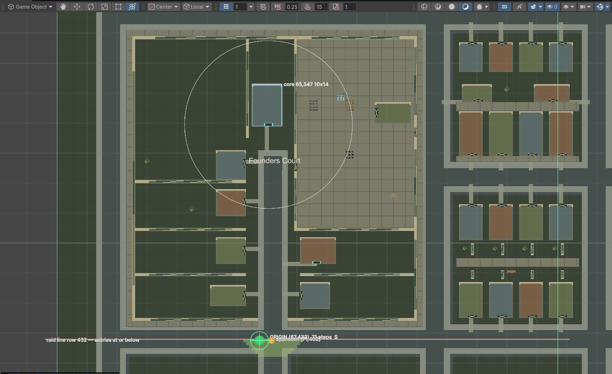
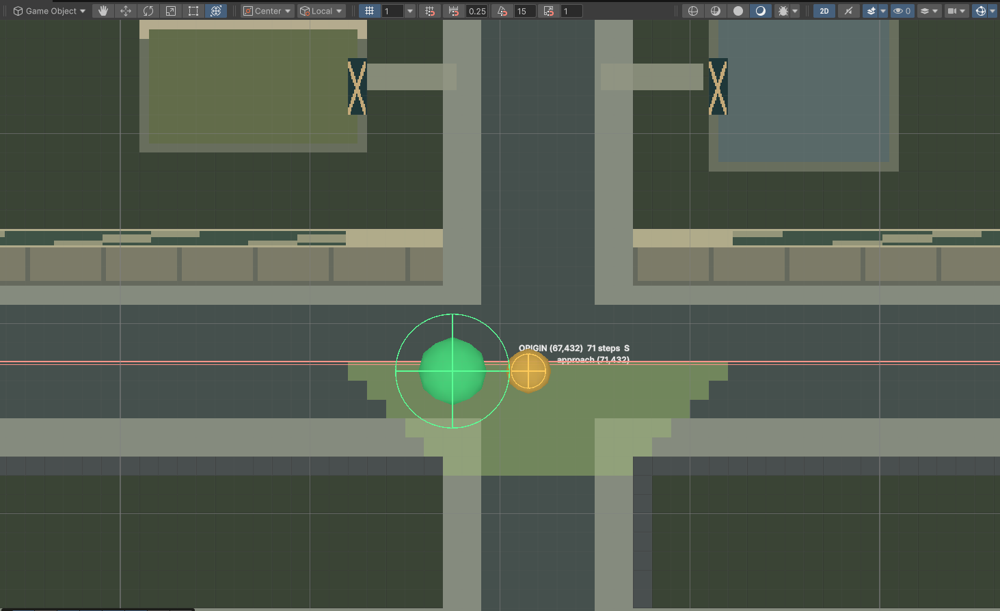

# Founders Court first-attack origin fix

Owner request 2026-09-18: *"Can you look at the first initial spawn and make sure it comes from the right area?"*, then, on the assessment, *"Do it. Use gizmos where you can"*. Work run 2026-09-18/19 against the open Editor (Unity 6000.6.0f1, project `Unity/Relight`, scene `Assets/Relight/Scenes/World.unity`). Nothing is committed. Decisions: court D54 (`FOUNDERS-COURT-DECISIONS.md`), U-D-RAID-01 (`DECISIONS.md`).

## 1. What was wrong

Measured with the sim's own director rules on a fresh new game (seed 1) compiled from the live scene:

| Quantity | Before | After |
|---|---|---|
| Raid field rows (core at (65,347), 10×14, last row 360) | 347..417 (70-tile box from the core's top-left) | 259..448 (88 beyond every edge) |
| Field steps at the raid line, row 432 | −1 (unreached) | 71 |
| Legal entry tiles (tier 0 / 1 / 2) | 0 / 0 / 0 | 0 / 90 / 0 |
| `DirectorRules.Origin` | (62,347), inside the court, 3 tiles west of the workshop, "north-west", 24 steps | (67,432), on the south ring road at the mouth, heading S, 71 steps |
| `Staging` for that origin | −1, so `Threat.ScheduleGroup` fell back to the raw origin | (67,432) |
| Debug raid, 5 bodies, where born | inside the compound | (67,432) (67,431) (68,432) (67,433) (66,432), about 72 tiles from the engineer at (70,360) |

Two faults combined. `RaidField.Build` clipped the breadth-first field to a 70-tile box measured from the core's top-left tile, so with the court raid line 72 rows below the core's last row (D19, row 432) no tile at or below the line ever received a distance. `DirectorRules.Origin` then had no tile with a real tier, but its loop still accepted a tile whose tier was `int.MaxValue` when nothing better had been seen, and returned the cheapest interior tile. The reference never met this because its raid line (`homeRaidY` 391) sat within 70 rows of the core. `GAMEPLAY_FUN_AUDIT.md` §1 item 3 ("the raid line sits below every candidate origin, so staging fails and the assault silently vanishes") is the same root cause seen from the major assault.

Tier 0 stays at zero on this map by design: the reference's preferred 20–60 step window ends before the mouth (C13 measures the walk core → mouth at 66 steps), so the court's raids use the 12–76 tier. That is the D19 layout, not a fault.

## 2. Code changes

`Unity/Relight/Assets/Relight/Sim/Combat/Director/RaidField.cs`
- `public const int Reach = DirectorRules.EntryFarSteps + 12;` (88). `Build` now clips the field to `Reach` tiles beyond every edge of the seed rect (`x - Reach .. xLast + Reach`, same for y), replacing `const int Box = 70` from the top-left. A raid line anywhere inside the entry band is therefore inside the field on every map. Doc paragraph "DIFFERENCE FROM THE REFERENCE (behaviour, 2026-09-18)" records why.

`Unity/Relight/Assets/Relight/Sim/Combat/Director/DirectorRules.cs`
- `Origin`: `if (tier == int.MaxValue || tier > bestTier) continue;` so a tile that is not an entry tile is never chosen. An impossible map now returns −1 (no group is scheduled) instead of an interior tile. `Approaches` already guarded this. Doc paragraph dated 2026-09-18 explains the (62,347) case.

`Unity/Relight/Assets/Editor/FoundersCourtCompound.cs`
- Verify check **C20 first attack origin**: compiles the scene, builds `ImportedGeometry` + `SimContext` + `Simulation.NewGame(ctx, 1)`, and fails when the raid line is beyond `RaidField.Reach` from the core's last row, when `Origin` is not an entry tile, is above the raid line, or is inside the block, or when `Staging` fails. Detail line: `origin (67,432) 71 steps heading S staging (67,432); raid line row 432 is 72 rows below the core's last row (field reach 88)`. Summary now reads "… of twenty checks".

`Unity/Relight/Assets/Relight/Tests/Sim/Combat/Director/RaidOriginTests.cs` (new, `Relight.Sim.Tests.Combat`)
- A 220×220 open map with an 8-tile core at (100,40) and the engineer spawned just south of it (the shared `RaidFixture` puts the engineer at the map centre, whose 28-tile safety ring rejected every candidate, which is why the first run of the test failed at −1; the fixture itself is unchanged).
- `TheOriginIsBeyondARaidLineSeventyTwoRowsBelowTheCore`: field reaches the line row, origin ≥ 0 at or below the line, `EntryTile` true, `Staging` = origin, every approach at or below the line.
- `AnUnreachableRaidLineYieldsNoOriginRatherThanAnInteriorTile`: raid line at `EntryFarSteps + 20` rows → `Origin` −1, `Approaches` empty.
- `TheFieldBoxExtendsReachTilesBeyondEveryEdgeOfTheSeed`: box edges at `−Reach` / `last + Reach` (clipped at 0), one tile past reads −1.

`Unity/Relight/Assets/Editor/RaidDirectorGizmo.cs` (new) — see §4.

## 3. Checks run

| Check | Result |
|---|---|
| `recompile` / `recompile_status` after each edit | completed, `compilationFailed` false, no errors |
| `run_tests --mode editor --filter_type testName --filter RaidOriginTests` | 3 / 3 passed (after the final wording edits) |
| `run_tests --mode editor --filter_type assembly --filter Relight.Sim.Tests` | 644 / 644 passed (after the final edits) |
| `Relight/Founders Court/Verify` | 20 / 20 PASS, C20 as quoted above |
| Birth probe (`Unity/Relight/Temp/fc_birth_probe.cs`, ignored): new game on the live scene, `DebugAllowed`, `DebugRaidCommand(5, true)` | five bodies born at (66..68, 431..433), all at or below the raid line, minor group heading S |
| Play Mode run of the actual introductory attack | **not run**; the probe exercises the same `Origin` → `Staging` → `ScheduleGroup` path with a debug raid |
| Major assault timing on this map | **not replayed**; only `Origin`/`Staging` resolution was confirmed |

## 4. The Raid Director gizmo

Menu `Relight/Gizmos/Raid Director` toggles it (EditorPrefs `Relight.RaidDirectorGizmo.Enabled`, checked when on) and recomputes; `Relight/Gizmos/Raid Director: Recompute` recomputes on demand. In Play Mode it reads the live `SimHost` simulation and refreshes every half second when the tick moves; in Edit Mode it compiles the scene and builds a seed-1 new game, and the snapshot is logged to the Console (`Raid Director gizmo: Edit Mode, new game | core 65,347 10x14 | raid line row 432 | field box rows 259..448 (reach 88) | entry tiles 0/90/0 by tier | origin (67,432) 71 steps S | approaches 1 (71,432)->(71,432)`). It draws through `[DrawGizmo]` on `SceneWorld`, so the Scene view's Gizmos toggle must be on.

What it draws, at z −8.5 in the tile-to-world mapping `(x + 0.5, −(y + 0.5))`:

- green wire box: the raid field's extent, labelled with its rows and reach, and "field ends" under its last row;
- translucent fill on every legal entry tile: green tier 0 (20–60 steps), lime tier 1 (12–76), amber tier 2 (8–76);
- blue wire box: the core rect, labelled;
- red double line: the raid line row, labelled "entries at or below";
- grey disc: the engineer's 28-tile safety ring;
- orange spheres: approaches, joined to their staging tile;
- the origin: a green sphere when legal, red when not, labelled with tile, steps and heading; "ORIGIN: NONE" when the director has none.

Capture note: the CLI's `capture_scene_view` renders the Scene camera without gizmos or Handles labels, so those two images are the real Scene view read back with `InternalEditorUtility.ReadScreenPixel` after `SceneView.LookAt`, in a separate eval so the view had repainted. The first mesh version was invisible until the quads were given explicit normals and both windings.

## 5. Gaps and residue

- Tier-0 (20–60 step) entries do not exist on this map; if the owner wants the reference's preferred window the raid line or the entry window would have to move (a design call, not made here).
- The gizmo's Edit-Mode snapshot is seed 1 with the engineer at spawn; the safety ring moves with the engineer in Play Mode only.
- `Unity/Relight/Temp/*.cs|*.png` probe and capture scratch files are ignored by git and left in place.
- `Assets/Temp` and its two gizmo-less captures were deleted through `AssetDatabase.DeleteAsset`; nothing remains under `Assets/Temp`.
