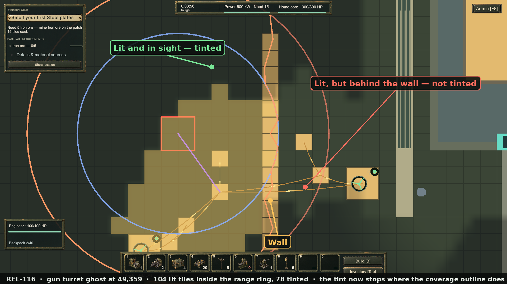

# REL-116 — the placement tint stops at the wall

**Built 2026-09-23.** Automated evidence and one Play Mode capture. No human has played this build;
no owner acceptance is recorded.

## What was wrong

`LightPreview.LitWithin` returned every lit tile whose centre fell inside a turret's range circle, with no
line-of-sight test. The coverage outline drawn over the same ghost *does* test sight, so a turret tucked
beside a building promised lit ground it could never fire at — tinted street outside its own outline.

## What changed

`LightPreview.LitVisible(ctx, st, in cover)` is `LitWithin` with everything the gun cannot see knocked out:
a tile survives when it is inside the wedge between the two swept rays that bracket it (the shorter of the
two, so nothing is tinted outside the outline drawn from that same sweep) **and** when `Sightline.Clear`
agrees — the rule the turret itself fires by. With nothing in the way every ray reaches the full range, so
the tint is exactly what it always was.

`PlacementPreviewPresenter.Range` now calls it with the sweep it already took for this ghost, and its tint
cache keys on `SimState.Rev` as well as the light, because the tint now follows the world too.

## The capture

`tint-stops-at-the-wall-raw.png` is the unedited 1920×1080 Game view frame; the file above is that frame
with three labels and a caption drawn on afterwards. Nothing in the game's own pixels was altered.

A gun turret ghost stands at 49,359 with a wall column at x=55 and a powered lamp on each side of it. Both
sides of the wall are lit. The warm tint fills the near side and stops dead at the wall; the lit ground
behind it is left plain, and the salmon coverage outline notches inward along the same edge. Live figures
from that frame: **104 lit tiles inside the range ring, 78 tinted** — the 26 the turret cannot see are gone.

The scene was set up by an editor script that inserted the walls, lamps, poles and fuelled generators
straight into the running state and called `PlacementPreviewPresenter.Show` with `WorldInput` disabled, so
the ghost would hold still for the shot. That is capture tooling, not a player path: no game rule was
changed for it.

## Checks

| Suite | Result |
| --- | --- |
| Offline sim tests | 910 passed, 1 skipped |
| EditMode | 1006 / 1006 |
| PlayMode | 96 total — 91 passed, 0 failed, 5 skipped |

Two new sim tests carry the contract: `TheTintStopsAtTheWallEvenWhenTheGroundBehindItIsLit` (a turret beside
a wall with lit ground behind it — nothing tinted is out of sight, and the wall costs the tint something)
and `WithNothingInTheWayTheTintIsUnchanged`.

## Limits

- The assistant has not played this build; the capture is a staged frame, not play.
- The tint is conservative at the very edge of the sweep: a tile is rejected when it is further out than the
  shorter of the two rays bracketing it, so a tile sitting between two rays of unequal reach can be dropped
  even though a ray straight at it would have cleared. That is deliberate — it keeps the tint inside the
  outline — and it costs nothing on open ground, where every ray reaches the full range.
