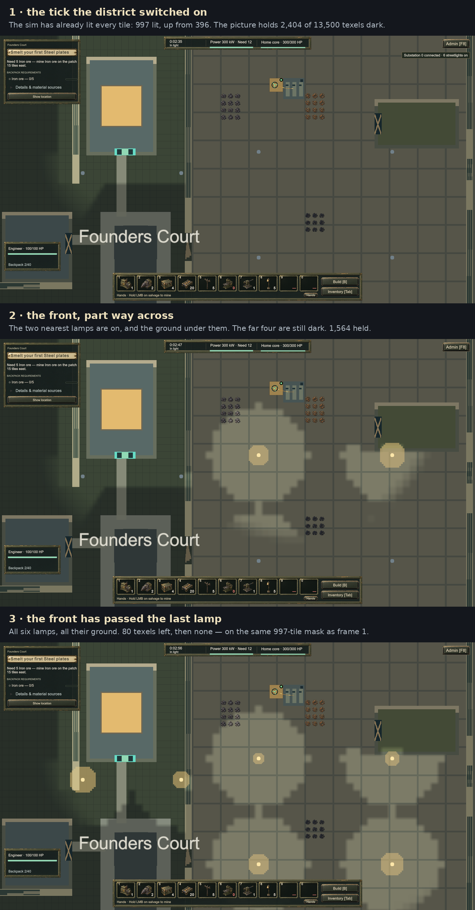

# REL-117 — the ground lights in step with the lamps

**Built 2026-09-23.** Automated evidence and one slowed Play Mode capture. No human has played this build;
no owner acceptance is recorded.

## What was wrong

When a substation's circuit went live, `CityPresenter.SweepDistricts` staggered the lamp *heads* outward from
the substation at 30 tiles a second — but the darkness overlay redrew the sim's new mask whole, so the whole
district's ground went bright in one frame, under lamps that had not come on yet. The two halves of the same
moment disagreed. Found by REL-58.

## What changed

`Sim/UI/LightSweep.cs` holds the timing rule, next to `DarknessLook` and picture-only like it: a front leaving
the substation at `TilesPerSecond` (30 — `CityPresenter` now takes its own speed from this one constant) with
`EdgeTiles` of soft edge, and `Hold(distance, elapsed)` saying how dark a tile is still drawn.

`LightingPresenter` keeps a copy of the last stamped mask, so when a `DistrictLitEvent` arrives it can mark the
tiles that build *newly* lit and hold only those — ground that was already lit never flickers. While the sweep
runs the overlay recomposes every frame, which is the one thing that breaks its cache, and it stops as soon as
the front is past the district's furthest new tile.

**Picture only.** The sim lights the district on one tick, as it always did; turret sight, alien hesitation and
every other reader see the whole district at once.

## The capture

`Time.timeScale` was set to 0.05 for the capture, which slows the drawn sweep (it runs on `Time.time`, as the
lamp heads do) — the simulation keeps its own clock, and its lit mask holds still at 997 tiles through all
three frames. The three `*-raw.png` files are the unedited 1920×1080 Game view frames; the sheet is those
frames scaled with a caption strip drawn above each. Nothing in the game's own pixels was altered.

| Frame | `LightingPresenter.Held` | Sim's lit tiles |
| --- | --- | --- |
| Before the switch | — | 396 |
| 1 · the tick it switched on | 2,404 of 13,500 texels | 997 |
| 2 · part way across | 1,564 | 997 |
| 3 · past the last lamp | 80, then 0 | 997 |

Substation 0 owns six streetlights spread 32 tiles, so the sweep takes 32 ÷ 30 ≈ 1.1 s at normal speed. The
scene was set up by an editor script that dropped a fuelled generator beside the substation lot in the running
state and held the camera still. That is capture tooling, not a player path: no game rule was changed for it.

## Checks

| Suite | Result |
| --- | --- |
| Offline sim tests | 916 passed, 1 skipped |
| EditMode | 1012 / 1012 |
| PlayMode | 96 total — 91 passed, 0 failed, 5 skipped |

Six new tests: five in `Tests/Sim/UI/LightSweepTests.cs` for the front's speed, its soft edge, when a sweep ends
and the case where nothing new was lit, and `LightReliefTests.TheSimLightsTheWholeDistrictOnTheTickTheEventFires`,
which is the rule the picture must not touch — on the tick `DistrictLitEvent` fires, both the near lamp and the
far one are already lit in the sim's mask.

## Limits

- The assistant has not played this build; the capture is a staged, slowed frame sequence, not play.
- `Held` counts texels of the **visible** rectangle, not of the district, so it falls as the front crosses the
  screen and says nothing about ground off camera. It is a test and profiling readback only.
- REL-11 is untouched: the same `DistrictLitEvent` still fires again on a refuel, and the lamp heads still
  replay their stagger. The ground does not, because a replayed event lights no new tile and a sweep with
  nothing new to show takes no time.
