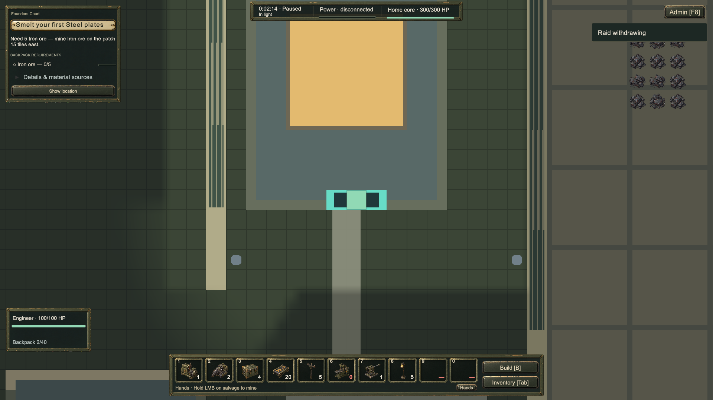

# REL-12 — every warning kind says its own words, and an announced large raid is never hidden

**Built 2026-09-23.** Automated evidence and three Play Mode captures. No human has played this build; no
owner acceptance is recorded.

Linear REL-12, verbatim title: *INT-08: "Base under attack" for five minutes after the attack*. Acceptance:
*tests pin the text for every warning kind*, plus the ENM-06 acceptance appended to the same row: *the warning
line counts down and changes to a present-tense line on arrival; an announced large raid is never hidden by a
live small one. Covered by a sim test on `Warning()` for both cases.*

## The premise, checked first

The headline defect — five red minutes of "Base under attack" after the fighting stopped — was **already
fixed**, by REL-74, which gave recovery its own branch and stopped the director's stale countdown printing
over a live fight. Read before touching anything, so this row is what was genuinely still open:

| Still open | What the player saw |
| --- | --- |
| The zero-second warning | A raid whose countdown has reached 0 but whose bodies have not spawned yet fell past every branch to **"Base under attack"** — a fight that was not happening. |
| A withdrawal's stale notice | `withdrawal` printed `Director.Notice`, which at that moment is as often as not the countdown that *brought the raid in* ("Raid inbound from E in 30 s."), in red, over a raid walking away. |
| A large raid behind a small one (ENM-06) | `Warning()` returns the small raid when one is live, so an announced **major assault** vanished from the strip until the small one finished. |
| The acceptance itself | No test pinned the text per kind, so any of these could come back silently. |

## The rule the fix is built on

One sentence decides every line: **the strip describes the STATE the sim is in, and is red only while
something is attacking.** The director's own sentence is printed in exactly one place — the recovery line —
where there is no fight to describe and that sentence is the account of the one just finished.

Nothing is lost by taking the notice off the other lines: what the director says at the *end* of a raid is
said again through the recovery line moments later, and `Director.Notice` reaches the player nowhere else.
Checked by grep across the whole project: `HudViewModel.ThreatLine` is its only player-facing reader;
`RaidNoticeEvent` feeds `AudioCueRouter` and `AutosaveScheduler`, neither of which shows text.

## What changed

| File | Change |
| --- | --- |
| `Sim/Combat/Director/DirectorQueries.cs` | `RaidWarning` gains `AlsoKind` ("warning" / "assault" / "") and `AlsoSecondsLeft` — the large raid the line is *not* describing. `Warning()` fills them in the small-raid branch, from `Director.Major` when it is not retreating. Which raid the line and the arrow follow is unchanged; the second raid rides alongside. |
| `Sim/UI/Hud/HudViewModel.cs` | `warning` at zero seconds gets its own present-tense line, "… arriving now · from the E". `withdrawal` is described from state — "Raid withdrawing", not red — instead of printing the notice. `recovery` stays the one line that prints the notice. Every line that describes a small raid appends the large-raid tail. The final fall-through returns the plain "Base under attack" and never the director's sentence. |

The six kinds, end to end:

| Kind | Line | Red |
| --- | --- | --- |
| *(none)* | *(empty)* | — |
| `warning`, counting down | `Raid approaching from the E · Arrives in 30 s` | no |
| `warning`, at zero | `Raid arriving now · from the E` | yes |
| `minor raid` | `Raid attacking · from the E` | yes |
| `assault` | `Major assault · wave 1 of 3 · from the S` | yes |
| `withdrawal` | `Raid withdrawing` | no |
| `recovery` | the director's own sentence | no |

And the tail, on any small-raid line: ` · Major assault in N s` while the large one counts down,
` · Major assault under way` once it lands, nothing when there is none or when it is retreating.

## The captures

Same save, same camera, three staged director states, each read straight off the running `HudViewModel`.

| | State | Strip |
| --- | --- | --- |
|  | small raid on the ground from the east, major assault announced 120 s out | **Raid attacking · from the E · Major assault in 120 s** — red, with the east arrow labelled "Raid". This is the ENM-06 case: before the fix the strip said only "Raid attacking" and the announced assault was invisible. |
|  | the same raid set to retreat, `Notice` still holding "Raid inbound from E in 30 s." | **Raid withdrawing** — calm, not red. Before the fix this printed the stale countdown in red. |
|  | both raids cleared, `RecoveryUntil = T + 300 s`, `Notice` = "The assault has broken off." | **The assault has broken off.** — calm. The one line that prints the director's sentence, for the row's own five minutes. |

The game is paused for each frame (the HUD says so, next to the clock). `SimHost` ticks on
`Time.unscaledDeltaTime`, so `timeScale = 0` does **not** hold a staged state still — an earlier attempt drifted
three seconds and the staged small raid was cleared before the shutter. Only `SimHost.Paused` stops the clock,
and pausing normally opens the pause menu over the strip, so the menu's own `_wasPaused` is pinned and its
overlay hidden for the capture. Nothing in the game's own pixels was altered.

## Checks

| Suite | Result | Before |
| --- | --- | --- |
| Offline sim tests | 918 passed, 1 skipped | 916 passed, 1 skipped |
| EditMode | 1014 / 1014 | 1012 / 1012 |
| PlayMode | 97 total — 92 passed, 0 failed, 5 skipped | unchanged |

Two new tests in `Tests/Sim/UI/RaidFeedbackTests.cs`:

- `EveryWarningKindHasItsOwnWords` — the acceptance criterion. Walks one state through "" → `warning`
  counting down → `warning` at zero → `minor raid` → `withdrawal` → `recovery` → `assault`, asserting both the
  text and the red flag at each step, with a stale countdown left in `Director.Notice` throughout so a line
  that leaks it fails.
- `AnAnnouncedLargeRaidIsNotHiddenByASmallOneOnTheGround` — ENM-06. Asserts `Kind == "minor raid"` with
  `AlsoKind == "warning"` and the exact seconds, the composed line, the same for a small raid still counting
  down, then the "under way" form once the major's second arrives, then that a retreating major drops the tail.

## Limits

- The assistant has not played this build. The captures are staged director states in a loaded save, not a
  raid that happened.
- The three PlayMode failures that appear when the suite is run in a different order (DroppedCargo
  E-collect, OpeningUi U6, EscapeCancelsRepair) are the known order-dependent ones and are unrelated to this
  row; the run recorded above is the standard order.
- The tail names the large raid "Major assault" in both forms. It does not carry the assault's direction or
  wave count — the line belongs to the small raid in front of the player, and the full assault wording takes
  over the moment the small one ends.
- Only the words changed. Which raid the strip and the arrow follow, when raids are scheduled, and everything
  the director does are untouched.
