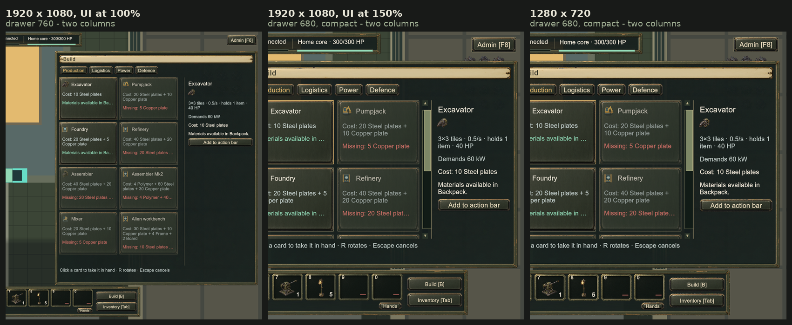

# REL-120 — the Build menu keeps two columns, and the stat line stays inside the pane

**Built 2026-09-23.** Automated evidence and three Play Mode captures. No human has played this build; no
owner acceptance is recorded.

## What was wrong

Found by REL-58. At 1920 with the UI at 100% the Build drawer is 760px and the catalogue showed two columns,
as U-D-55 intended. Everywhere else it did not:

- `GameplayDock` adds `compact-ui` when the panel resolves under 1100×800, which **both** 1280×720 and 1920
  with the UI at 150% do, and `industrial.uss` narrows the drawer to 680 there.
- Measured in the running game with the old sizes forced back on: the detail pane took 260 + 16 margin and
  left the grid **358px**. A host asks for `flex-basis: 50%` — 179 — which its own 200px floor raises to 200,
  and two of those want 400, so the grid wrapped to **one column of 200px with 158px of the row left empty**.
- The detail pane's stat line — "3×3 tiles · 0.5/s · holds 1 item · 40 HP" — used the shared `.panel-sub`
  class, which sets a size and a colour and **no** `white-space`. On one line that text is 269px wide; the
  pane's text column is 241px at 1920 and 181px in compact, so it drew 24px and 84px past the panel's inner
  edge. That one was true at all three sizes, 1920 included.

## What changed

Three rules, all in the style sheets; the card itself is untouched.

| File | Rule | Why |
| --- | --- | --- |
| `UI/Styles/industrial.uss` | `.compact-ui .build-detail { width: 200px; margin-left: 8px; }` | The pane beside the grid is narrower when the drawer is. That takes the grid from 358 to 426 — enough for the second column. |
| `UI/Build/BuildPanel.uss` | `.build-host { flex-grow: 1 }` (was `0`) | A row that can still hold only one host is *filled* by it instead of left half empty. A row holding two is unchanged: two 50% bases are the whole row, so grow has nothing to hand out. |
| `UI/Build/BuildPanel.uss` | `#build-panel .panel-sub { white-space: normal }` | The stat line wraps inside the pane. Only the short names — `.card-name`, `.card-status` — stay `nowrap` with an ellipsis, where the grid's shape is the thing being protected. |

## The captures

The three `rel120-*.png` files are the unedited Game view frames; the sheet is the right-hand half of each,
scaled, with a caption above. Nothing in the game's own pixels was altered. Same save, same tab
(Production), same selection (Excavator) in all three.

### The grid

Measured off the live panel's `worldBound`, not eyeballed:

| Size | `compact-ui` | Panel | Detail pane | Grid | Columns | Host | Row left empty |
| --- | --- | --- | --- | --- | --- | --- | --- |
| 1920 × 1080, UI 100% | no | 760 | 260 | 452 | 2 | 226 × 168 | 0 |
| 1920 × 1080, UI 150% | yes | 680 | 200 | 426 | 2 | 213 × 168 | 0 |
| 1280 × 720, UI 100% | yes | 680 | 200 | 426 | 2 | 213 × 168 | 0 |
| *before, compact* | yes | 680 | 260 | 358 | **1** | 200 × 168 | **158** |

The last row is the same running panel with the pre-fix sizes put back as inline styles and then removed
again — the before and the after read a frame apart on one screen, so nothing about the two states differs
except the three rules above.

### The stat line

A `nowrap` label keeps its box and draws the text past it, so the element's own bounds cannot show that
overflow; `MeasureTextSize` on an unconstrained width can. In the compact pane:

| Line | Column | Text on one line | Would run past the panel by | Now |
| --- | --- | --- | --- | --- |
| `detail-name` "Excavator" | 181 | 89 | — | 1 line |
| `detail-facts` "3×3 tiles · 0.5/s · holds 1 item · 40 HP" | 181 | 269 | **84** | 2 lines |
| `detail-power` "Demands 60 kW" | 181 | 119 | — | 1 line |
| `detail-cost` "Cost: 10 Steel plates" | 181 | 148 | — | 1 line |
| `detail-status` "Materials available in Backpack." | 181 | 228 | **43** | 2 lines |

At 1920 the column is 241 and only `detail-facts` overran, by 24px — which is why REL-58 saw it there too.
Every line's box now ends at 1244 against the panel's inner edge of 1248, and the two long ones stand at
45px high against a one-line 26px, which is the second line.

## Checks

| Suite | Result |
| --- | --- |
| Offline sim tests | 916 passed, 1 skipped |
| EditMode | 1012 / 1012 |
| PlayMode | 97 total — 92 passed, 0 failed, 5 skipped |

One new test, `PanelPlayTests.TheBuildGridKeepsTwoColumnsWhenTheDrawerIsNarrow`: it forces the compact width
(680) on the live panel and asserts at least two columns, the hosts reaching the grid's right edge so no dead
space is left, no label's box crossing the panel's inner right edge, and — the check that would actually have
caught this defect — that any line whose text is wider than its column either wraps or ellipses. It restores
the width and the class afterwards, so it leaves nothing behind for the tests that follow.
`PanelPlayTests.TheBuildCardsAreAllTheSameHeight`, the acceptance criterion, passes unchanged.

The test switches `HudController` off for that window and back on afterwards. Its dock repaints every frame
and sets `compact-ui` from the root's own resolved size, so on a large Game view it took the class straight
back off between the test adding it and the layout pass: the first version of this test passed at a 1280×720
Game view and failed at 1920×1080, which is a test that measures the editor's window rather than the sheets.
Both suites above were re-run after that correction, at a 1920×1080 Game view.

## Limits

- The assistant has not played this build; these are staged frames from a loaded save with the drawer open.
- The new Play test proves the compact case by setting the width directly. It does not drive Unity's own
  screen size, so the `compact-ui` class itself — the `resolvedStyle.width < 1100 || height < 800` rule in
  `GameplayDock` — is covered by the captures, not by the test.
- The test reads `resolvedStyle.textOverflow` for the ellipsis case and not `overflow`, which is not on
  `IResolvedStyle`. The two rules in this panel that ellipse set both together, so reading the one is honest
  here; a rule that set `text-overflow` without `overflow: hidden` would pass the test and still clip badly.
- The figures are the Excavator's. A machine with a longer stat line takes more lines, which the pane now
  has room for; a machine with a longer *name* still ellipses, by the same rule as before.
- The fix is sizes only. Which machines appear, their order and their costs are untouched.
