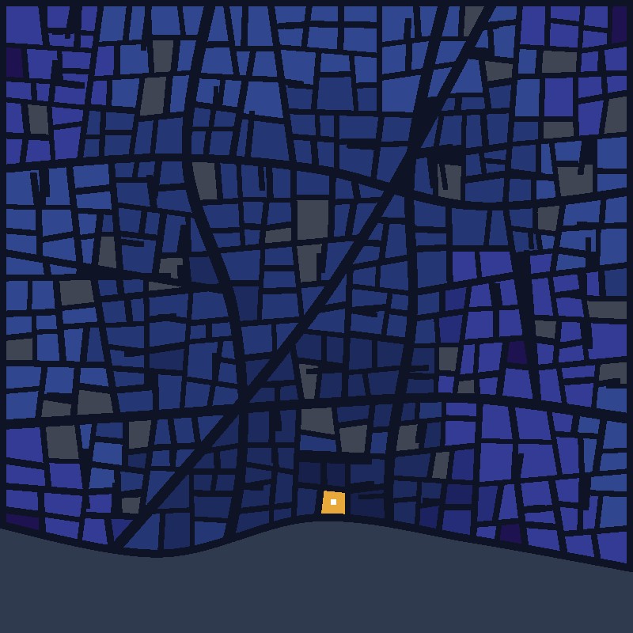
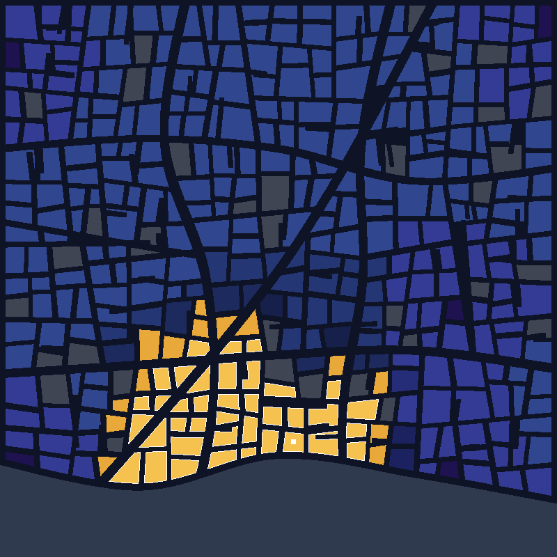
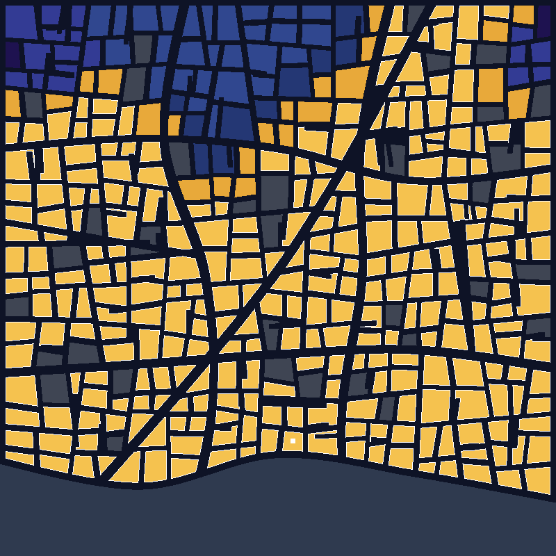

# RELIGHT — design concept

*2D top-down factory-automation game. Reclaim a dead city block by block; every block you take is front your factory has to feed.*

All numbers below are first-pass tuning targets. Where a number was checked against the throwaway front simulation (see section 25), it is marked **[sim]**. Everything else is a starting value for the prototype.

---

## 1. Name

**Relight.**

The verb is the whole game: you are not conquering the city, you are switching it back on. The title is also the name of the endgame event (section 16).

## 2. One-sentence hook

**"Factorio in a dead city: every block you take back adds front your factory has to feed, until you close the ring and the inside is yours for free."**

Refinement of the brief's line: it keeps "block by block" and "extends the front you have to feed", and adds the release valve (closing the ring) so the sentence contains both the cost and the reason to pay it.

## 3. Core fantasy

You are the engineer who came back, on foot, with a toolbelt and a rifle you would rather not use (D5). The city fell a long time ago; nobody is fighting over it, it is simply dark and something lives in the dark. You hold one lit block on the river with a generator, two turrets and a pile of rubble. You walk to the rubble and dig it, carry it to the workbench and turn it into wire and frames and bullets, and walk those to the next block's substation and power it. When its streetlights come on, the block is yours, and the block after it wakes up and starts sending things at you.

The fantasy is civic, not military. Turrets are plumbing. The thing you are proud of is a district where every lamp works and no turret has fired in an hour because there is nothing dark left to fire at. The picture the game is built around: a black block on the map, a substation you just powered, and a line of streetlights coming on one after another down the street you are standing in, while the rot on the pavement burns away around your boots. The rifle is for the minute the belt is late; the game is finished by people who never fire it.

## 4. Top-down presentation

**Grid.** 32 px tiles, orthographic, no elevation. The city is generated **streets first** (D6, §17): curved arterials, a bending river, one diagonal avenue and secondary streets that branch and dead-end are drawn as splines, 6–12 tiles wide, and every **block** is a face of that street graph: an irregular polygon of ≈ 20–50 tiles across with 3–7 neighbours, rasterised to tiles, whose buildable **lot** is the face's tiles inside the street edges. Two blocks are neighbours when they share a **street segment** (the stretch of street between them), and that segment is the front edge between them **[sim: rework-graph]**. A standard city is ≈ 500–600 blocks over ≈ 768×768 tiles, the river along one side; the 24×24 lattice of Phases 1–4 (32×32-tile cells, 8-tile streets, four neighbours each) is the *lattice era* and its runs are kept only as the baseline the rework's numbers are compared against (`REWORK_REPORT.md`). Roughly 8–10 % of faces are **inert**: river, embankment, collapsed overpass, plazas and parks. Inert faces cannot be built on and cannot hold rot.

**Two renderers, one data model.**
- *World view* (zoom 3× down to 0.5×, the slice's range, D-P4-1): the primary screen. The **engineer** is a sprite on the tile grid and the camera follows them; the map view is a key (**M**) and comes back to the engineer on M again. Machines are 1×1 to 8×8 tile sprites with a single idle/active animation each. Rubble is one tileset per rubble type with five density variants; a block's 250–350 rubble tiles are laid in three clusters, densest at the centres and denser on deeper blocks, and dig out thinnest-first as the block's pool drains **[sim: M1-tiles]**. Rot is a tinted overlay tileset with five density levels (0.05 steps of visible mottling) so "how bad is this block" is readable without a tooltip.
- *Map view* (M): each block is drawn as its polygon, the street segments between them as lines, the engineer as a white dot. This is where the front is read from mid-game on, and claims are placed from it; poles, machines and everything with a footprint are placed by the engineer within reach in the world view. It is not a minimap.

**Direct control (D-B1-5).** The layout is deliberately not Factorio's where it does not need to be. **WASD** moves the engineer directly (8-way, velocity input; machines, walls and the river are solid, belts and poles are not). **Shift** sprints at 1.6× walk on a stamina bar drawn under the engineer (≈ 4 s of sprint, ≈ 6 s to refill from empty); **Space** dodges, a 3-tile dash in 0.25 s that crawlers cannot touch, on a 1 s cooldown, for a fixed quarter of the bar. Sprint can never drain the bar below one dodge's worth, so a dodge is always there after sprinting into trouble; that rule is the whole point of having both. Stamina is a movement resource only and is never tied to anything survival-shaped (§22). There is no click-to-walk in the world view; in the map view a click on a Held or street tile sets a walk-here target that any WASD input cancels, the only auto-walk the player has. **Left-click does what the hand holds:** an empty hand mines (hold on rubble) or picks up; a building in hand places; the rifle in hand fires toward the cursor. Right-click with an empty hand removes with a full refund, with anything in hand clears it. **E interacts** (the chest, the workbench, a machine's panel, the truck, a survivor group) and never mines, places or fires. Tab or I opens the pockets, B the build menu (the hotbar 1–9 is its shortcut), R rotates, Q pipettes, the wheel zooms, M toggles the map, Esc closes anything. **The rifle is aimed at the cursor.** It is a hotbar item like any building: select it and it is in hand, and while it is in hand holding left-click fires toward the cursor and nothing can be mined or placed until it is cleared (Q, Esc or another slot), so shooting is a thing the player chooses to do, not something that happens while they build. The shot is a hitscan along the engineer–cursor line out to the turret's 9 tiles (no range advantage) with a 1.5-tile hit radius, so it is aim, not twitch; crawlers walk at 3 t/s and are easy to lead. No auto-target and no lock-on (§23). The constitution's "no reflexes" rule has exactly this exception: the rifle, sprint and dodge are the engineer's body, the only skill inputs in the game, and the game is completable without any of them **[sim: B-M1-body] [play: Gate B]**.

**Lighting.** A low-resolution light map (one texel per tile) multiplied over the world layer. Lit tiles are full colour; unlit tiles are desaturated and darkened to ~25 %. No shadow casting. This one overlay carries the whole "lights coming on" payoff and the Shade rule (section 7) and is the only lighting tech in the game.

**Map-view encoding (fixed vocabulary, learned in the first 30 minutes).**
| Thing | How it is drawn |
|---|---|
| Held block | Warm amber polygon |
| Interior block | Brighter amber, thin white border |
| Contested block | Amber flicker, rot mottling burning off from the substation outward |
| Dark block | Navy polygon, mottled; brightness of the mottle = rot density |
| Frontage edge | Red-orange bar along the shared street segment, as long as the segment, with **supply pips** at its middle: green ≥ 50 % of turret hoppers full, amber 10–50 %, red blinking = at least one empty hopper |
| Awake dark block | A ring at the polygon's centre that fills as its bloom timer counts down |
| The engineer | A white dot; the truck a white rectangle |
| Belts | Thin lines with moving dashes; empty segments dashed grey; a jam draws a static red marker at the stop point |
| Trams | Moving rectangles on the street lines |
| Facilities | Silhouette icon (foundry chimney, arsenal star, turbine hall) |
| Survivors | A small lit-window icon on the block |

**HUD, always on:** `Front 14 edges · Interior 6 · Power 2.1 / 3.0 MW · Shot 412 · Shells 30 · Steel 1,840 · Cu 620` for the Depot, and the engineer's own pockets beside it: `Carrying 12 / 40 · Shot 3`. Everything else (the ring order, the line's rates, the calibration counters) sits behind a debug key.

**Art scope.** One 32 px tile pass, ~40 machine sprites, 4 rubble tilesets × 5 variants, 1 rot overlay set, 3 enemy sprites with 4-direction walk, the engineer with a 4-direction walk, a knocked-down frame and a rifle pose, the truck, ~12 facility silhouettes, 1 light-map shader. Buildable by one artist and one technical artist over the project.

## 5. The front — exact rules

These are the rules the player learns by watching. Each is one sentence a player could say out loud after the first hour.

**Block states.** Every non-inert block is **Dark**, **Contested** or **Held**. A Held block with no Dark or Contested neighbour is **Interior** (a display state, not a fourth state). Inert blocks and the map boundary count as Held for adjacency. Two blocks are adjacent when they **share a street segment** (D6); a block has 3–7 neighbours, and blocks that only meet at a street corner never touch. On the lattice this was the 4-neighbour rule; every rule below is the same rule on the graph **[sim: rework-graph]**.

**Rot.** Every Dark cell has a rot density *d* in [0, 1]. Asleep cells (no Held/Contested neighbour) grow silently toward their district cap: *d* rises by `g · (dmax − d)` per second, so an untouched block reaches ~90 % of its cap in 34–67 minutes (outskirts fastest, civic slowest) **[sim: sanity]**. Rot cannot grow on a lit tile; a lit tile burns rot at 0.05/s. Only streets and lamp radii are lit: a Held lot is unlit buildable ground, burn-off (rule 4 below) clears the whole cell regardless, and rot never re-enters a Held block while its substation runs. "Lights out" means the substation has stopped; a lamp a crawler has eaten is an unlit gap (a shade corridor, section 7), not lights out.

**Waking.** A Dark block with a Held or Contested neighbour is **awake**. Awake cells bloom on a timer `T = 120 / (0.5 + d)` seconds (240 s at d = 0, 96 s at d = 0.75). A bloom spawns enemies on the block's street segments facing the player (every front edge of the block, its arrivals counted per edge) and drops *d* to `max(0.05, 0.9·d)`. Both numbers are locked at these values (C8, D-P3-5): Gate A passed without a feel verdict on the rhythm, so the slice encodes them deliberately and Phase 4's playtests are the first place they can move **[play: Gate A]**. Between blooms *d* regrows, so each awake cell settles at a district-specific steady state (section 7).

**How a block becomes Held.**
1. Every city block has a pre-existing 3×3 **substation** on the buildable tile nearest its lot's centroid (D-B1-4; a face too thin for 3×3 gets a 1×1). The claim tool highlights it. Tooltip: `Claim — 10 wire, 5 frames · rot 31 % · front +2 · closes 1`.
2. You connect it with power poles to a powered substation you already hold (poles have reach 8; substations never auto-link across streets). The instant it draws power the cell becomes **Contested**.
3. Contested does three things at once: the cell's pre-existing streetlights come on (they stand on the kerb, one every 4 tiles along each of the block's street segments, so a segment's count follows its length — D-B1-4; some are broken — those gaps are yours to fill with lamps); the rot begins burning off from the lamps outward; and the cell fires a **wake bloom** of twice its normal size, immediately (a wake bloom costs 62 rounds against 34 for a steady bloom on civic, 84 vs 49 on residential, 120 vs 71 on industrial, the 40-crawler cap biting on the denser blocks) **[sim: E3-compact-shade0.3-hulk0.5]**.
4. Burn-off takes `20 + 60·d` seconds (38 s at d = 0.3, 80 s at d = 1.0). When it finishes, the cell is **Held**: you can build on its lot, its rubble patches are minable, and its facility or survivors (if any) activate.

**Frontage.** The front is a count: `F = number of (Held, Dark-or-Contested) pairs that share a street segment`. Each pair is one street segment you must cover, 20–50 tiles long (32 on the lattice). The HUD shows F. A block's claim tooltip shows how F will change: `front +N` is the block's dark neighbours minus its held ones, so with 3–7 neighbours N runs from −7 (filling a hole in a big block) to +5 (a seven-neighbour block on an open side), where the lattice ran −4 to +2; a claim that reads `front +4` is the graph's way of saying "a big block on an open side", and the same block from its other side may read `front +1`.

**What one frontage edge costs.**
| Item | Per edge (a 32-tile segment; real segments are 20–50) | Per tile |
|---|---|---|
| Per-block variance (D6) | a block's edges vary 20–50 tiles and its neighbours 3–7, so a block's front cost varies about 2× by segment length and 2× again by neighbour count **[sim: E-variance]** | — |
| Gun turrets (range 9) | 2 (1–3 by segment length) | 1 per 16 tiles of segment length, at least one a segment (D-B1-4: the HQ's start turrets are placed by this rule on each segment's front ring, a corner sliver too short for its own covered by the neighbouring segment's turrets that reach it) **[sim: B-M1-start]** |
| Lamps to plug broken streetlights (avg) | 3 × 5 kW | — |
| Ammo, residential steady state | 1.3 magazines/min **[sim: E3-block]** | 0.04 mag/min |
| Ammo, industrial steady state | 1.8 magazines/min **[sim: E3-block]** | 0.06 mag/min |
| Ammo, outskirts steady state | 4.3 mag/min + 2 shells/min **[sim: E3-block]** (4.0 + 1.8 per edge over 25 h of compact play **[sim: E9-district]**) | 0.13 mag/min |
| Substation draw, Contested or Held block with any dark neighbour | 100 kW **[sim: E4h]** | — |
| Substation draw, interior block | 20 kW **[sim: E4h]** | — |

A held block touching three dark blocks costs three edges of turrets and ammo but only one substation. That asymmetry is the reason compact shapes are cheap. **Machine slots** (D6): a Held block's lot has one machine slot per ≈ 600 buildable tiles, at least one (GAME-ASSUMPTION, §25 item 17), so a big block is worth more than a small one for the same substation and the same edges; the lattice gave every lot exactly one. A block's rubble pool scales with its area the same way. Measured over five hours of compact play, wake tails included, a residential edge averages 1.8 mag/min and a civic edge 1.1 **[sim: E3-compact-shade0.3-hulk0.5]**.

**Enclosure.** When the last Dark/Contested neighbour of a Held block becomes Held, the block is Interior: its substation drops to 20 kW, its turrets have nothing to shoot at and can be picked up, and its streets are free ground. Belts you laid along its front streets stay and become trunk lines.

**What a wave looks like.** Not a wave. Each awake block blooms on its own timer; timers are interleaved by the spawner so no two adjacent blocks bloom within 10 s of each other (interleaving changes the compact policy's five-hour ammo by 0 %; it is a feel rule, not a cost rule) **[sim: E7]**. A bloom is 4 + 36·d crawlers **[sim: E3-block]** arriving in a 15-second stream on the street segment, plus shades and a hulk above the density thresholds in section 7; a wake bloom is double that, capped at 40 crawlers after doubling (a normal bloom never reaches the cap; it trims a well's wake bloom from 198 to 170 rounds **[sim: wake-cap]**). From the player's seat a front of 20 edges is a steady patter of small fights, one every few seconds somewhere on the line, not a siren and a horde.

**How a block falls.** A Held block falls only when its substation stops. Four ways: brownout (grid demand > supply for 20 s; machines shed first **[sim: M3-rates]**, then substations in order of most-dark-neighbours first **[sim: E2-matrix]**), a **shade** reaching the substation (disables it for 30 s per shade, stacking), a **hulk** smashing it (600 HP, it walks through barricades and turrets to get there), or **crawlers** reaching it unshot: 40 arrivals stop it (the counter is per block across all its edges, so a corner block with two dark edges fails faster than a block with one), which on a residential edge whose hoppers have run dry is about 5 minutes after the pip went red (2–21 across seeds) **[sim: E1-starve-substation-N40]**. Lights out → rot creeps in from every dark edge at 1 tile per 3 s → **90 s after the substation stops** the block is Dark again at d = 0.3, wherever the substation sits on the lot (the rule; the sim's fall timings use it **[sim: E1-starve-substation-N40]**). With the 60 s refeed reset (D3; the sim's fall timings include it **[sim: E1-starve-substation-N40]**) that leaves a 30 s window in which the engineer running magazines to the failing block's turrets saves it, a play we want; the engineer can also stand on the segment and hold it with the rifle while the belt catches up (D5): a rifle kills a crawler in ≈ 2 s against a turret's 0.6 s, so one engineer is worth about a third of a turret and a red edge held by hand still bleeds arrivals. Measured: when one edge of a block runs dry with its belt 90 s away, the block holds with or without the engineer (0–7 kills, up to 70 HP lost); when the block's whole belt is 90 s away it falls in about 1.5 min to a **shade** at an unlit edge, and the rifle cannot save it because shades are untargetable off light (the turret rule the rifle inherits). The rifle's rescue is therefore the crawler edge, at 10 HP a kill, 62 HP a rescue on average and 90–145 HP on the hard ones, never a knock-down **[sim: E-rifle]**. The rule as it ships (D-P3-3): the unshot-arrival counter is per block, stops the substation at 40, and clears once every edge of the block has had a non-empty hopper for 60 s, which also restarts the substation if it is not shed; a rule that stopped at 10 or 20 arrivals loses the HQ at minute 8 and one that creeps rot in from an empty hopper falls in 2.8 min **[sim: E1-ring-substation-N10, E1-ring-substation-N20, E1-starve-creep]**. The rescue the player actually has (D-P3-2) is the 4–20 minutes of red pip before the fortieth arrival, and the 30 s after the substation stops is the second chance, not the first: in the prototype the bot that idles from the 3 h snapshot sees its first red pip about 5 minutes before its first loss, 75 real seconds at 4× speed **[sim: E1-starve-substation-N40] [play: Gate A]**. Machines on it are mothballed (greyed, contents kept). Belts and poles are never destroyed. Neighbouring Held blocks gain one frontage edge each, and while a power shortfall lasts that is a cascade: each shed front substation adds 80 kW of new front draw next door (160 kW when the cascade was measured at the old 200/40 kW draw), so a 15 % shortfall for 10 minutes cost 0–2 blocks (mean 0.7) under substation-first shedding and a 25 % shortfall 3–6 (mean 5); shedding machines first cost 0 and 0 **[sim: E2-matrix]**. Nothing cascades once supply is restored: no run under either shedding rule lost a block outside the shortfall window. **Retake** = re-power the substation → wake bloom → burn-off → everything un-greys. Rot is data, not damage; the punishment is the front you just re-grew, not lost buildings.

**Encircled dark blocks.** A Dark block all of whose neighbours are Held keeps blooming but has no growth input from other dark blocks, so it decays to its own cap alone; it is never a threat to more than its own 3–7 edges and you close it whenever you have the wire.

**Rot wells.** 4–6 blocks per map, the count the generator's validator enforces (always visible on the map as a darker throb) have `dmax + 0.3` and 4× growth, and lift the cap of blocks within 3 steps on the graph. A well dies when all of its neighbours are Held and it has bloomed for five minutes with no dark neighbour to feed it. Killing a well is the mid-game milestone (section 15). The enclosure rule is in the sim and never fires under any bot: the compact bot claims the well block itself between hours 3 and 22 at the §18 cadence (the first well at 7.6 h on the mean of seeds, inside §15's hours 6–9 where the lattice said 13–24 h), before it is ever enclosed, so wells are taken head-on rather than starved **[sim: E8-wells]**.

**Outskirt blocks.** No substation and no streetlights. To hold one you place a craftable **Substation** (Electricians survivor, section 8) and your own lamps **[sim: B-M3-unlocks]**. Same rules otherwise; the district cap is 1.0, so these are the hardest edges in the game.

**Start.** The HQ always sits against the river, so it has 3–4 land neighbours and the first enclosure is three or four claims, not a ring of eight; the generator's validator (§17) rejects a seed whose HQ has five.

## 6. The payoff moment

You have just linked a pole to the substation of a residential block north of the HQ. The map square flickers amber. In world view the substation hums, and the block's streetlights come on in sequence down the street at three per second, each one pushing back a circle of desaturation. Rot mottling on the pavement fades outward from every lamp. The wake bloom arrives at the same moment — eighteen crawlers streaming across the north street into your two turrets — so the lamps come on *while* the guns are firing, and the crawlers that reach a lit tile are visible for the first time. Forty seconds later the mottling is gone, the "Contested" flicker stops, and the lot turns from navy to amber on the map.

Ten minutes later you power the block to the north-east, the HQ's last dark neighbour. The HQ square gets a thin white border. Its two north turrets show "no targets" and you pick them up. The 8-tile street between the HQ and the new block, which for the last forty minutes had a turret line and a lamp line along it, is now just a street with a belt on it. That is the moment the game is selling: not the fight, the *afterwards*.

## 7. Threat

**Model chosen: creeping spread, not hordes.** Threat is a field (rot density per block) that the player's lights suppress locally and the player's expansion wakes. It is never on a clock. The rejected horde/timed-wave model is in section 23.

**The Rot.** Per-block density *d*. District caps and growth rates:

<!-- docsync:districts (generated from packages/sim; edit the .ts, then `npm run docsync`) -->
| District | Rubble type | dmax | g (per s) | Steady-state awake *d* **[sim: E3-block]** | Ammo per awake block **[sim: E3-block]** |
|---|---|---|---|---|---|
| Civic (halls, hospital, library) | stone/concrete | 0.30 | 0.0004 | 0.13 | 0.9 mag/min |
| Residential | copper | 0.45 | 0.0005 | 0.21 | 1.3 mag/min |
| Rail yard | coal | 0.45 | 0.0005 | 0.21 | 1.3 mag/min |
| Industrial | steel | 0.60 | 0.0006 | 0.29 | 1.8 mag/min |
| Outskirts | none (deposits) | 1.00 | 0.0008 | 0.50 | 4.3 mag/min + 2.0 shells/min |
| Within 3 blocks of a well | as district | +0.30 | ×4 | 0.54–0.78 | 5.3–8.7 mag/min + 2.1–2.6 shells/min |
<!-- /docsync:districts -->

Depth multiplier: `dmax × (1 + 0.3 · distance_from_start / 20)`, capped at 1.0, so the same district is ~30 % worse on the far side of the city (residential at ×1.3 depth: d 0.26 and 1.6 mag/min against 0.21 and 1.3) **[sim: E3-block]**. Steady-state values and the ammo column are the equilibrium of 10 % drop per bloom against regrowth over one timer, stepped for an isolated awake block **[sim: E3-block]**, and the densities match the sim's observed mean awake densities of 0.24–0.34 across policies **[sim: E7]**.

**Three enemies, each a logistics failure made visible.**

<!-- docsync:enemies (generated from packages/sim; edit the .ts, then `npm run docsync`) -->
| | Crawler | Shade | Hulk |
|---|---|---|---|
| Footprint / speed | 1 tile, 3 t/s | 1 tile, 2 t/s | 3×3, 0.8 t/s |
| HP | 12 (3 Shot rounds) | 40 (10 Shot rounds) | 600 (Shot does 1, Shell does 60 → 10 shells) |
| Appears | every bloom | 1 per 8 crawlers when d ≥ 0.3 **[sim: E3-block]** | 40 % of blooms when d ≥ 0.5 **[sim: E3-block, E9-district]** |
| Targets | nearest lamp, then turret, then the substation (40 unshot arrivals stop it); the engineer only when shot or blocked by them (D5) | substation (disables 30 s each, stacking) | barricade → turret → substation |
| Special | none | **untargetable on unlit tiles** | walks through barricades at 1 per 4 s |
| Punishes | ammo throughput and hopper distribution: an edge left unfed loses its block in about 7 min (4–20 across seeds) **[sim: E1-starve-substation-N40]** | light coverage: a single unlit gap in a street is a corridor to the substation | frontage length: one long thin front has nowhere with enough Cannons |
| The player sees | red supply pip, hoppers empty, crawlers eating lamps | a block goes dark with full hoppers and no visible fight | a 3×3 shape walking through a turret line that is plinking at it |
<!-- /docsync:enemies -->

**Retaliation (D5).** The rot does not know the engineer is there. A crawler keeps its chain (nearest lamp, then turret, then the substation) and turns on the player only when shot by them or when the player stands in its path; a shade and a hulk never retarget at all. A crawler that has turned on the player hits for 5 HP a second at arm's reach (GAME-ASSUMPTION; §25 item 18); the engineer has 100 HP, regains it at 5 HP/s after 5 s out of contact, and at zero is knocked down and respawns at the HQ with their inventory intact, no other penalty. Rot on the pavement and Dark blocks do nothing to the player: the engineer walks anywhere. The rifle fires Shot magazines from the engineer's pockets at turret rules: 1.5 rounds a second, so a crawler (12 HP, 3 rounds) takes ≈ 2 s against a turret's 0.6 s, shades are untargetable on unlit tiles, hulks take 1 damage a round and are only slowed, and the rifle's range is a turret's 9 tiles, no more. One upgrade at the Arsenal (a second barrel: 1.4 s a crawler). The game is completable without firing a round; the rifle exists for the rescue in §5, and a bot that never fires loses the same blocks as one that does **[sim: E-rifle]**.

Wake blooms cap at 40 crawlers so the ammo maths stays bounded: the biggest single fight in the game is 40 crawlers and 5 shades, 170 rounds against a 100-round hopper **[sim: wake-cap]**. Shades only show the player a corridor, they never bypass a lit street; the fix is always "put a lamp there". Hulks force Cannons (Arsenal, section 8) and Shells (coal in the recipe), which is the only reason the coal chain touches the front.

**What threat scaling feels like.** Civic blocks are the soft way in; residential is the default; industrial is where the steel is and where shades become constant (deep industrial blocks sit at d ≥ 0.3 and shade on every bloom; the first shades come from residential blocks that have slept past d = 0.3; hulks belong to wells and outskirts, 30–41 % of their blooms over 25 hours (10 % in the first five, while the wells are shallow) against 17 % of deep industrial **[sim: E3-compact-shade0.3-hulk0.5, E3-spike-shade0.3-hulk0.5, E9-district]**); outskirts are where the deposits are and they cost 3–4× a residential edge to hold **[sim: E3-block]**; wells are the boss blocks. The sim's spike policy (straight line toward a target) paid 2.4× the ammo of the compact policy at five hours on the city, for 33 blocks (19–48) against compact's 52 (17,142 vs 7,119 magazines; 2.2× over a thousand seeds) **[sim: E6-shape, E7, E-variance]**. That ratio is the number the whole game is tuned around: shape is worth about two and a half times your ammo budget. On the street graph the price is the front's own length, not free walls: with every plaza buildable the ratio is the same 2.4×, and making the plazas inert saves compact play only 3 % of its ammo (0.97×) where the lattice era's scattered inert cells saved half of it **[sim: E6-plazas]**.

## 8. Found tech

There is no research menu. Everything that is not in your starting toolbar is unlocked by reaching a **facility** or a **survivor group**, both procedurally placed under distance and direction constraints. Scouting: from any Held block you see the skyline silhouettes of facilities up to 6 blocks away; a block's contents (survivors, rubble type, well) are revealed when any neighbour across a street segment is Held.

**Facilities.** Restored by paying a fixed kit at the building (materials by belt or tram), then they run like a machine. Some cannot be crafted at all.

| Facility | Footprint | Placement rule | Gives | Restore kit |
|---|---|---|---|---|
| Depot / HQ | 6×6 | start block, on the river | the Depot chest (§14), the workbench, starting toolbar | — |
| Foundry | 8×8 | industrial, 5–9 blocks from start | iron/copper ore → steel/copper at 4/s; needed for deposits | 60 frames, 40 wire |
| Arsenal | 6×6 | 6–12 blocks, never same octant as Foundry | Cannon, Shell recipe, the rifle's one upgrade (§7) | 100 frames, 50 boards |
| Tram depot | 6×8 | 5–10 blocks, on a street with rails | the truck (driven, §14), Tram, Tram stop, Track | 80 frames, 40 boards |
| Turbine hall | 8×6 | riverbank, 8–14 blocks | 5 MW, no fuel | 200 concrete, 100 frames |
| Refinery | 10×10 | adjacent to the oil field, outskirts | Crude → Fuel + Polymer | 300 concrete, 150 frames, 60 boards |
| Transformer yard ×5 | 6×6 | one per district, must be Interior to work | endgame node (section 16) | 100 concrete each |
| Power station | 16×16 | far edge, ≥ 15 blocks, opposite octant to start | the Relight | section 16 |

Foundry, Arsenal, Tram depot, Turbine hall, Refinery and Power station are **uncraftable**. Losing the block they sit on mothballs them; they cannot be destroyed.

**Survivors.** Found on a block; when it becomes Held they move into the HQ with a one-line "we're in" and their recipes appear on the toolbar. They are never fed, housed, counted or lost.

| Survivors | Distance | Unlocks |
|---|---|---|
| Electricians | ≤ 3 blocks | Floodlight, Big pole, craftable Substation — on the build menu (0, [, ]) the second their block turns Held, kept after it falls **[sim: B-M3-unlocks]** |
| Concrete crew | ≤ 4 | Mixer, Concrete, Barricade |
| Gunsmith | 4–8 | Turret hopper accepts belt input directly (no inserter) |
| Rail crew | 5–10 (near Tram depot) | lay Track, Freight tram |
| Foreman | 6–10 | Line truck (the truck automated, §14), Front kits, auto-restore on claim |
| Chemist (optional) | 10+, near oil | Fuel and Polymer recipes at the Refinery |
| Lamplighters (optional) | anywhere | Arc lamp (1×1, radius 6, 12 kW) |
| Surveyors (optional) | anywhere | reveal district type of every block on the map |

**Distribution rules.** Near (≤ 4 blocks): Electricians, Concrete crew, Foundry direction hinted by skyline. Mid (5–12): Foundry, Arsenal, Tram depot, Turbine hall, Gunsmith, Rail crew, Foreman. Far (≥ 15): Power station, oil field and Refinery, Chemist. Optional groups are placed in dead-end pockets so a player who never turns that way still finishes. The generator guarantees that Foundry and Arsenal are in different directions so the first big decision (steel first or Cannons first) is real.

## 9. Why the front creates interesting layouts

Every problem below is a decision with a visible cost on the HUD, not a puzzle with an answer.

1. **Shape vs reach.** The Foundry is 7 blocks north-east. A straight corridor of 7 blocks has 16 frontage edges; a 3×3 blob plus a 4-block spur has 14 and gets you a 3-block interior. The sim says the corridor costs 2.4× the ammo, and the same with every plaza buildable: the price is the frontage, not the walls **[sim: E6-shape, at the §18 cadence]**, but the blob is 40 minutes slower to the Foundry. *Cost paid:* time vs ammo.
2. **Which edge to starve.** Twenty edges, one assembler making 20 mag/min, industrial edges at 1.8 and civic at 0.9 **[sim: E3-block]**. A single belt loop that visits every turret feeds them in order; the last turret on the loop is the one that empties first. Where you start the loop decides which block you are willing to lose. *Cost paid:* ammo distribution vs a second assembler.
3. **Pole routing vs shade gaps.** Poles reach 8 tiles, lamps light radius 4, streetlights are broken 20 % of the time. A pole line that hugs the lot edge leaves an unlit strip on the far pavement; a shade walks it. Lighting the whole 8-wide street costs 8 lamps (40 kW) per edge; lighting only your side costs 4 and leaves a corridor. *Cost paid:* power vs a substation you will lose at 3 am.
4. **Interior trunk vs front belt.** The belt you lay along a front street to feed turrets is in exactly the place the trunk line will want to be when the block goes interior. Building it as a proper 2-lane trunk now costs double; building it cheap means ripping it later. *Cost paid:* steel now vs a rebuild later.
5. **Enclosing a well.** A well needs all of its neighbours Held (3–7 on the graph; the lattice's four). Three of them are outskirts at d ≈ 0.75, each 7.7 mag/min plus shells. Taking the fourth side closes the well and removes ~30 mag/min of demand for good, but the 20 minutes before that is the worst load in the mid-game. *Cost paid:* a temporary ammo peak vs a permanent front.
6. **Where the Cannons go.** Hulks come from d ≥ 0.5 blocks only. A Cannon (3×3, range 12) covers one and a half edges. A front with 4 outskirt edges needs 3 Cannons and a shell line; a front that avoids outskirts entirely needs none but never reaches the coal seam. *Cost paid:* coal for shells vs coal for power.
7. **Retreat as a layout tool.** Un-claiming is not possible, but letting a spur block brown out on purpose (cutting its pole) converts a 3-edge salient into a 1-edge notch; you lose the mothballed machines until you retake it. *Cost paid:* a temporary loss of production vs two edges of turrets.

Each of these is the same rule (F counts pairs; each pair costs supply) seen from a different building.

## 10. Core gameplay loop

One loop at three time scales. All three are the same verbs: dig, make, feed, light.

**Minute loop (world view).** A supply pip on the map goes amber. You look: the belt to that turret pair is dashed grey past a splitter. You walk there (or drive), fix the splitter priority or add an inserter from your pockets. Pip goes green. You walk back to the excavator you were placing. Before the truck the walk is the loop's cost; with it the loop is Factorio's.

**Ten-minute loop (map view).** Front is 11 edges, ammo output is 24 mag/min against 16 mag/min demand, power is 1.9 of 2.4 MW. You pick the next block: the claim tool says `front +1 · closes 2`. You walk a pole line out, watch the burn-off, pick up two turrets from the block that just went interior and carry them to the new edge. The truck (once you have found it) carries the kit for you; the Line truck (Foreman) drives itself.

**Hour loop.** A facility silhouette is 6 blocks away. You plan a shape toward it that keeps F under what your ammo line can feed, build the second assembler and the belt trunk that the shape will need, and take blocks in the order that closes interiors as you go. When the facility comes online its recipes change what the next hour's shape is for.

The loop never changes verbs. It changes what one edge costs (district, depth, wells) and what one held block gives (rubble type, facility, survivors).

## 11. First hour in three windows

**0–10 min.** The engineer stands on the HQ lot: river to the south, a 6×6 Depot with its chest and workbench, one Generator (300 kW) with 40 coal, two Gun turrets on the north edge with 20 magazines in the chest (enough, narrowly: with the ammo line running from minute 10 the HQ never falls on 200 rounds, 32 unfed arrivals against the 40 that stop a substation; a rule that tolerated only 10 or 20 would lose the HQ at minute 8 **[sim: E1-start-min, E1-ring-substation-N10]**; locked at 20 (C10, D-P2-1): the third hopper's 30 s of amber-then-red at 0:00 is the pip ladder's first lesson, not a shortfall **[play: Gate A]**), a small steel-rubble patch, a copper patch and a coal patch of ~700 units on the lot (D1) **[sim: E4h-patch700]**, and 200 steel, 100 copper, 50 stone in the chest. The camera follows you; M shows the map. Three dark neighbours across three street segments: rail yard west (coal + steel rubble), residential east (copper), civic north (Electricians, visible as a lit window). Front = 3. You walk to the steel patch (the lot is 30 tiles across; reach is 8) and hand-mine a few frames' worth into your pockets, walk back to the workbench and craft. At about 3 minutes the north block blooms: 9 crawlers, the turrets fire, 3 magazines gone; you are on the far side of the lot and do nothing, which is the point. You place 2 Excavators (3×3) on the steel patch, a belt, an Assembler (3×3) set to Shot magazine, a belt to the turret hoppers, and at minute 6 a second Generator with an Excavator on the coal patch: one Generator alone browns out at minute 8 and the 40 coal in hand is gone by minute 11 without the patch **[sim: E4h-literal-1gen, E4-literal]**. Every placement is from your pockets, within reach, so the lot is built in three or four trips to the chest. By minute 10 ammo is automated at 20 mag/min and you have walked magazines to the west and east turrets twice each.

**10–30 min.** You claim east (residential, d ≈ 0.22) from the map: 10 wire, 5 frames from the chest, wake bloom of 22 crawlers on the shared segment, 40-second burn-off, then a lot with 90k copper rubble. Front goes 3 → 4. You walk over (two street widths and a lot, about 40 s), put an Excavator on the copper, the wire recipe on a second Assembler, and a third Generator (hour-one draw peaks at 0.98 MW, two-thirds of it machines, and the HQ with its three dark neighbours is still the first substation a brownout sheds **[sim: E4h-literal-1gen, E4h-gen@0,6,15]**). You claim west (rail yard): front 4 → 5 and coal rubble feeds the Generators by belt. The HQ's ~700-unit patch mines out at about minute 29 at one Excavator, so west's coal is wanted by minute 30 (D1; 450 units mine out at 21 min, 1,000 at 39, 3,000 not in hour one) **[sim: E4h-patch700, E4h-patch450, E4h-patch1000, E4h-patch3000]**. Both times you stood at the substation, watched the ring on the neighbouring polygon fill on the map and the crawlers come down the street at the moment the lamps lit; the first time a crawler walks past you to the lamp it does not look at you.

**30–60 min.** North is the cap. Claiming it puts the HQ at all-Held/inert neighbours: the HQ polygon gets its white border at about minute 40, the two south-facing turrets on east and west get picked up and carried (four stacks in your pockets), and the Electricians walk into the Depot: Floodlight, Big pole, Substation appear on the toolbar (they appear when the block turns Held, minutes earlier, and stay if it falls **[sim: B-M3-unlocks]**). Front is 7. The first shade comes with a residential bloom at minute 32–47, from a block that slept past d = 0.3, and is the lamp rule's first lesson **[sim: E3-first]**. Somewhere in this window a belt is late, an edge goes red, and you either run six magazines to its turrets (from the pockets, E on the turret; the Depot chest is never drawn on **[sim: B-M3-hands]**) or stand on the segment, put the rifle in hand (hotbar 9) and hold the mouse on the crawlers for the first time (≈ 2 s a crawler; the turret beside you does it in 0.6), then clear it with Q to go back to placing belts; Gate B records the minute and whether it mattered. You have 3 Assemblers (one on Shot: hour-one demand is 8 mag/min against its 20 **[sim: E5-compact-1-shot-asm-h1]**), 4 Generators (three carry the front to minute 45; the fourth comes with the fifth Excavator and third Assembler, whose 980 kW peak three cannot hold; no brownout; coal does not run out in hour one, but 609 of the 740 coal in reach are burned by minute 60, so west's rubble has to feed the Generators from about then **[sim: E4h-gen@0,6,15,25, E4h-patch700]**), 5 Excavators, 8 turrets, and the first thing you say out loud is "if I take north-east and north-west next, east and west go interior too." You are now playing the game. The walking the sim can count (block to block, for claims) is under a minute of hour one and two to four minutes an hour by hour three, with the truck found at 91–146 minutes **[sim: E-walk]**; the trips across the lot that this hour is made of are the slice's to count (Gate B's tedium row). The hour-one lesson is ammo, not power (D-P3-1, locked at Gate A): at the 100/20 kW draw with four Generators no hour-one run browns out, while the Shot line's 8 mag/min against one assembler's 20 is the number the player watches, the first pip leaves green inside the first minute and the first shade comes at minute 32–47 **[sim: E4h-gen@0,6,15,25, E5-compact-1-shot-asm-h1, E3-first] [play: Gate A]**.

## 12. Resources

**Raws (5, all finite except river power).**
| Raw | Source | Notes |
|---|---|---|
| Steel | industrial rubble (direct) · iron ore deposit → Foundry | rubble tiles hold 300 units; a block holds 250–350 rubble tiles (75–105k) |
| Copper | residential rubble (direct) · copper ore deposit → Foundry | same |
| Stone | civic rubble (direct) · quarry | Mixer turns 2 stone → 1 concrete |
| Coal | rail-yard rubble (direct, ~30k per block) · coal seam (outskirts) | 4 MJ each; Shell recipe |
| Crude | oil field (outskirts, late) → Pumpjack → Crude drum item | no fluid system; Refinery → Fuel + Polymer |

Mined-out rubble tiles become plain ground you can build on. Deposits are large (iron mine ~2M, coal seam ~1.5M) and outskirts, so they are held at outskirt front cost.

**The HQ lot's own patches.** The start lot carries a steel patch, a copper patch and a coal patch (§11, §18) whatever district it sits in: on the city the HQ face is civic and its rubble is stone, which no recipe in hour one wants, so the lot's copper is what pays the first claims and the Mk1's magazines. In the block-only sim (the calibration harness, flow off) the start patch yields 64 steel/min and 32 copper/min for two hours, the lattice's own supply, because the lattice's start cell happened to be residential; the tile layer's copper patch is 1,200 units, a third of that, and which number the slice ships is a decision in `REWORK_REPORT.md` **[sim: calibration]**.

**Intermediates (8).**

<!-- docsync:recipes (generated from packages/sim; edit the .ts, then `npm run docsync`) -->
| Recipe | Inputs | Output | Time | Made in |
|---|---|---|---|---|
| Wire | 1 Cu | 2 wire | 1 s | Assembler |
| Frame | 2 steel | 1 frame | 2 s | Assembler |
| Concrete | 2 stone | 1 concrete | 2 s | Mixer |
| Board | 3 wire + 1 steel | 1 board | 4 s | Assembler |
| Shot magazine | 2 steel + 1 Cu | 1 magazine (10 rounds) | 3 s | Assembler |
| Shell | 2 steel + 1 coal | 1 shell | 3 s | Assembler (Arsenal recipe) |
| Fuel | 1 crude | 4 fuel | 3 s | Refinery |
| Polymer | 2 crude | 1 polymer | 3 s | Refinery |
<!-- /docsync:recipes -->

Nothing is more than two steps from a raw.

**Ammo chain.** Steel rubble → Excavator → belt → Assembler (Shot) → belt → turret hopper (50 rounds = 5 magazines). One Assembler = 20 magazines/min = 40 steel + 20 Cu per minute = 1.3 Excavators on steel and 0.7 on copper. That one assembler feeds about seven edges of the mixed mid-game front (52–67 mag/min over 20–21 edges at 5–12 h of compact play, 2.5–3.4 mag/edge-min with wake tails) and fifteen civic or eleven residential edges at steady state; the early front is cheaper still, one 10 mag/min line plus the start stock carrying an 8–11-edge front for two and a half hours without a pip (C1, D-P2-2, locked **[sim: E9-hourly, E3-block, calibration] [play: Gate A]**). There is no Mk1/Mk2 ladder in the game: the Assembler makes 20 mag/min from the 3 s recipe, and the prototype's 10 mag/min "Mk1" is its calibration stand-in until Phase 4 places the real machine (C9, D-P3-7). Shells: steel + coal → Arsenal-recipe Assembler → Cannon hopper (20 shells).

**Counts by phase.**
| | Early (0–3 h) | Mid (3–12 h) | Late (12–25 h) |
|---|---|---|---|
| Raws in use | steel, copper, coal, stone | + iron/copper ore via Foundry | + crude |
| Intermediates in use | wire, frame, shot | + concrete, board, shell | + fuel, polymer |
| Ammo demand (compact play) | 8–48 mag/min **[sim: E5-compact-base]** | 43–85 mag/min + 0–20 shells/min at four assemblers, which the front outgrows at hour 15–20 **[sim: E9-hourly]** | 80–115 mag/min + ~20 shells/min (four assemblers plateau at ~84 because blocks fall; eight from hour 4 never run short on the city, whose 25-hour front is 23–33 edges against the lattice's 43) **[sim: E9-hourly, E9-hold]** |
| Power | 1.0–2.0 MW **[sim: E4h-gen@0,6,15,25, E2-demand]** | 2.0–5.2 MW **[sim: E2-demand]** | 5.2–9.4 MW **[sim: E2-demand]**, then 40 MW for the Relight |

## 13. Machines with tile footprints

| Machine | Tiles | Power | Rate / notes | Unlock |
|---|---|---|---|---|
| Excavator | 3×3 | 60 kW | mines a 5×5 area under it at 0.5/s **[sim: M2-rates]** | start |
| Assembler | 3×3 | 100 kW | any intermediate recipe (Shot magazine: 2 steel + 1 Cu in 3 s, 20 mag/min **[sim: M2-rates]**) | start |
| Generator | 2×2 | — | 300 kW from coal or fuel (4 MJ a coal: 40 coal is 533 s at full load) **[sim: M3-rates]** | start |
| Mixer | 2×2 | 150 kW | stone → concrete | Concrete crew |
| Gun turret | 2×2 | none | range 9, 5 rounds/s, 50-round hopper (rate and hopper **[sim: M3-rates]**; range is M4's geometry); the HQ starts with one per 16 tiles of each of its street segments, at least one a segment, on the segment's front ring (D-B1-4) | start |
| Cannon | 3×3 | none | range 12, 1 shell/2 s, 20-shell hopper | Arsenal |
| Lamp | 1×1 | 5 kW | lights radius 4 **[sim: M3-rates]** | start |
| Floodlight | 2×2 | 40 kW | 12-tile cone, 60° wide, rotatable (R); lit while its face is powered, shed with the Lamps **[sim: B-M3-unlocks]** | Electricians |
| Barricade | 1×1 | none | 200 HP, blocks crawlers, slows hulks | Concrete crew |
| Pole | 1×1 | — | reach 8 **[sim: M3-rates]**, supplies 7×7 (in M3 a substation powers its whole cell, so a pole only links) | start |
| Big pole | 2×2 | — | reach 12 **[sim: B-M3-unlocks]**, supplies 3×3 (in the slice it links, as a Pole does) | Electricians |
| Belt / Fast belt | 1×1 | — | 7.5/s **[sim: M2-rates]** · 15/s | start / Foundry |
| Inserter | 1×1 | 10 kW | 1 item/s **[sim: M2-rates]** | start |
| Splitter | 1×2 | — | with priority side | start |
| Underground pair | 1×1 ×2 | — | span 4 | start |
| Chest | 1×1 | — | 400 items | start |
| Depot chest | 6×6 (part of the Depot) | — | the stock; belts feed it through its input face, the engineer takes from it within reach (§14) | start |
| Workbench | 2×2 (on the HQ lot) | — | hand-crafting within reach, from the engineer's pockets into the pockets, at the recipe's own time **[sim: B-M2-pockets]** | start |

**Pre-existing fixtures (D-B1-4).** A block's substation (3×3) sits on the buildable tile nearest its lot's centroid; its streetlights stand on the kerb — the street tiles bordering the lot on its side of the watershed — one every 4 tiles along each street segment, 3 in 8 broken; the HQ's start turrets are one per 16 tiles of each segment's length, at least one, placed on the segment's front ring facing its street. All three are placed by the face's geometry, not by the lattice's lot coordinates.
| Truck | 2×3, drives on streets | — | carries 200 stacks and the engineer; found at the Tram depot, driven by hand, automated by the Foreman as the Line truck (§14) | Tram depot |
| Track | 1×1 | — | streets only | Rail crew |
| Tram stop | 2×3 | 20 kW | loads/unloads via up to 6 inserters (one per tile of its long sides): a 600-item Freight tram fills in 100 s, a Tram in 34 s | Tram depot |
| Tram / Freight tram | 1×3 / 1×9 | — | 200 / 600 items, 8 t/s, two stops | Tram depot / Rail crew |
| Line truck garage | 4×4 | 50 kW | holds 4 front kits, re-fronts on claim | Foreman |
| Substation (craftable) | 3×3 | — | 20 frames + 20 wire + 10 boards (the slice pays 50 steel + 25 Cu in rubble as a stand-in, D-B3-1); goes on a Held face that has none (the outskirts) and powers it, one a face **[sim: B-M3-unlocks]** | Electricians |
| Pumpjack | 3×3 | 200 kW | Crude drums at 0.5/s | Refinery found |
| Foundry / Arsenal / Turbine hall / Refinery / Transformer yard / Power station | 8×8 / 6×6 / 8×6 / 10×10 / 6×6 / 16×16 | see §8 | facilities | found |

Twenty-eight things with a footprint, twenty-six of them placeable: the workbench comes with the HQ and the truck is found. A Factorio player recognises twenty of them on sight.

## 14. Logistics

**Belts.** Standard two-lane belts, 7.5/s and 15/s (four items a tile; 8/16 until Phase 4 M2 fixed the tile tick at 20/s, D-P4-6), inserters at 1/s **[sim: M2-rates]**, splitters with priority, undergrounds of span 4. Belts run on lots and on streets; streets are 8 wide **[sim: M1-tiles]**, which is room for two belts, a track and a lamp line.

**Power.** Poles link substations; each substation powers its whole block (lot and its half of every street segment around it) so you never pole individual machines inside a held block. Grid is one pool; brownout sheds machines first (an assembler line is 220 kW **[sim: E2-demand]** and stopping it loses output, not blocks), then substations most-dark-neighbours first, so the front dims before the interior does; substation-first shedding cost 0–2 blocks in a 15 % shortfall and 6 in a 25 % one, where machines-first cost none **[sim: E2-matrix]**. Brownout shedding order: Shot and recipe Assemblers first, then other machines, Excavators feeding Generators last (and the inserter that puts coal into one: shedding it first starves the second Generator, the §18 drawing's finding), substations only after all machines; substations then in most-dark-neighbours order **[sim: M3-rates]**. A grid with no Generator burning is dead, not browned out: everything on it stops at once, and a substation shed on a dead grid comes back 20 s after the supply does **[sim: M3-rates]**.

**The Depot chest and the engineer's pockets (D5).** The Depot is a chest on the HQ lot, not a global pool. Anything belted into its input face lands in it; claims (wire, frames) are paid from it because the claim is made from the map; everything else the engineer places is placed from their pockets within **reach** (8 tiles, GAME-ASSUMPTION, §25 item 15) and drawn from a **personal inventory** of 40 stacks (GAME-ASSUMPTION, §25 item 16). Taking from the chest is instant within reach **[sim: B-M1-walk]**, so the cost of stock is the walk to it: the HQ lot is 30 tiles across and the front is tens of blocks out by hour three, and that walk is the tedium the truck removes (§19). Hands do two things in hour one: hand-mining pulls one unit a second from a rubble or patch tile within reach into the pockets, and hand-crafting at the workbench makes a magazine in the recipe's 3 s from what the engineer carries; both are the make-up while the line goes down, and neither scales **[sim: M2-rates, B-M2-pockets]**. The engineer can pick up any machine within reach into a stack and put it down again anywhere within reach **[sim: B-M2-pockets]**; that is how interior turrets move to the new edge before the truck.

**Trams (the one bulk system).** Track on streets only. A tram shuttles between exactly two stops, loads and unloads by the stop's inserters (up to 6, section 13), 200 items at 8 t/s. Freight tram (Rail crew) is 600, a 100-second load. There is no signalling, no junctions, no schedule: one tram per track. Long distances are solved by placing more tracks in parallel on 8-wide streets. This is bulk transport with the Factorio train fantasy but without the signalling chapter.

**The truck's two lives (Tram depot, then Foreman).** The truck is found at the Tram depot with the keys in it. Driven, it is a 200-stack inventory on wheels at three times walking speed on streets, and the engineer's reach works from its seat: the walk to the chest becomes a drive, and a claim's kit rides out with you. With the Foreman it becomes the **Line truck**: a front kit is a saved strip the length of a street segment (turrets one per 16 tiles, lamps, a belt stub, a pole); the truck holds four kits and, when a block goes Held, drives itself from the Depot, lays the kit on every new frontage edge and picks the turrets up from every edge that just went interior, drawing from the Depot chest, not from the engineer's pockets. This is the tedium fix for re-fronting and it is a found unlock so the player has done it by hand, then by driving, for ~4 hours first.

**Blueprints and copy-paste** from minute one.

**Not present:** fluids, robots, trains with signals, item quality, circuits. See section 22.

## 15. Progression

Progression is territory. There is no tech tree to read, so the pull is always a silhouette on the horizon and a number on the HUD.

**Early, 0–3 h (12–28 blocks; [sim: E8-hourly]).** Ammo automated, first interior at 60–86 min for the compact bot (~40 with the river T, §19) **[sim: E7]**, Electricians. Push toward the Foundry silhouette; take the industrial blocks around it for steel rubble. The first shade comes from a residential block at 32–47 min in compact play (17 min on a straight push) and teaches the lamp rule; the industrial edge is where shades become constant **[sim: E3-first]**. Around hour 2 the first iron deposit is in reach on the outskirts and its edge is brutal; most players wait. End state: two assembler lines, 2.0 MW **[sim: E2-demand]**, 13–19 edges **[sim: E8-hourly]**, one blueprint for the front strip.

**Mid, 3–12 h (28–136 blocks; [sim: E8-hourly]).** Arsenal (Cannons, shells: coal now matters twice). Tram depot and Rail crew: the first tram line hauls steel from the Foundry across the interior. Turbine hall on the riverbank: 5 MW without coal, against a demand of 2.6 MW at 4 h and 4.6 MW at 10 h **[sim: E2-demand]**; whether the rail-yard coal runs out here is not simulated (no rubble-depletion model, section 25). Foreman: the Line truck takes re-fronting away just as F passes 30. First well neutralised somewhere in hours 5–18 (mean 11.5): the compact bot takes the well block head-on rather than enclosing it, one or two of five by 25 h **[sim: E8-wells]**; the map shows its throb stop and the three surrounding blocks drop to their district steady state. The mid-game is about half the playthrough and it is where shape play lives: closing districts, deciding whether to skirt or hold the outskirt deposits.

**Late, 12–25 h (136–292 blocks; [sim: E8-hourly]).** Oil field and Refinery: Fuel (for Generators far from coal) and Polymer (endgame only). Power station found at ≥ 15 blocks. The five Transformer yards are each in a different district and must be interior, so the late game is five enclosure puzzles across the map, with the outskirts and the remaining wells between them. Coal seam and iron mine held at outskirt cost. Front peaks at ~43 edges for the compact bot **[sim: E8-hourly]**; 50–70 with a human's looser shape is the guess.

**Endgame, 20–40 h.** Section 16.

## 16. Endgame megaproject: the Relight

**Goal.** Restore the Power station and switch the whole city back on.

**Steps.**
1. Hold the Power station block (far edge, always an outskirts-adjacent industrial block, d ≈ 0.6–0.8 with a well within 3 blocks in 80 % of seeds).
2. Deliver the restore kit by tram or belt: 2,000 concrete, 1,500 frames, 800 boards, 500 polymer. At mid-game rates that is ~3 hours of a dedicated line.
3. Bring all five Transformer yards interior (they each show a red "exposed" flag until then).
4. Feed the station 20 coal/s or 5 fuel/s and start it. **Spin-up is a 10-minute hold.** For those 10 minutes every remaining well surges ×3 and every awake block blooms at its wake size. This is the only time the game is a siege, and it is the last thing that happens. It is survivable with preparation: banking magazines over the last hour is the intended play, and a player who has stocked about 2× an hour's production over the final hour should lose fewer than 5 blocks. Measured with the wells' ×3 and the wake-size bloom on every awake block both in the sim: the ten minutes demand 1.6× the ammo of the hour before them (138 vs 85 mag/min at four assemblers), peak minutes 2.5×, and cost 19–21 blocks in twenty minutes at four assemblers and 0–24 at six when production only matches demand and nothing is banked, against 4 without the surge; banking a four-assembler line's stock still loses 16–20; eight assemblers from hour 4 lose 0 blocks on all three seeds with or without a bank, the city's 25-hour front being short enough that 160 mag/min covers the surge **[sim: E9-hold]**. Decided (D-P3-4, locked at Gate A): the Relight is survivable and banking is the intended play, not the ending. The bank is a buildable object holding about two hours of eight-assembler production, ~20,000 magazines, since the 400-magazine line buffer (C4) and a 4,000-magazine bank both lose the hold; Phase 10 builds it and E20 measures the size a player fills by hand (§25 item 5) **[sim: E9-hold] [play: Gate A]**.
5. At 10:00 the station hits 40 MW and the Relight sweeps outward from it at one block per 0.4 s. Every dark block's streetlights come on whether it has a substation link or not, rot burns to zero everywhere, wells die. Two minutes of watching the map turn from navy to amber, one district at a time. Then the score screen.

**After.** Free play continues with no rot growth anywhere. The front is gone; you can build across the whole city. Optimisation targets (section 17) keep score.

## 17. Replayability

- **Procedural city, streets first (D6).** The generator (`packages/sim/src/city/`) draws the streets and takes the blocks as what is left: a bending river spline along one side; three to five curved arterials across the city; one diagonal avenue; secondary streets by recursive subdivision of the faces with jitter, some of them dead-ending; plazas and parks as inert faces. Street widths are 6–12 tiles, blocks are the faces of that graph, 3–7 neighbours and ≈ 20–50 tiles across, rasterised to tiles. Districts are regions of the graph by band from the HQ (civic 0–30 %, residential to 45 %, industrial to 60 %, outskirts beyond, by graph distance), and the district layout, river course, inert faces, well positions, facility and survivor positions all reroll with the seed. About 8–10 % of faces are inert, and every headline ratio in this document refers to that map; the lattice-era figures are kept in `REWORK_REPORT.md` as the baseline. The generator uses rejection sampling against a validator, on the graph: the HQ is river-adjacent with 3–4 land neighbours, no block has fewer than 2 neighbours unless it touches the river, the outskirts are reachable from the HQ without crossing more than two outskirt edges, no facility sits behind a well (the sim's rule is local: no facility within one hop of a well and farther out than it, GA-R8), Foundry at graph distance 5–9, Arsenal in a different octant, Power station ≥ 15 opposite, every district with at least three blocks, 4–6 wells. A seed browser (`npm run seeds`) draws any seed's map view for the human.
- **Strategy space.** Compact vs spike vs skirting: the sim shows a 2.4× ammo spread between compact and spike (2.2× over a thousand seeds); "always take the quietest block" costs 1.27× compact (1.36× over a thousand seeds), because long shallow frontage closes no edges **[sim: E6-shape, E7]**. Steel-first (Foundry) vs Cannons-first (Arsenal). Coal-for-power vs coal-for-shells. Kill wells early vs wall them off.
- **Scenario presets (5), as generator parameter sets.** *River city* (default); *Ring road* (an arterial ring at band 30 % with an inert verge makes a natural first enclosure); *One giant industrial district* (steel everywhere, shades everywhere); *No outskirts* (deposits are inside the city, wells are more numerous); *Canals* (a second and third river spline: many inert strips, enclosure is cheap, fronts are short and dense).
- **Optimisation targets** on the score screen and a global stats panel: blocks per hour, magazines per frontage-edge-hour, time to first enclosure, coal per MW, Relight time. No loot, no unlock persistence between runs, no RPG layer.

## 18. Example territory at 10 minutes, 5 hours, 25 hours

Three rendered map-view images (`npm run section18`, `packages/tools/src/section18.ts`): the compact bot on the street-first city, seed 3 (River city), at the locked cadence (one claim per 15 min in hour one, then one per 5 min, D-P3-6), production off as in E8, 800 × 800 tiles at one pixel a tile. Colours are the game's city map: Dark by rot tier (navy, lighter as rot deepens), Held amber, interior a brighter amber with a white rim, plazas grey, streets near-black, the river slate, and every front edge painted red along the whole street segment the two blocks share. The white square is the HQ.

| 10 minutes | 5 hours | 25 hours |
|---|---|---|
|  |  |  |
| held 1 · front 4 · interior 0 · 38 magazines | held 52 · front 27 · interior 38 · 7,162 magazines | held 292 · front 33 · interior 270 · 100,103 magazines, nothing lost |

At 10 minutes the HQ stands alone with its four street edges red. At 5 hours the territory is a blob of ≈ 50 irregular lots with the front running along whole street segments, and about three quarters of it is already interior (the §5 white rim). At 25 hours the compact bot holds about half the city's buildable faces with a front of ≈ 30 edges: the lattice caption said 292 held / 43 front / 253 interior at 25 h, the city's three-seed mean is 292 / 23 / 276 **[sim: E8-cadence]**. Same territory, a shorter front: irregular faces with 3–7 neighbours enclose more per claim than squares with four, and that is the D6 number the rest of the doc's ammo figures ride on. The lattice's three drawings and its HQ-lot sketch are archived with the lattice fixtures (`packages/sim/fixtures/lattice/`, `REWORK_REPORT.md`).

## 19. Fun checks

**Hands test (what is the player physically doing most of the time?).** Walking the engineer to the next thing and placing belts and machines on a lot within reach in world view, and clicking blocks in map view. Measured by the loop in section 10: roughly 60 % of input is belt/inserter/machine placement inside held blocks, 15 % is walking or driving, 15 % is map-view claiming, pole-dragging and blueprint stamping, 10 % is looking at supply pips and following a dashed belt to a jam. Hand-feeding turrets exists only in the first 10 minutes and returns only when a line breaks. Shooting is capped by design at 10 % of an hour's input: the rifle is a rescue, and if a playtest shows more, the turret rules are wrong, not the rifle **[sim: E-rifle] [play: Gate B]**. A second telemetry guard, **time in danger** (seconds per hour with a crawler targeting the player), is capped at 5 %: over it, either retaliation is too eager (the danger comes without the player shooting) or the rifle is too tempting (most danger seconds are ones the player fired in), and the report says which **[sim: E-rifle]**. Walking is a real cost (D5) and is measured: the sim's bots walk the streets at the engineer's speed, and the walking minutes per hour at hours 1, 3 and 5, before and after the truck, are the E-walk number; if more than 20 % of hour 3 is walking, reach or the truck moves **[sim: E-walk]**.

**Constraint or friction?** The front is a constraint: it takes something the player wanted to do anyway (expand) and attaches a price that can be paid cleverly (shape). On the city the price of shape is 2.4× compact's ammo for a straight push and 1.27× for quiet-block play (2.44× and 1.40× with the plazas buildable) **[sim: E6-shape, E7]**. It is friction only when re-fronting is manual, and the Foreman removes that at hour 4–6. The honest weak point: before the Foreman, taking a block is claim → wait 40 s → pick up 2–4 turrets → place 2–4 turrets → extend a belt. Four hours of that is on the edge of tolerable. If playtests say it is not, the Line truck moves into the starting toolbar (section 24). The unfed rule gives the price teeth: an edge whose hoppers stay empty loses its block in about 5 minutes, so the front constrains ammo routing as much as shape **[sim: E1-starve-substation-N40]**.

**Flow visibility (can the player see the bottleneck?).** Yes, in two places. In world view, empty belt segments are dashed grey and a jam has a static red marker at the stop tile. In map view, each frontage edge carries a supply pip, so "which edge is starving" is a colour on the map, not a tour of the line. Power shortfall is one HUD number; the assembler lines stop first, then the front dims **[sim: E2-matrix]**. The thing the player *cannot* see directly is the rot growth rate of a block, only its density; that is intentional, but it is the first thing to expose if testers say fights feel random.

**Clear-the-jam (is fixing a problem a satisfying act, i.e. what does the player do and see?).** A red pip → click the edge → the camera lands on the turret pair → the belt behind it is dashed → the cause is a splitter with the wrong priority or an assembler out of copper. One or two clicks fix it, the dashes turn to moving items, the hopper counts climb, the pip turns green. The fix is always local and the confirmation is always visible on the same screen within 10 seconds. The bad case is a shade sabotage: the block goes dark with full hoppers and the player does not know why. The fix for the fix is a "sabotaged" icon on the substation for 60 s after a shade touches it, so the player learns the lamp rule from the first loss.

**Clever-feeling: three layouts a player can be proud of.**
1. *The ammo ring.* One belt loop around the interior boundary with a splitter to every frontage edge, fed at one point by three assemblers, so every edge shares one stock and the loop's priority order is the player's stated retreat order.
2. *The river corner.* The HQ has three or four land neighbours; claim the two along the river first so that the third claim (north) makes the HQ interior at minute 40 rather than minute 60–86 (the pure compact policy's first interior time on the lattice, re-run on the graph at Step 4) **[sim: E7]**; the player who spots this feels like they beat the rule.
3. *The well noose.* Hold all but one of a well's neighbours, put Cannons on the last one's neighbours before claiming it, then claim it and let the truck lay kits while the noose closes. The player who does it with zero substations lost has understood every rule in section 5.

**Ignore test (can the player leave a problem alone?).** Yes. Nothing is on a clock. An awake block blooms forever but blooms are bounded (wake cap 40), and the turtle policy in the sim cost 963 magazines over five hours (756–1,131; 193 an hour) **[sim: E7]**: flat, tiny, survivable. The one thing that cannot be ignored is an empty hopper: 40 unshot crawlers stop the substation, about 5 minutes on a residential edge **[sim: E1-starve-substation-N40]**, and a line at ~78 % of demand by 3 h and at parity by 5 h, with an empty buffer from 2 h, lost 19 blocks (4–33) in five hours on the spike policy, on industrial and well edges **[sim: E1-ring-spike, E7]**. A live well behind you that guards nothing (the (22,19) well in section 18) can be ignored for the whole run. The anti-turtle pressure is finite rubble (the start block's steel runs out in ~2 hours of two excavators) and the pull of facilities, not the enemy. The prototype's steel wall is that pressure and is intended (D-P2-3): from the 3 h snapshot the stock reaches 0 at about 3:40 whatever the player does, the bot that keeps expanding is down to 2 blocks by 4:30 and an idle one loses 6, and the ways out are the ones the rules name — claim industrial, reorder the ring, retreat **[sim: calibration] [play: Gate A]**.

**Tedium audit.**
| Repeated action | Frequency | Removal point |
|---|---|---|
| Hand-feeding turrets | first 10 min, then only on line breaks | belt to hopper, minute ~8; Gunsmith removes the inserter |
| Placing a front strip on a new edge | every claim | blueprint from minute 1; Line truck kits from hour 4–6 |
| Picking up interior turrets | every enclosure | Line truck |
| Extending the ammo belt | every claim | interior trunk stays; the ring layout makes it one splitter |
| Linking a substation | every claim | one pole drag; never removed, it is the claim itself |
| Filling broken streetlights | every claim, 2–4 lamps | included in the kit |
| Carrying stuff to the Depot | early only | Depot input by belt |
| Walking to the Depot chest and out to the front | every claim and every refill, before the truck | the truck (Tram depot, driven, hour ~2–3), then the Line truck (Foreman) which drives itself **[sim: E-walk]** |
| Re-taking a fallen block | rare | Foreman auto-restore |
| Watching burn-off (20–80 s) | every claim | never; it is the payoff, and you can do other things during it |

**Punish or teach?** Each enemy causes exactly one kind of loss and the loss is reversible. Crawlers eat lamps (cheap), then turrets, then walk to the substation; 40 of them stop it, about 5 minutes after the pip you saw go red **[sim: E1-starve-substation-N40]**. Shades take a substation down for 30 s and if the block falls, everything on it is mothballed, not destroyed, and the retake costs one claim. Hulks are announced by a 3×3 sprite walking at 0.8 t/s, slow enough to watch. The only permanent cost in the game is ammo spent, and the only failure state is running out of a raw with nowhere to get more, which finite rubble makes possible but the outskirts deposits make avoidable.

**Pressure test (rhythm).** The rhythm is: calm inside, patter on the edge, one spike per claim. Claims are player-initiated, so spikes are chosen. The sim's §18 claim cadence of one per 5 minutes after hour one gives a spike every 5 minutes with a 2× bloom **[sim: E8-cadence]** and 40 s of burn-off between them; the steady patter in between is 1–4 small fights per minute across the front. There is no rising tide and no timer, and that is a risk: some players want to be pushed. The pressure that grows over a run is economic (the front gets longer and farther from the interior) and the wells and outskirts get worse with depth. The Relight's 10-minute hold exists to give the run one siege.

**First-hour test.** Section 11 in full. Minute 0–10: two rules learned (blocks bloom; ammo is made from rubble). Minute 10–30: two more (claiming wakes the neighbour; each claim changes the front count). Minute 30–60: the payoff rule (enclose, and the inside is free) and the first found unlock. Five rules in an hour and the first "if I take those two, these two go interior" sentence at about minute 50. Complexity of what has been introduced by minute 60: belts, inserters, one machine chain, poles, three block states, two enemy types: the first shade arrives with a residential bloom at 32–47 min in compact play (17 min on a straight push); the first hulk waits for a well or outskirts edge, 152–172 min in compact play, 49–62 on a straight push **[sim: E3-first]**.

**"One more thing" test.** Every claim's tooltip shows `front +N · closes N`. The game keeps handing the player a claim that closes something: "one more block and east goes interior." Facilities are visible 6 blocks out, so there is always a silhouette you are two claims from. And each interior block you close hands back 2–4 turrets, which is exactly enough to take the next block. The chain is short, visible and free of timers. This is the strongest of the eleven checks and it comes straight from the one rule.

## 20. Prior art

- **Mindustry.** Closest cousin: tile grid, conveyor logistics, turrets fed by belts, enemy waves. Differences that matter: Mindustry's map is a fixed sector with a spawn point and a wave timer, so shape does not matter beyond choke points, and expansion is not a cost. Relight's front makes shape the primary decision, has no timer, and has no research (Mindustry's research tree is where its 200-hour depth lives; Relight trades that for territory).
- **They Are Billions.** The origin of "the map wakes as you expand" and of "a breach is a collapse". Relight takes the wake-on-approach and drops the collapse: a fallen block is mothballed, not eaten, because TAB's run-ending cascade is the reason its players save-scum. TAB also has population and housing, which Relight explicitly excludes.
- **Factorio biters.** Pollution-driven expansion of the enemy toward the player. Relight replaces pollution with light: threat is about where you *are*, not what you emit, so it is spatial and reversible. Factorio's turret creep is the closest existing feel to the claim → wake → hold loop.
- **Creeper World series.** Rot as a density field that the player's tools burn back is a direct descendant of the creeper fluid. Creeper World has no logistics; Relight's rot is per block, not per tile, to keep it readable at city scale.
- **Kingdom Two Crowns.** Expansion as "the next wall out", with the inside becoming safe. That is the interior rule, seen from the side.
- **Rimworld / Frostpunk** are the thing Relight is *not*: no colonists, no morale, no cold.

## 21. Why a Factorio fan or a Mindustry player would buy it

**Factorio fan.** The belts, inserters, splitters, poles and assembler recipes are the ones they know; there is nothing to relearn and the first 10 minutes feel like home. What is new is that the map has an opinion: every expansion is priced and shaped, so the layout question they love (where does the trunk go) is joined by a second one (what shape is the base). Biters were never that; you walled them off and forgot them. And there is no research tree, so a 25-hour run is a run, not a 60-hour one.

**Mindustry player.** They get a turret line fed by conveyors, which is the Mindustry core, in a city that is not a sector: no wave countdown, no fixed spawn, and the front moves because *they* moved it. Their skill at choke points becomes skill at enclosure. And there is a game-end that is a picture (the Relight), not a launch.

**Both.** Two to four people can ship it because it is one mechanic; the pitch survives a screenshot of map view with 40 red edges and 12 amber interiors, and anyone who has played either game reads that screenshot in five seconds.

## 22. What is deliberately not simulated

- **People.** Survivors are recipe unlocks with a sprite. No food, housing, morale, headcount, death.
- **Fluids.** Water and oil are handled by pre-placed riverside facilities and a Crude drum item. No pipes, no pumps, no tanks.
- **Damage to infrastructure.** Belts, poles, machines and facilities are never destroyed. Lamps and barricades and turrets can be chewed (they drop to 0 HP and are picked up as scrap-free "needs replacing" ghosts, refilled from stock by the truck).
- **Repair and maintenance.** Nothing wears out.
- **Day/night, weather, seasons.** The light map is the only lighting and it is static per tile.
- **Per-tile rot in asleep blocks.** Only awake and contested blocks have a per-tile rot layer; asleep blocks are one number.
- **Enemy AI beyond flow-field.** Each bloom follows a flow field to its target class. No formations, no retreat, no learning.
- **Research, technology tiers, item quality, modules, circuits, robots, trains with signals.**
- **Economy.** No money, no trade, no contracts.
- **Player combat as a system.** The engineer walks and carries (D5), but there is no player-side combat layer: the rifle uses the turret's damage rules with a slower fire rate and a generous hit radius, there is no hit chance, no cover, no ammo types beyond Shot, one upgrade. Being knocked down costs a walk from the HQ and nothing else: no hunger, no cold, no darkness damage, no death penalty, no dropped inventory, no armour, no healing items. Stamina exists and is movement only (sprint and dodge, §4): it is never a survival meter.

## 23. Rejected alternatives

- **Horde / timed waves (the enemy model not picked).** A global timer with escalating waves at the front is TAB's model and it is easier to tune. Rejected because it makes the front a *place* rather than a *cost*: with a timer, shape only matters as choke points and the "every block extends the front you have to feed" sentence stops being true. It also puts the player on a clock, which kills the ignore test. Kept: bloom size caps and interleaved timers, borrowed from wave design so that the creeping model still has legible fights.
- **Player without a weapon.** Considered when the engineer came in (D5): an unarmed avatar keeps the fights purely the turrets'. Rejected because the rescue in §5 (an edge red, the belt 90 s away) would then be a walk to watch a block fall; a weak rifle at turret rules gives the player one thing to do in that minute and no way to make it the game. The lattice-era rejection of any avatar ("travel time is dead time") is reversed at D5: the walk is the cost that makes reach, the chest and the truck mean something.
- **Auto-target (Factorio's spacebar).** A key that shoots the nearest enemy would make the rifle a toggle. Rejected at D-B1-5: it's Factorio's, and the rifle is the one place the player's hands get to matter; the rifle is aimed at the cursor with a hit radius wide enough that it is aim, not twitch.
- **Mindustry ship.** A flying builder with unlimited reach and no walk. Rejected: it deletes the cost D5 exists to add, and it makes the truck pointless.
- **Salvage / dismantling / scrap.** Excluded by the brief and the right call: it makes every building a resource and every enemy a drop, which is a loot loop.
- **Research menu.** Found tech does the same job with a map instead of a tree.
- **Powered barricades / walls that need power.** Made power a third front cost. Rejected; barricades are dumb concrete.
- **Turrets that need power.** Would let a brownout collapse the front instantly. Rejected; turrets need only ammo, so ammo and power are two separate failures with two separate fixes. Machines-first shedding (section 14) recreates the ammo dependency one step removed: a brownout stops the Shot assemblers, the hoppers drain, and the unfed rule takes the block. The difference relied on is speed: about 7 minutes with a red pip on the map, not instant.
- **Separate rail and tram.** Two bulk systems. Rejected; one tram system on streets.
- **8-neighbour adjacency.** Made enclosure need 8 claims instead of 4, and diagonal "touch" is unreadable at block scale. Rejected.
- **The square lattice (24×24 cells, four neighbours each).** Phases 1–4 ran on it. Rejected at D6: every claim had the same shape (`front +2` on an open side, four claims to any enclosure), so shape was a policy, not a read of the map. Street-first faces with 3–7 neighbours make the tooltip's N vary by block, and the same rule prices them.
- **Rot spreading into lit blocks.** Would make holding a block a per-tile fight. Rejected; a held block with lights on is safe, full stop.
- **Survivors needing food or housing.** Fourth system. Rejected.
- **Day/night cycle.** Would make the light map dynamic and the Shade rule time-based. Rejected.
- **Fluid system.** A whole simulation layer for two recipes. Rejected; riverside facilities and drums.
- **Unit-based capture (send a squad to clear a block).** Player-controlled units. Rejected.
- **Pollution-driven threat.** Makes the factory, not the territory, the cause; it is the Factorio model and it does not produce a front.

## 24. Biggest development risks

**Design risks.**
1. *Re-fronting is tedious before the Foreman.* Mitigation as a design change: blueprints from minute one; the "kit" concept is available as a manual stamp from the start; if playtests still show fatigue at hour 2, the Line truck moves into the starting toolbar and the Foreman becomes an upgrade (4 kits → 8, auto-restore).
2. *Ammo tuning: the front either never bites or starves everyone.* Mitigation: the tuning surface is four numbers per district (dmax, g, bloom base, bloom slope) and the sim already exposes them; blooms are capped and bursty, but a line near parity at 5 h with an empty buffer from 2 h lost 19 blocks (4–33) in five hours on the spike policy, all on industrial and well edges, while compact play at 58 % load lost none **[sim: E1-ring-spike, E1-ring-substation-N40]**: the pip reddens slowly on a residential edge and a well edge simply falls.
3. *Rot is unreadable.* Mitigation: five discrete density tiers in the overlay tileset, the map-view mottle, and the bloom ring; if testers still cannot read it, show density as a number on hover only in map view.
4. *A block falling is not legible.* Mitigation: a 60-second "sabotaged" or "brownout" icon on the substation, the lights going out in sequence (the payoff played backwards), and the block's map square blinking navy for 10 s before the state change.
5. *The endgame is a haul, not a climax.* Mitigation: the 10-minute siege hold is the only timed event in the game and it is the last one; the restore kit is deliverable by a single freight tram line so the haul is a logistics build, not a wait.
6. *Greedy "quietest block" play dominates (the sim's cheapest policy used 127 % of compact's ammo on the city and 140 % with the plazas buildable: on the street graph quiet-block play is dearer than compact play everywhere, where on the lattice it was cheaper on open ground)* **[sim: E6-shape]**. Mitigation: the sim ignores resource pull. In the game the quiet blocks are civic (stone) and the player needs steel and copper, which live in dense blocks. If real play still shows it, civic caps rise from 0.30 to 0.40.
7. *An early brownout sheds the HQ first.* Under substation-first shedding the most-dark-neighbours rule picks the HQ (three dark neighbours) at minute 8 of the §11 start (minute 6 at the old 200 kW draw); exempting the HQ instead stalls the ammo line, and the 40 coal in hand still runs out at minute 11. Mitigation: the §11 start conditions (coal patch, a Generator at minute 6, a third at the east claim and a fourth at minute 45), under which hour one never browns out **[sim: E4h-literal-1gen, E4h-hq-exempt-1gen, E4h-gen@0,6,15,25]**.
8. *A straight push outruns its ammo line.* On the spike policy demand reaches parity with production at 5 h (78 % at 3 h), the buffer is empty after 2 h, and 4–33 blocks fall in 5 h (19 on the mean of seeds) even with the ring fed in creation order (a well bloom is up to 170 rounds against a 100-round edge hopper). Mitigation: none in the rules; it is the price of shape, and §12 now states the demand **[sim: E1-ring-spike]**.
9. *Cascade during a shortfall.* Under substation-first shedding a 25 % shortfall for 10 minutes at hour 4 cost 6 blocks, the +80 kW each fallen block hands its neighbours making about one knock-on per two direct sheds. Mitigation: machines-first shedding (section 14), which cut it to 0, and 1 MW of headroom, which also cut it to 0 **[sim: E2-matrix]**.
10. *The rifle becomes the defence.* If shooting is cheaper than turrets, players stand on the front and the belt game dies. Mitigation: turret rules at a third of a turret's rate, the ammo comes from the same pockets, and the bot test: a bot that fires in steady play must spend within 5 % of one that never does and lose no block; only the rescue scenario (an edge red, the belt 90 s away) may show a difference, and the size of that difference is the rifle's whole justification **[sim: E-rifle]**. If steady play differs, the fire rate drops.
11. *Irregular blocks are unreadable zoomed out.* Polygons of 3–7 sides in five states and a mottle may not read at 0.5× the way squares did. Mitigation: the palette test at Step 5 (the same five states, the front bar as long as the segment, the pip at its middle), a thicker outline for the held region's boundary, and a fallback of drawing each face's state as a filled circle at its centre if the polygons blur.

**Technical risks.**
1. *Simulating rot per tile across a 768×768 map.* Only awake and contested blocks carry a per-tile layer (typically 20–70 blocks); asleep blocks are one float.
2. *Pathfinding for 40-crawler blooms across many edges.* One flow field per bloom per target class, cached per block edge; enemies never path across more than two blocks.
3. *Belt simulation at Factorio scale.* Standard lane-based belt sim; the city is smaller than a typical Factorio base by item count because chains are short.
4. *Procedural city validity.* Rejection sampling with the validator in section 17. Each attempt is an independent jitter stream and the validator rejects 26 % of them, so 74 % of seeds are accepted on the first attempt, the mean seed costs 0.35 rejected ones, and an accepted seed costs 0.23 s end to end at 800×800, rejections included — inside the 1 s target. The budget is 16 attempts: at the 8 the rework first shipped, one seed in 10,000 (3767, "no well site: west riverside") ran out of streams and the game would have started on a map its own validator rejects; 16 puts that at one seed in 2.3 billion and costs nothing for the rest, because the generator stops at the first stream that validates (D-R4) **[sim: E-variance]**.
5. *Light-map overlay on integrated GPUs.* One 768×768 single-channel texture updated per changed tile; trivially cheap.

## 25. Open questions

1. **Bloom cadence.** Is `T = 120/(0.5+d)` with a 10 % drop per bloom the right rhythm, or do fights need to be rarer and bigger? *Prototype first, headless.* The front simulation (`packages/sim`, the street-first city since D6 and a 24×24 lattice before it, six claim policies; the Python `frontsim.py` it was ported from was retired in Phase 3) has an ammo ring with hoppers and a power model with shedding; belt latency is still not modelled. The cadence was varied on the scattered map: doubling the timer to `240/(0.5+d)` halves fights on a 20-edge front from 6.8 to 3.6 a minute and cuts ammo per edge 30 % (1.37 → 0.97 mag/edge/min); a 20 % drop per bloom instead of 10 % keeps 6.1 fights a minute and cuts ammo 24 % **[sim: E10-bloom-cadence, Python only; not re-run in Phase 1]**. Which rhythm is right is a feel question for the prototype, not a sim question. Locked at Gate A at the doc's values without a feel verdict (C8, D-P3-5) **[play: Gate A]**; Phase 4's playtests are the first place it can move, and E10 is ported to the harness if a number is wanted first (DEFERRED.md).
2. **Diagonal leaks.** Closed at D6: on the street graph two blocks are adjacent only when they share a street segment, so there are no diagonals and the question does not arise; the validator's "no block with fewer than 2 neighbours except river-adjacent" rule (§17) is the graph's version of the inert-square assertion. The lattice-era answer stands as history: with 4-adjacency, can a player build a checkerboard that is all "interior"? No: each held block needs all four neighbours held, so a checkerboard is all front. But a diagonal seam of inert cells may create degenerate free enclosures. A validator rejecting 2×2 inert squares or runs of three changed nothing on three scattered seeds (0–1 such squares occur and ammo totals were identical with and without it) **[sim: E6-validators]**; keep it as a map-generator assertion, not a rule. Counting scattered inert as Dark for enclosure (the other reading of §5) changes nothing for compact or cheapest play — same claims, same ammo — and costs the river-hugging policy 26–28 % more ammo (its front-to-held ratio 0.40 against compact's 0.37); §5 stands **[sim: E6-river]**.
3. **Global stock too easy?** Closed at D5: the Depot is a chest on the HQ lot, placement is from the engineer's pockets within reach, and carrying is back as the cost the truck removes (§14, §19). What remains to test is the numbers (items 15 and 16).
4. **Well count and visibility.** Three to six always visible. Should some be hidden until adjacent? Hidden wells punish planning; visible wells are a promise. Lean visible.
5. **Endgame hold.** Re-run at 25 h on compact play at the §18 cadence, three seeds, with the wells' ×3 and the wake-size bloom on every awake block both in the sim **[sim: E9-hold]**. At four assemblers the window demands 138 mag/min against 85 the hour before (1.6×), peak minutes 2.5×; six assemblers 159 against 107. Blocks lost in the twenty minutes from 25:00 when production only matches demand and nothing is banked: 19–21 at four assemblers and 0–24 at six, against 4 without the surge. A bank that production cannot fill is no bank: four assemblers (80 mag/min) under an 85 mag/min demand bank nothing, and banking their stock still loses 16–20 blocks. **On the city the eight-assembler line never runs short in the window** — 0 blocks lost with a 400-magazine buffer and 0 with a 20,000-magazine bank — because the 25-hour front is 23–33 edges where the lattice's was 43, so the surge never outruns 160 mag/min. D4 (bankable Relight) stands as the design and D-P3-4 locks it, but its sim evidence is the lattice's: on the city the bank is untested because nothing is short. Phase 10 builds the object and E20 measures what a player fills by hand, on a harder window than this one (`DEFERRED.md`).
6. **Density farming.** Can a player leave one dark block encircled as an ammo-free "rot farm" for nothing? There is nothing to farm (no drops), so the only exploit is a stable interior with a hole; the hole costs four edges forever, which is the intended price.
7. **The quiet-block problem** (risk 6 above). The first real-game playtest question is whether resource pull is enough to make players take dense blocks. The sim prices quiet-block play above compact play on the city (1.27×) and with the plazas buildable (1.40×) **[sim: E6-shape]**; the lattice era's open-ground exception (0.57×) is gone.
8. **Outskirts and well edge cost in play.** Closed at 25 h: over 25 hours of compact play an outskirts edge costs 4.0 mag/min + 1.8 shells/min (hulks in 42 % of blooms) and a well edge 3.0 + 0.8 (25 %), against 4.3 + 2.0 and 5.3–8.7 + 2.1–2.6 at isolated steady state; the well edge is cheaper on the city than on the lattice (5.2 + 1.5) because a well face is reached across fewer, shorter fronts **[sim: E9-district, E3-block]**.
9. **Coal depletion and the Turbine hall.** There is no rubble-depletion model, so "coal runs out for the second player in three" (section 15) is unsupported; it needs excavator throughput against per-block rubble stock.
10. **The §18 drawings are ahead of the sim's cadence.** The 5-hour drawing holds 52 blocks and the 25-hour drawing 313, against 52 and 292 in the sim at one claim per 5 minutes after hour one (34 and 184 at the old 8-minute cadence); either the drawings are redrawn or the claim cadence is the thing the map-view prototype tests. The drawings imply one claim every ~5 minutes after hour one: at 4 minutes compact holds 64 at 5 h and 364 at 25 h, at 5 minutes 52 and 292, at 6 minutes 44 and 244, at 8 minutes 34 and 184 **[sim: E8-cadence]**. Closed at Gate A: the cadence is locked at one claim per 15 minutes in hour one and one per 5 minutes after it (C2, D-P3-6) **[play: Gate A]**, and the §18 drawings are generated from the sim at it, so the drawings can no longer be ahead of anything.
11. **Late-game demand.** Closed at 25 h. Compact play at the §18 cadence demands 52 mag/min at 5 h, 44–67 at 8–12 h and 81–85 from 15 h, where four assemblers plateau and blocks start falling (134–199 lost by 25 h); eight assemblers from hour 4 never run short on the city, at 78–114 mag/min with ~10–20 shells/min **[sim: E9-hourly, E9-hold]**. §12's mid and late columns carry these numbers.
12. **Fall distance.** Closed. 90 s from substation stop to Dark is the rule (§5), wherever the substation sits; the 48 s lot-centre figure is gone. Decisions matched at both **[sim: E1-starve-substation-N40]**, and 90 s leaves a 30 s rescue window against the 60 s refeed reset, which is the play we want. Shipped as written (D-P3-2, D-P3-3): the real rescue window is the minutes of red pip before the fortieth arrival; the 30 s is the second chance (§5).
13. **Spike on the city.** Closed (D-25-13, D-P1-2): a choice the doc prices, not a trap. At the §18 cadence spike costs 2.4× compact and, with the ring fed in creation order, loses 19 blocks (4–33) in five hours while holding 33 (19–48) against compact's 52 **[sim: E7, E1-ring-spike]**. "Clearly worse but valid" (§19) stands; the losses are the far end of the ring, which is a feed-order lesson, not a rule to change. §12 states the demand and §24 risk 8 the price.
14. **Power in hour one.** Closed on the draw. Front and Contested substations draw 100 kW and interior 20 kW (§5; 200/40 had no evidence behind it), and ammo, not power, is the hour-one lesson. At that draw three Generators carry hour one to minute 45 and a fourth is needed for the fifth Excavator and third Assembler (980 kW peak, two-thirds of it machines) **[sim: E4h-gen@0,6,15, E4h-gen@0,6,15,25]**; §11 says four, not five. Settled by D1: the HQ coal patch is ~700 units and mines out at about minute 29 at one Excavator, so west is wanted by minute 30 **[sim: E4h-patch700]**. Locked at Gate A (D-P3-1): the draw stays 100/20 kW and the hour-one lesson is ammo (§11).

15. **Reach radius** (GAME-ASSUMPTION, D5; start 8 tiles). Mining, crafting, placing and picking up all work within 8 tiles of the engineer. Too short and a 30-tile lot is a tour; too long and the walk stops mattering. The question for the human: at 8, does hour one's lot take three or four trips to the chest (§11) or ten? E-walk reports the walking share; if hour 3 is more than 20 % walking, reach or the truck's find time moves **[sim: E-walk]**.
16. **Inventory cap** (GAME-ASSUMPTION, D5; start 40 stacks). A claim's kit (2–3 turrets, 4 lamps, a pole, a belt stub, magazines) is about ten stacks, so 40 is four claims' worth or one trip of machines. The question: is a trip to the chest per claim the right rhythm, or should the cap be a Factorio-like 60–80 so the trip is per hour and the truck matters less?
17. **Slots per lot area** (GAME-ASSUMPTION, D6; one machine slot per ≈ 600 buildable tiles, minimum one). A lattice lot of 576 buildable tiles had one slot; a 50-tile face has ≈ 4. The question: does a big block's extra slot value make players chase big blocks the way resource pull was meant to make them chase dense ones (item 7), and is that the read we want on the map? E-variance reports the slot distribution per seed **[sim: E-variance]**.
18. **Unprovoked targeting** (GAME-ASSUMPTION, D5; never). A crawler ignores the engineer until shot by them or blocked by them. The alternative (crawlers within a few tiles turn on the player) makes walking the front dangerous and the rifle a necessity. The question: does "never" make the rot feel like weather rather than an enemy, and is that right? The retaliation damage (5 HP/s) and the 100 HP are the same assumption's numbers.

Prototype order: (1) headless front + ammo-line sim, two days; (2) a map-view-only prototype with claim, poles, pips and bloom rings and no world view, two weeks; (3) the world view with belts, one machine chain and turrets, eight weeks. The bet is settled by step 2: if choosing blocks on a map with a front count is not interesting on its own, no amount of belt fidelity saves it.

## 26. Complexity score

**5 / 10.**

Counting systems the player must hold in their head at once: (1) belts/inserters/machines, which they already know; (2) the front rule, one sentence with three consequences (wake, cost, enclosure); (3) found tech, which is a map, not a system. Power is a single number. Trams are one-track shuttles. Enemies are three, each bound to one supply. Nothing is on a timer except the last ten minutes. Recounted at D5/D6: the engineer is presence, not a system (a position, a reach and a pocket, which a Factorio player already holds; the walk is a cost inside system 1, the way distance is), and the rifle is a tool that fires the turrets' rounds at the turrets' rules with no rules of its own; the street graph changes the geometry system 2 runs on, not the rule. Still three. The count would reach four if the rifle grew its own rules (aiming, ammo types, cover) or if the engineer grew needs; both are in §22 as not simulated.

Cuts made during design to keep it at 5: fluids (→ drums and pre-placed facilities), rail signalling (→ one tram per track), powered barricades, player combat as a system (the avatar itself came back at D5, as presence), a fourth enemy (a "burrower" that hit belts; cut because belts must never be damaged), survivor needs, and a per-tile rot layer in asleep blocks. The one thing I would still cut if a tester says "too much" is the Cannon/shell line: hulks could instead be killed by concentrated Shot at a much higher round count, and coal would be power-only.

Every feature, one sentence each: *Claim tool* is the mechanic. *Substations* make claiming one action. *Streetlights and lamps* are the shade rule and the payoff. *Turrets* are the ammo sink. *Cannons* make frontage length matter for one enemy. *Barricades* buy 4 s per tile against hulks and nothing else. *Excavators* are the miner. *Assembler/Mixer* are the recipes. *Generators/Turbine/Power station* are the power curve. *Belts/splitters/undergrounds/inserters/chests* are Factorio. *The engineer* is where you are and what you carry. *Depot chest* is where the stock is. *The rifle* is the minute the belt is late. *Trams* are distance. *The truck* removes carrying, then re-fronting. *Blueprints* remove repetition. *Facilities/survivors* are the progression. *Wells* are bosses. *Street-first blocks and inert faces* make enclosure geometry vary. *Map view* is where the front is played. *Presets and targets* are replay.

## 27. Fun confidence

**7 / 10.**

Evidence for: the one-sentence hook produces a decision at every claim (`front +N · closes N`); the sim shows a straight push costs 2.4× compact's ammo and quiet-block play 1.27× (2.44× and 1.40× with the plazas buildable), so the decision has weight **[sim: E6-shape, E7]**; the "one more thing" chain is built from the rule itself; the payoff is a visual event that happens 150+ times per run and gets bigger each time; the tedium audit has a removal point for every repeated action.

What would raise it to 8: the map-view-only prototype (section 25, step 2) showing that testers make different shapes on the same seed and argue about them. Gate A (2026-09-03) was passed by the owner on the bot calibration and the smoke test, with no tester sessions, so that evidence is still outstanding and the score stays at 7 until Phase 4's human hour supplies it.

What would drop it to 5: (a) testers treat the front as a tax, i.e. they always take the cheapest block and never talk about shape (the quiet-block risk); (b) the patter of small fights reads as noise rather than information, meaning pips are watched but blooms are not; (c) hour 2–4 re-fronting fatigue before the Foreman. Each has a named mitigation in section 24 and none requires a new system.

---

## Appendix: veteran self-review

*As a sceptical Factorio veteran.* "Where's my factory after containment?" The answer is that the front never ends until the Relight, and the Relight needs 40 MW and a four-item kit that is the largest build in the game; the factory grows for the whole run and interiors are the factory. "Is this Mindustry with a city skin?" The city skin is doing work: blocks are the unit of cost, and Mindustry has no unit of cost. "Hidden fourth system?" Power is the candidate; it is kept to one number with one failure mode (front dims first) and no distribution puzzle inside a block. "Degenerate strategy?" Quiet-block greed, named and mitigated. "Waiting?" Burn-off is 20–80 s and you are not made to watch it; the only wait is the ten-minute hold, once.

*As a sceptical Mindustry player.* "Where are the waves?" Replaced by blooms you cause. "Where is the tech?" On the map. "Do turrets need power?" No, and that is deliberate, because a Mindustry brownout is a wipe. "Is there a boss?" Wells, and the Relight hold. "Will I lose my base?" You will lose a block; you will never lose a building.

Neither review found a system to cut; both found the same risk (greedy quiet-block play), which is why it is open question 7 and the first playtest question.

## Changelog

Each edit as `§N — what changed — why — run name`. Run names before Phase 1 were lines of the Python `frontsim.py --experiments` output (retired in Phase 3; the fixtures it exported are frozen in `packages/sim/fixtures`). Entries from the map-view prototype brief onward are `§N — what changed — why`. From Phase 1 on, every run name is a section or row of `docs/EXPERIMENTS.md`, written by `npm run experiments` (packages/harness, TypeScript sim, config hash in the file's header); `calibration` is `docs/experiments/calibration.md`. The §7 district and enemy tables, the §12 recipe table and the §18 map-view drawings are generated from packages/sim by `npm run docsync`, and CI fails if they drift. `[play: Gate A]` marks a constant locked at Gate A (2026-09-03, `docs/TEST_RESULTS.md`): the owner passed the gate on the bot calibration and the smoke test with no tester sessions, so a `[play: Gate A]` number is a deliberate lock, not a measurement, and Phase 4's human hour is the first place it can move.

- §5 — map boundary counts as Held (the sim's frontage counts assume it) — E7
- §5 — rot timing was 2× too slow; defined lit lots vs streets and what 'lights out' means (wording gaps) — sanity
- §5 — residential steady-state ammo 1.2 → 1.3 — E3-block
- §5 — industrial steady-state ammo 2.2 → 1.8 — E3-block
- §5 — added the in-play per-edge average so the table's steady state and the sim's measured cost both appear — E3-compact-shade0.3-hulk0.5
- §5 — the cap was written as if it bounded normal blooms; it only ever trims wake blooms — wake-cap
- §5 — added the unfed consequence (crawlers stop the substation at 40 arrivals), shed order, the 48 s vs 90 s arithmetic, and replaced 'Nothing cascades' with what the sim shows — E1-starve-substation-N40, E2-h500-15pct-doc, E2-h500-25pct-doc, E2-h500-*-shed=machines-first, E8-fall16
- §7 — residential ammo 1.2 → 1.3 — E3-block
- §7 — rail yard ammo 1.2 → 1.3 — E3-block
- §7 — industrial steady d 0.28 → 0.29, ammo 2.2 → 1.8 — E3-block
- §7 — outskirts steady d 0.49 → 0.50 — E3-block
- §7 — well row: steady d ~0.75 → 0.54–0.78 by district, ammo 7.7+2.5 → 5.3–8.7 + 2.1–2.6 — E3-block
- §7 — tagged the table's source — E3-block, E7
- §7 — crawler target chain ends at the substation, which is the unfed consequence — E1-starve-substation-N40
- §7 — the crawler row had no consequence — E1-starve-substation-N40
- §7 — cap applies to wake blooms; stated the worst case it bounds — wake-cap
- §7 — shades start in residential, not industrial; hulks are a well/outskirts enemy; shape ratio restated for the scattered map — E3-*, E6-noscatter, E6-scatter
- §9 — corridor cost restated for the scattered map — E6-noscatter, E6-scatter
- §11 — start block gains a coal patch (40 coal runs out at minute 11); 20 magazines confirmed sufficient — E1-start-min, E4-literal, E4-start-coal-rubble
- §11 — second Generator at minute 6; the §11 start as written browns out at 6 min — E4-literal, E4-rubble+gen@6,15,25,40
- §11 — a Generator per claim; 2 Generators cannot carry four 200 kW substations — E4-literal, E4-rubble+gen@6,15,25,40
- §11 — 5 Generators by minute 40, one Shot assembler in hour 1, first shade at ~47 min — E4-rubble+gen@6,15,25,40, E5-compact-1-shot-asm-h1, E8-first-shade-compact
- §12 — early ammo demand 10–30 → 8–48 mag/min (1 h → 3 h) — E5-compact-base
- §12 — early power 0.3–1.5 → 1.2–4.5 MW, mid 3–8 → 4.5–8 MW at the doc's own 200/40 kW draws — E4-literal, E2-demand, E2-demand-25h
- §13 — inserter count per stop stated (600 items through one 1/s inserter would be 10 min) — wording gap, no sim
- §14 — shed order: machines before substations — E2-h500-15pct-doc, E2-h500-15pct-shed=machines-first
- §14 — freight load time follows from the stop's inserter count — wording gap, no sim
- §15 — first shades are residential, not industrial — E8-first-shade
- §15 — power at 3 h 2 → 4.5 MW — E2-demand
- §15 — removed a [sim] tag no run supports; stated the demand the 5 MW meets — E2-demand-25h
- §17 — 3.4× matched no run (open-ground compact/cheapest is 1.77×); quiet-block play is dearer than compact on the scattered map — E6-noscatter, E6-scatter
- §18 — caption counted the sim, not the drawing; both now stated — E7-compact, E5-compact-base, §18 recount
- §18 — caption (~180 / 38 / ~120) matched neither the drawing (313 / 67 / 270) nor the sim (184 / 31 / 155) — E2-demand-25h, §18 recount
- §19 — constraint now includes the unfed consequence — E1-starve-substation-N40
- §19 — follows the new shed order — E2-h500-15pct-shed=machines-first
- §19 — Ignore test now names the one thing on a clock — E7-turtle, E1-starve-substation-N40, E1-ring-spike
- §19 — crawler loss is now a block, on a visible timer — E1-starve-substation-N40
- §19 — hour one contains a shade; hulks are later than stated — E8-first-shade, E8-first-hulk
- §24 — the '20 % short is survivable' claim is false on industrial and well edges — E1-ring-spike, E1-ring-substation-N40
- §24 — 'a third' was 56 %; on the scattered map quiet-block play is dearer than compact — E6-noscatter, E6-scatter
- §24 — three risks the sim exposed — E4-literal, E4-hq-exempt, E1-ring-spike, E2-h500-25pct-*, E2-h1000-25pct-shed=machines-first
- §25 — the ammo-line extension the item asked for now exists — E1–E8
- §25 — validator tested and found irrelevant at 8–10 % scatter — E6-scatter
- §25 — status update — none
- §25 — unsettled questions the runs could not close — E6-scatter, E3-compact-shade0.3-hulk0.5, E8-fall16
- §17 — the default generator scatters 8–10 % inert cells and every headline ratio refers to that map — the scattered map is canonical; open ground is the special case
- §7 — shape ratio leads with 3.2× on the scattered map, open ground in a parenthetical — the scattered map is canonical
- §9 — corridor cost leads with the scattered map — the scattered map is canonical
- §19 — constraint states the scattered-map price of shape (3.2× and 1.31×); ignore test says the turtle figure holds on both maps and marks the E1-ring-spike loss count as open-ground — the scattered map is canonical
- §27 — evidence line leads with 3.2× and 1.31× instead of '~60 %' — the scattered map is canonical
- §25 — new item 13: spike on the scattered map may be a trap rather than a choice — untested until E12
- §25 — new item 14: power's hour-one role is undecided and outside the map-view prototype — §11's E4 fix makes power the dominant hour-one cost; decide before world view; §11 left as is
- §14 — full brownout shedding order stated (assemblers, other machines, excavators feeding Generators, then substations by dark neighbours) — 'machines first' named no order among machines
- §23 — turrets-need-power entry says machines-first shedding recreates the ammo dependency one step removed and that the difference relied on is speed — the entry claimed a separation the shed order does not give
- §25 — item 1 gains the varied-cadence numbers (a 240 s timer halves fights, a 20 % drop cuts ammo a quarter) — the cadence had never been varied — E10-bloom-cadence
- §25 — item 10 says the drawings imply a claim every ~5 minutes; the drawings stay — E9 ran 4/6/8-minute cadences to 25 h — E9-claim-cadence
- §18 — 5 h and 25 h captions note the ~5-minute cadence that matches the drawings' counts — same run; nothing redrawn — E9-claim-cadence
- §19, §25 — spike on the scattered map lost no blocks in five hours; item 13 closed as a choice, not a trap — the open-ground loss count was the only one — E12-spike-scattered
- §25 — item 2 says what inert-as-Dark would cost (river +21 %, compact and cheapest unchanged); §5 stands — the prototype needed the enclosure reading settled — E13-inert-dark
- §25 — item 5 has the hold's numbers (window demand 1.6× the hour before, peak minutes 2.3×, 18–29 blocks lost in twenty minutes at parity); banked stock left open — the hold had never been run — E11-relight-hold
- §16 — step 4 names the surge's ammo multiple and block cost and says the wake-size blooms are not in the sim — same run — E11-relight-hold
- §7 — item 1's corridor cost is 2.2× compact's ammo on the scattered map and ~1.3× on open ground (was 3.2× and ~1.6×) — the sim's claim gap after hour one is now the 5 minutes §18 is drawn at (was 8) and the fixtures were re-exported; the corridor's extra cost is smaller when claims are cheaper — E6 re-run, CALIBRATION_REPORT.md part 1
- §19 — the price of shape is 2.2× for a straight push and 0.97× for quiet-block play (1.3× and 0.57× on open ground); the spike line loses 18–23 blocks on open ground and 4–11 on the scattered map, within 0–15 % of demand — same re-export at the 5-minute cadence; the old 3.2× / 1.31× and "lost none on the scattered map" no longer hold — E1/E6/E12 re-run, CALIBRATION_REPORT.md part 1
- §27 — the evidence line quotes the same 2.2× / 0.97× figures as §7 and §19 (was 3.2× / 1.31×) — a stale copy of the §7 number would have contradicted it; beyond the §7/§19 brief, flagged in CALIBRATION_REPORT.md — same re-export
- §5 — cost table: substation draw 100 kW for a Contested or Held block with a dark neighbour, 20 kW interior (was 200/40); the cascade's knock-on draw is 80 kW — D1, calibration 2: ammo is the hour-one lesson, power is not — E4h-*, CALIBRATION_REPORT_2.md
- §5 — a block is Dark 90 s after its substation stops, wherever the substation sits; the 48 s lot-centre figure is deleted — D2: with the 60 s refeed reset that is a 30 s rescue window — E8-fall16
- §5 — the 40-unshot-arrivals rule says the counter is per block across all its edges, so corner blocks fail faster — D3 — E1-starve-substation-N40
- §11 — the HQ lot's coal patch is ~3,000 units; one Generator browns out at minute 8 at the new draw; third Generator with the east claim, fourth at minute 45, none with west or north (was five by minute 40); the patch mines out at ~106 min, so west's coal is wanted in hour two — D1; E4 re-run at 100/20 kW — E4h-literal-1gen, E4h-gen@0,6,15, E4h-gen@0,6,15,25
- §12 — power row 1.0–3.1 / 3.1–5.5 / 5.5–8.6 MW (was 1.2–4.5 / 4.5–8 / 10–15) — D1; E2-demand re-run at the halved draw, 5 h and 25 h, compact seed 3 — E2-demand-half, E2-demand-half-25h
- §23 — risk 7's HQ shed is at minute 8 at the new draw and its mitigation is three Generators plus a fourth at minute 45 — D1 — E4h-literal-1gen, E4h-hq-exempt-1gen, E4h-gen@0,6,15,25
- §16 — the hold is survivable with preparation: banking magazines over the last hour is the intended play, ~2× an hour's production banked should lose fewer than 5 blocks; the E11 figures are the unprepared floor — D4 — E11-relight-hold
- §25 — item 5 reframed to confirming the banked number with the wake-size bloom on every awake block before the world view builds the hold — D4
- §25 — item 12 closed: 90 s is the rule — D2
- §25 — item 14 closed on the draw (100/20 kW, four Generators in hour one); the patch size that makes west wanted by minute 30 is recorded as not settled (3,000 mines out at ~106 min, ~700 would at 30) — D1 — E4h-*

- §4 — standard city is 24×22 cells (was 24×24); shipped size flagged as a human decision — every run and the §18 drawings are 24×22 — E8-cadence
- §5 — wake bloom cost stated (63/84/110 rounds vs 34/49/82 steady); interleaving tagged as a feel rule; bloom size tagged — Phase 1 tagging pass — E3-compact-shade0.3-hulk0.5, E7, E3-block
- §5 — residential edge 1.8 and civic 1.1 mag/min (was 1.5 / 0.9) — TS sim over five hours — E3-compact-shade0.3-hulk0.5
- §5, §19, §23 — unfed edge falls about 7 min after the red pip, 4–14 across seeds (was 5–8) — three seeds — E1-starve-substation-N40
- §5, §14, §24 — cascade: 15 % costs 0–2, 25 % costs 3–6, machines-first 0 and 0, knock-on +80 kW (was 3 / 9 / 0 and 2 / +160 kW) — re-run at D1 draws with the hash hulk roll — E2-matrix
- §5, §15, §18 — wells are taken head-on by the compact bot at 13–24 h; the enclosure rule never fires (was killed hours 6–9) — E8-wells
- §5, §7 — cost-table draws, outskirts ammo and the depth multiplier tagged — Phase 1 tagging pass — E4h, E3-block, E9-district
- §7 — district and enemy tables are generated from packages/sim (docsync markers); steady-state columns from E3-block — docs-sync rule — E3-block
- §7 — hulk share 28–39 % over 25 h vs 11 % industrial (was 25–47 % vs 4 %) — 25-hour run — E3-compact-shade0.3-hulk0.5, E9-district
- §7, §9, §17, §19, §27 — spike costs 2.7× compact on the scattered map, 1.3× open (was 3.2× / 2.2× and 1.6× / 1.3×); quiet-block play 1.17× / 0.57× (was 1.31× or 0.97× / 0.56×) — one ratio at the §18 cadence everywhere — E6-shape, E7
- §9 — industrial edge 1.8 mag/min (was 2.2) — steady state — E3-block
- §11, §25 — HQ coal patch ~700 units, mines out at minute 29 (was ~3,000 / minute 106); hour-one coal burn stated — D1 — E4h-patch700, E4h-patch450, E4h-patch1000, E4h-patch3000, E4h-gen@0,6,15,25
- §11, §15, §19 — first shade tags renamed; first hulk 162–182 min compact, 47–62 spike (was 99–154) — E3-first
- §12 — recipe table generated from packages/sim (docsync) — docs-sync rule — none
- §12 — ammo columns 8–44 / 50–85 / 85–180 mag/min (was 8–48 / 60–150 / 150–250); power 1.0–2.0 / 2.0–5.6 / 5.6–10.0 MW (was 1.0–3.1 / 3.1–5.5 / 5.5–8.6) — 25-hour runs at D1 — E5-compact-base, E9-hourly, E9-hold, E2-demand
- §15 — territory 12–28 / 28–136 / 136–292 blocks, front peaks ~39, first interior 65–86 min, 2.0 MW at 3 h, 2.6 at 4 h, 5.0 at 10 h (was 12–25 / 25–100 / 100–200, 50–70, ~40 min, 4.5 / 5.5 / 7.6 MW) — §18 cadence to 25 h — E8-hourly, E7, E2-demand
- §16, §25 — the hold measured with both surges in the sim: 1.6× / 2.25×, 20–36 lost unbanked, 0 lost with eight assemblers and ~15,000 banked (was floor-only 18–29) — E9-hold
- §18 — captions: 52/18/36 at 5 h and 292/39/257 at 25 h at the §18 cadence, demand ≈ 52 mag/min (was 34/24/12, 184/31/155, 61) — E8-cadence, E9-hourly, E8-wells
- §19 — turtle 878 magazines over five hours (was 528 over three; same rate); spike line loses 12 at ~98 % of demand (was 18–23 at 0–15 % short); cadence one per 5 minutes (was 8) — E7, E1-ring-spike, E8-cadence
- §24 — risk 6 cheapest 57 % / 117 % (was 56 % / 131 %); risk 8 twelve blocks fall at 98 % (was 4 at 7–30 % short); risk 9 restated — E6-shape, E1-ring-spike, E2-matrix
- §25 — item 2 river +27–31 % (was +21 %); items 8, 11, 14 closed; item 5 rewritten; item 10 gains the 5-minute row; item 13 reopened (D-25-13); item 12 retagged — Phase 1 runs — E6-river, E6-validators, E9-district, E9-hourly, E9-hold, E4h-patch700, E8-cadence, E1-starve-substation-N40
- §5, §7 — refeed reset (D3) and the outskirts 3–4× multiple tagged — Phase 1 tagging pass — E1-starve-substation-N40, E3-block
- §14 — assembler-line draw tagged; the sim's demand curve charges it — Phase 1 tagging pass — E2-demand
- §4 — standard city is 24×24 cells, river the last row, 23 claimable (was 24×22) — human decision D-P1-1; the sim's canonical map is now 24×24 and every run below is at its config hash `01dc5d02` — E8-cadence
- §5, §7, §19, §20 — unfed → fall delay range 4–20 min (was 4–14) — 24×24 re-run — E1-starve-substation-N40
- §5 — wake-bloom rounds 62/34 civic, 120/71 industrial (was 63/34, 110/82) — 24×24 re-run — E3-compact-shade0.3-hulk0.5
- §5, §15 — wells taken head-on at hour 5–18, mean 11.5 (was 13–24) — 24×24 re-run; the moved southern wells are nearer the HQ — E8-wells
- §7, §9, §17, §19, §25 item 7, §27 — spike 2.6× compact, 42 vs 52 blocks, 16,768 vs 6,458 magazines; cheapest 1.07× (was 2.7×, 40 vs 52, 16,792 vs 6,178; 1.17×) — 24×24 re-run — E6-shape, E7
- §7, §25 item 8 — hulks 30–41 % of well/outskirts blooms, 17 % of deep industrial; outskirts edge 4.4 + 2.0, well 5.2 + 1.5 (was 28–39 %, 11 %, 4.2 + 1.9, 5.2 + 1.4) — 24×24 re-run — E9-district, E3-spike-shade0.3-hulk0.5
- §11 — start ammo: 200 rounds hold with 32 unfed arrivals against 40; a 10- or 20-arrival rule loses the HQ at minute 8 — the sim default is now 200 rounds = 20 magazines (C10, D-P1-3) — E1-start-min, E1-ring-substation-N10
- §11, §15, §19 — first shade at minute 32–47 in compact play (was ~47); first hulk 152–172 min (was 162–182), 49–62 on a push (was 47–62) — 24×24 re-run — E3-first
- §12 — ammo early 8–48, mid outgrown at hour 15–20, late 85–165 with eight assemblers meeting 145–165 (was 8–44, hour 10–12, 85–180, 165–180) — 24×24 re-run — E5-compact-base, E9-hourly, E9-hold
- §12, §15 — power mid 2.0–5.2 MW, late 5.2–9.4 MW, 4.6 MW at 10 h (was 2.0–5.6, 5.6–10.0, 5.0) — 24×24 re-run — E2-demand
- §14, §24 risk 9 — 25 % shortfall under substation-first shedding costs 6 blocks (was 3–6) — 24×24 re-run — E2-matrix
- §15, §19 — first interior at 60–86 min (was 65–86); 13–19 edges by 3 h (was 14–19); front peaks ~43 (was ~39) — 24×24 re-run — E7, E8-hourly
- §16, §25 item 5 — Relight window 1.5× (127 vs 84), losses 17–21 / 29–33 / 21–30 at four / six / eight assemblers, 4,000 bank 0 or 39–42 by seed, uncapped ~13,700 → 0 (was 1.6×, 20–28 / 24–31 / 30–36, 34–38, ~15,000) — 24×24 re-run; the D4 check now compares eight assemblers with and without the bank, since a four-assembler bank never fills — E9-hold
- §18 — captions 52/19/36 at 5 h and 292/43/253 at 25 h (was 52/18/36, 292/39/257); demand ≈ 50–70 mag/min; drawings marked as the 24×22 sketches — 24×24 re-run — E8-cadence, E9-hourly
- §19, §24 risks 2 and 8 — spike loses 10 blocks (9–12) at 96 % of production by 5 h, 78 % at 3 h (was 12, 98 % at 3 h) — 24×24 re-run — E1-ring-spike, E5-spike-base
- §25 item 2 — river policy +26–28 %, front/held 0.40 vs 0.37 (was 27–31 %, 0.35 vs 0.43) — 24×24 re-run — E6-river
- §25 item 11 — demand 67 at 5 h, 52 at 8–12 h, 80–84 from 15 h, 111–164 lost by 25 h at four assemblers (was 52 / 73 / 84, 144–164) — 24×24 re-run — E9-hourly
- §25 item 13 — closed: a priced choice, not a trap; spike 2.6×, loses 10 (9–12), holds 42 — D-P1-2 — E7, E1-ring-spike
- §4, §18 — the three map-view drawings are generated from the sim (compact bot, seed 3, locked cadence) by `npm run docsync`, CI-checked; the 5 h shape is a river strip, not a blob, and the bot reaches the Foundry at hour 14 for want of a facility pull — Phase 3 redraw after Gate A — E8-cadence, E8-hourly, E8-wells, E7
- §5 — bloom timer and drop locked at `120/(0.5+d)`, 10 % (C8, D-P3-5) — Gate A passed without a feel verdict, so the slice encodes them on purpose — [play: Gate A]
- §5 — the unfed rule as it ships (per block, 40 arrivals, 60 s all-fed clears and restarts; D-P3-3) and the rescue window as the minutes of red pip, the 30 s the second chance (D-P3-2) — the two pre-slice decisions the constitution names — E1-starve-substation-N40, E1-ring-substation-N10/N20, E1-starve-creep, [play: Gate A]
- §11 — start ammo locked at 20 magazines with the 30 s opening flicker named as the pip ladder's lesson (C10, D-P2-1) — Gate A — [play: Gate A]
- §11, §25 item 14 — hour-one lesson locked: ammo, not power, at the 100/20 kW draw (D-P3-1) — pre-slice decision — E4h-gen@0,6,15,25, E5-compact-1-shot-asm-h1, E3-first, [play: Gate A]
- §12 — edges per assembler locked: one 20 mag/min assembler ≈ 7 edges of the mid-game front, 15 civic / 11 residential at steady state, the early front cheaper (C1, D-P2-2); no Mk1/Mk2 ladder in the game (C9, D-P3-7) — the constant §8 of TEST_RESULTS.md put first — E9-hourly, E3-block, calibration, [play: Gate A]
- §16, §25 item 5 — the Relight is survivable by banking, the bank a ~20,000-magazine buildable object, §12 late assumes eight assemblers (D-P3-4) — pre-slice decision — E9-hold, [play: Gate A]
- §19 — the prototype's steel wall is the intended anti-turtle pressure (D-P2-3) — Gate A — calibration, [play: Gate A]
- §25 item 1 — the Python sim is retired; the TS sim is the front simulation — Phase 3 first commit
- §25 item 10 — closed: cadence locked at 15 min in hour one, then 5 (C2, D-P3-6); §18 generated at it — Gate A — E8-cadence, [play: Gate A]
- §27 — score stays 7; Gate A passed without tester sessions, so the shape evidence is still outstanding — Gate A
- §4, §14 — cell geometry built at tile scale (32×32 cell, 24×24 lot, shared 8-tile street, 768×768 city with the river row) and 250–350 rubble tiles per block in five density variants, clustered, denser on deeper blocks, dug thinnest-first from the block's pool; the world view zooms 0.5–3× with E to the map view at the same block (the doc said 1.0–0.2×, D-P4-1) — Phase 4 M1 — M1-tiles
- §18 — the 10-minute lot sketch waits for Phase 4 M3: it draws turrets and belts, which M1 does not have — Phase 4 M1
- §13, §14 — belt 7.5/s and fast belt 15/s (was 8/16): the constitution's M2 rate, four items a tile on the 20 ticks/s tile tick (D-P4-6); Excavator 0.5/s, inserter 1/s and the Shot assembler's 3 s (20 mag/min) measured at tile level and tagged — Phase 4 M2 built the machines and the tick — M2-rates
- §14 — hand-mining (a unit a second into the Depot) and hand-crafting (a magazine in 3 s from stock) stated as hour one's make-up — Phase 4 M2 built the hands the constitution's M2 names — M2-rates
- §13, §14 — Generator 300 kW on 4 MJ coal (the start's 40 coal are 533 s of full load), Gun turret 50-round hopper at 5 rounds/s fed by inserter, belt or hand, Lamp 5 kW radius 4, pole reach 8, and the §14 shed order among tile machines (Shot assembler, other machines, coal Excavators and the Generator-feed inserter last, then substations; a dead grid stops everything) measured at tile level and tagged — Phase 4 M3 built defence and power — M3-rates
- §18 — the 10-minute lot sketch is generated from the world view (`renderLot`: the game's M3 session config, §11's line placed by hand at the doc's 200/100 stock); it shows the doc's own opening browning out for 120 s until the second Generator at minute 6 — Phase 4 M3 — M3-rates
- §11 — the sim starts with six turrets (two a street side, the north pair where §18 drew them) and the 40 coal in the Generator's hopper; the text's "two Gun turrets on the north edge" stands until D-P4-8 — Phase 4 M3 — M3-rates
- §3 — the engineer on foot with a rifle they would rather not use; the payoff picture is the street the engineer stands in — D5 makes the player a presence on the tile grid — rework
- §4 — streets-first geometry (arterials, river, avenue, subdivision; widths 6–12; faces 20–50 tiles across with 3–7 neighbours, adjacency = shared street segment), the world view as the primary screen with the camera on the engineer and the map on M, polygons and an engineer dot in the map-view encoding, the engineer's pockets on the HUD, engineer and truck sprites in the art scope; the 24×24 lattice retired as the lattice era — D5/D6 — rework
- §5 — every 4-neighbour rule restated on the graph (adjacency, waking, frontage, wells, encirclement); `front +N` ranges −7 to +5 (lattice −4 to +2); a per-block variance row in the cost table; machine slots one per ≈ 600 buildable tiles and the rubble pool by area; the D2 rescue as the engineer running magazines or holding the edge with the rifle (≈ 2 s a crawler against a turret's 0.6 s); the HQ start has 3–4 land neighbours — D5/D6 — rework
- §7 — retaliation: crawlers keep lamp → turret → substation and turn on the engineer only when shot or blocked; player HP 100, 5 HP/s at arm's reach, knockdown and respawn at the HQ with inventory intact, rot and dark blocks harmless; the rifle at turret rules (0.4 s a round, shades untargetable off light, hulks slowed only, range 9) with one Arsenal upgrade; completable without firing (the crawler's Targets cell is generated from enemies.ts) — D5 — rework
- §8, §9, §10 — reveal and well enclosure on all neighbours across street segments; the Depot/HQ row is the chest and workbench; the Tram depot holds the truck and the Arsenal the rifle upgrade; the loops walk and drive — D5/D6 — rework
- §11 — the three windows rewritten with the engineer (walking the lot, pockets and the chest, the workbench, the first optional rifle use in window three for Gate B's "first fired" minute); every minute number and tag kept — D5 — rework
- §13 — Depot chest, Workbench and Truck rows; twenty-eight things with a footprint, twenty-six placeable — D5 — rework
- §14 — global stock replaced by the Depot chest and the engineer's pockets (reach 8, 40 stacks, pick up and carry machines); the truck's two lives, driven from the Tram depot and self-driving as the Line truck, drawing from the chest; a substation powers its block and its half of every street segment — D5/D6 — rework
- §17 — the street-first generator in packages/sim/src/city/, districts as graph bands from the HQ, the validator restated on the graph (HQ river-adjacent with 3–4 land neighbours, ≥ 2 neighbours except river-adjacent, outskirts reachable, no facility behind a well), presets as parameter sets, a seed browser — D6 — rework
- §18 — the three map-view drawings and the lot drawing deleted (lattice era, archived with the fixtures); placeholder until Step 5 renders the three examples as map-view images in docs/; the section18 and section18lot docsync generators retired — D6 — rework
- §19 — hands test with walking (15 %) and a 10 % shooting ceiling, walking measured by E-walk with a 20 %-of-hour-3 trigger; the river T becomes the river corner and the well noose "all but one"; a tedium row for walking to the chest and the front, removed by the truck then the Line truck — D5/D6 — rework
- §22 — "Player avatar. Nothing walks." replaced by player combat as a system, hunger and death penalties as not simulated — D5 — rework
- §23 — the rejected avatar reversed at D5; "player without a weapon" and "Mindustry ship" rejected; the square lattice rejected at D6 — D5/D6 — rework
- §24 — risks 10 (the rifle becomes the defence; E-rifle bot test) and 11 (irregular blocks unreadable zoomed out; palette test) — D5/D6 — rework
- §25 — item 2 (diagonals) closed by the graph, item 3 (global stock) closed by the chest; items 15 reach, 16 inventory cap, 17 slots per area, 18 unprovoked targeting, each a GAME-ASSUMPTION with its question — D5/D6 — rework
- §26 — recounted at D5/D6: the engineer is presence and the rifle a tool at turret rules, the graph is geometry; still three systems, and the feature list names the engineer, the chest, the rifle and the truck — D5/D6 — rework
- §18 — the three examples redrawn as rendered map-view images on the street-first city (seed 3, the locked cadence, production off) with the city's numbers; the lattice drawings archived — D6 rework Step 5 — E8-cadence, section18
- §7 — rifle rate 1 round per 0.4 s → 1.5 rounds a second (the sim's RIFLE_ROUNDS_PER_S; 3 rounds ≈ 2 s a crawler, which the 0.4 s figure contradicted) — D5 rework — E-rifle
- §5 — the rescue as measured: an edge-scope rescue holds either way, a whole-belt rescue falls to a shade at an unlit edge that the rifle cannot target; the damage number (10 HP a kill, 62 HP mean, 90–145 HP on the hard cases) — D5 rework — E-rifle
- §12 — the HQ lot's start patch yields copper as well as steel in the block-only economy (the lattice's start cell was residential by accident of the zone rule; the city's HQ is civic and lost every calibration run at minute 27 without it) — D6 rework Step 5 — calibration
- §11 — "walked about a fifth of the hour" replaced by what E-walk measures: claim walking is under a minute in hour one and 2–4 min/h by hour three (truck at 91–146 min); the lot trips are the slice's to count — the bot walks between blocks, not across the lot — D5 rework — E-walk
- §7, §9, §17, §19, §24, §25, §27 — every shape ratio re-measured on the street-first city: spike 2.4× compact (2.2× over a thousand seeds, was 2.6× on the lattice's scattered map), quiet-block play 1.27× (was 1.07×), and the reason changed with it — inert plazas save compact play 3 % where scattered inert cells saved half, so the price of shape is frontage, not free walls — D6 rework Step 4 — E6-shape, E6-plazas, E7, E-variance
- §5, §19, §24 — the unfed→fall delay is about 5 minutes on the city (2–21 across seeds, was 7); the fed ring on spike loses 19 blocks (4–33) in five hours where the lattice lost 10 (9–12), and demand reaches parity at 5 h rather than 96 % — a face has 4.9 neighbours against the lattice cell's 4 — D6 rework Step 4 — E1-starve-substation-N40, E1-ring-spike, E5
- §19 — the turtle policy costs 963 magazines in five hours (756–1,131; 193 an hour, was 878 and 176) and the open-ground claim is dropped, since the city has no open-ground map — D6 rework Step 4 — E7-turtle
- §5 — wells are 4–6 a map (the validator's count, the doc said 3–6) and the compact bot claims its first at 7.6 h on the mean of seeds, hours 3–22 across them — inside §15's hours 6–9, which the lattice's 13–24 h contradicted — D6 rework Step 4 — E8-wells
- §17 — the validator list restated as the code checks it: the facility-behind-a-well rule is local (no facility within one hop of a well and farther out, GA-R8), districts are checked for three blocks each rather than yards, and the well count is 4–6 — D6 rework Step 4 — city/generate.ts validate()
- §6, §12, §16, §25 — the 25-hour numbers re-measured on the city: an outskirts edge costs 4.0 mag/min + 1.8 shells/min and a well edge 3.0 + 0.8 (was 4.4 + 2.0 and 5.2 + 1.5); late demand is 80–115 mag/min where the lattice's was 85–165; the Relight window demands 1.6× the hour before it (138 vs 85 at four assemblers) and costs 19–21 blocks unbanked, but the eight-assembler line never runs short on the city, so D4's bank keeps the design and loses its sim evidence (E20 needs a harder window) — the 25-hour front is 23–33 edges against the lattice's 43 — D6 rework Step 4 — E9-hold, E9-hourly, E9-district
- §24 — technical risk 4 gains the generator's measured rejection rate (26 % of jitter streams, 0.23 s an accepted seed) and the attempt budget raised 8 → 16 after seed 3767 ran out of streams — D-R4 — E-variance
- §25 item 10 / §13 — C1/C2 scored on kitted edges only, and the engineer's tick moved ahead of the ring fill so an edge kitted this second is filled this second (an unkitted edge is red by construction until the kit walks out from the chest); C1/C2 back to MET on seeds 3–5 — D-R2 — calibration map=river walk=1
- §14 — the chest answers within reach (8 tiles) of the Depot's edge and refuses beyond it; the engineer walks through belts and poles and nothing else built; kits are drawn free from the chest, one a claim, and a claim's edges wait for the kit to be carried there — prompt B M1 put the engineer on the tiles — B-M1-walk (`walk.test.ts`)
- §4 — a click on the ground walks the engineer there, a click on a block in the map view walks them to its pole, WASD walks, and the world view follows the engineer from minute 0; the reach ring is drawn faintly and brightens with the cursor inside; hand actions beyond it show "walk closer" — prompt B M1 — B-M1-walk
- §4, §11, §19, §22, §23 — direct control: WASD moves, Shift sprints on a stamina bar that can never drop below one dodge, Space dodges; left-click does what the hand holds, E interacts and never mines/places/fires, B is the build menu and 1–9 its hotbar; the rifle is a hotbar item aimed at the cursor (hitscan to 9 tiles, 1.5-tile hit radius, no auto-target); no click-to-walk in the world view, the map's walk-here is the only auto-walk; a second §19 guard caps time in danger at 5 %; §22's "no stamina" becomes "stamina is movement only" — D-B1-5 — B-M1-body (`body.test.ts`), E-rifle
- §5, §13 — placement by face geometry: the substation on the buildable tile nearest the lot's centroid; streetlights on the kerb every 4 tiles along each segment (count from length, replacing 8 per edge); the HQ's start turrets one per 16 tiles of segment length, at least one a segment, on the front ring (replacing the fixed six and the HQ-at-t=0 kit special case; a corner sliver is covered by the neighbouring segment's turrets that reach it) — D-B1-4, D-P4-8 superseded — B-M1-start (`defence.test.ts` seeds 3/4/5), minute-20 soak
- §13, §14 — machines are placed from the pockets within reach and paid from the pockets in rubble (the Depot chest is never drawn on for a machine); placement outside reach is refused by the cursor and nothing moves; a picked-up machine goes back into the pockets as one stack with what it held (a turret's rounds as whole magazines, the loose remainder to the line buffer; a full pocket refuses the pick-up with a toast); hand-crafting at the workbench pays 2 steel + 1 Cu from the pockets, puts the magazine in the pockets and pauses out of reach of the Depot — prompt B M2 built the pocket model the D5 text describes and tagged it — B-M2-pockets
- §11, §13, §14 — on seed 3's HQ face, which is not a rectangle, the doc rates hold on the tile layer: the 23-tile belt run from the steel patch to the assembler carries its first unit in 12.25 s (23 tiles at 1.875 tiles/s = 12.27 s), a saturated belt into the Depot moves 7.50 items/s, one steel Excavator feeds 15.0 magazines/min over ten minutes, §11's 200 steel covers the line (114 steel + 23 Cu) with 86 to spare; the slot count from area (`floor(area/600)`, 1 on every HQ-neighbour face) is an economic cap, not a footprint limit — 4–9 §11-scale lines fit on each face (D-P3-10 measured, D-B2-2) — no number changed — B-M2-rates
- §7, §8, §11, §13 — the Electricians' unlocks are built: Floodlight (2×2, 40 kW, a 12-tile cone 60° wide along its facing, lit while the face is powered), Big pole (2×2, reach 12; a wire spans the longer of its ends' reaches) and the craftable Substation (3×3, one a face, on a Held face that has none — the outskirts have neither substation nor streetlights at tile level, §7) land on the build menu (0, [, ]) the second the Electricians' block turns Held and stay after it falls; the Substation's §13 price (frames, wire, boards) is paid as 50 steel + 25 Cu in rubble until Phase 5 (D-B3-1) — prompt B M3, run name B-M3-unlocks
- §11, §14 — hand-feeding turrets and Generators draws the engineer's pockets (E on the machine; magazines and coal), never the Depot chest, as placement does since M2; the harness bot, which has no pockets, keeps the Depot path — prompt B M3, run name B-M3-hands
- §4, §13 — on the city, an edge is a street segment: the HQ's six start turrets on seed 3 serve its four segments (1 / 2 / 2 / 2 by D-B1-4, the 5-tile corner sliver by reach), an edge's rounds are the sum of its turrets' hoppers, and the hopper-empty event turns the segment's pip red in the map view on the same tick (the pulse lands on the pip, not the block's centre) — prompt B M3, run name B-M3-segments
